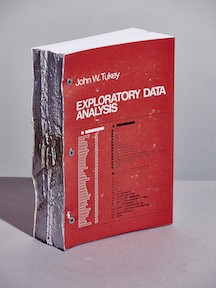

# Data Visualization "Versus" UI and Data Science

_NB: This is an article I wrote in 2017, published on [Medium](https://medium.com/@lynn-72328/data-visualization-versus-ui-and-data-science-d59182d58af4) originally. The field has changed a lot, and roles and jobs have too._

<i>I had too much fun looking for fake owl combat. Don't go there.</i>

I want to talk about the wealth of opportunities I see for data visualization specialists visiting in and borrowing from the "adjacent" fields of UI design and data science.

I prefer to imagine this post will be about more than a tempest in a twitter teapot — or a teenier splash of soy milk in a Silicon Valley macchiato. But it did start with a tweet from there:

<i>Elijah actually says they are "fleeing" in the latest Data Stories podcast.
</i>

Since then, we've seen a flurry of posts (see references) about data visualization as a profession, and what if anything might be wrong with it. I'm going to ignore some of the raised issues about the role definition itself and focus more on the relationships between the fields and a bit about the jobs and therein.

### UX/UI and Vis Design

My position: I'm someone who went **from** UI design to data vis and data science, many years ago. I'm not young anymore, and I've had [lots of corporate roles and clients](https://www.linkedin.com/in/lynn-cherny-39414/). I was in Silicon Valley for a while, like Elijah, but also in Seattle, Boston, Miami, and now France.

I was a UX designer or manager for nearly 18 years. This was in the days when that didn't mean writing code or HTML, but doing user research, making wireframes, writing specs. I gradually transitioned into data vis because of a growing interest in making stuff, rather than just advising developers; an interest in quantitative data analysis; and a low tolerance for the politics of UX design processes on most software team. Making things with code has higher status than making with pixels, whether it should or not, and quantitative data carries more weight than qualitative with many managers. My move was partly strategic, and partly due to boredom with design battles.

Selling the move to data visualization from UX wasn't hard: Dashboards were booming 10 years ago and who else was going to design them, D3.js as a tool was starting to "wow" people and few had learned it, R and Python and even Excel data literacy was rare among UX folks. I got jobs. It helped that I also knew something about user research and design processes in general, not just good vis principles and tools. 

<i>
Image of project dashboard for successful, on-time development of Heathrow Terminal 2 from Paolo Quattrone talk at EM-Lyon Business School.</i>

The gist here is that all 4 quadrants are in potential conflict but that's still useful to the users. I still maintain that dashboard design can be a pit of political misery (see my [Datavis Consulting: Advice for Newbies](http://blogger.ghostweather.com/2013/11/data-vis-consulting-advice-for-newbies.html) post.)

Those facts about the world then are still true. There are still jobs, D3.js and Python/R haven't stopped wowing people, and the world lacks sufficient data literate folk, especially among designers. The world still lacks people who can make a good chart or pivot in Excel, too.

I probably learned first about data visualization from hearing research talks at conferences on user interfaces. There has always been a strong relationship in research between UI design and data visualization. I think the CHI conference, a research-oriented UI event that I attended first as a student, has always had a track on data visualization. That research has certainly influenced practice. Visualization researchers like [Robert Kosara](https://eagereyes.org/) have moved into industrial research roles, informing the design of products like Tableau; and data products like [Trifacta](https://www.trifacta.com/) are the result of academic visualization research under the guidance of [Jeff Heer](https://homes.cs.washington.edu/~jheer/) (at Stanford and now UW). There is arguably a backlog of research debt (see [Olah](http://distill.pub/2017/research-debt/)) in academic vis, but the scene is getting better, as grad students release more interactive demos with their papers at conferences like IEEEVis (I recommend [Kosara's summaries of the conference](https://eagereyes.org/blog/2016/vis-2016-wednesday-thursday-papers-and-the-death-of-scivis#more-9743) because he usually links to accessible writeups and demos).

Data vis research, like UI research, is extremely important, but I'm personally more motivated by shorter-term, real-world impact.

#### Static Charts Are a Serious Thing

Effective data visualization design borrows from principles of good UI design. This is true for static as well as interactive data vis. Static infographics and charts, and the market for them, no doubt outweighs that for interactive data vis. Perhaps dismissed by web vis designers as "just" for business intelligence, communications, or the side-job of a data analyst, a lot of folks make good livings off static vis. (Side note: I would like to hear their voices more often in the twitter kerfuffles about the state of the field.)

Infographics remain as popular as ever. I don't think anyone would deny the chops that goes into one of these beauties by [Hiram Henriquez](http://h2hgraphics.com/infographics.html):

<i>
Bad cropping by me — Hiram said at Malofiej 2017 that it doesn't take him long to make these from the visual perspective — now that is skill expertise and tool ninja'ing.</i>

Static infographics and chart makers borrow from UI and visual design techniques, for sure: layout, typography, color, content design, contrast, etc. Even if they don't make infographics like Hiram, they do highly technical work, using tools like Illustrator, Tableau, and Excel or R. Their impact may even be more profound long-term: A congressperson can't hold up an interactive graphic in a hearing, but he can hold up [a chart](https://www.cbo.gov/publication/43289) [Jon Schwabish made at the Congressional Budget Office](https://vimeo.com/203009297). Jon mostly uses Excel. Regardless, he was a judge at [Malofiej 2017](http://www.malofiejgraphics.com/), where prestigious prizes for international news graphics (static and interactive) are awarded every year ([this year's list](https://iguacel.github.io/malofiej/index.html)).

#### Teaching Excel Aside

I'm teaching business students about data analysis and graphics right now. I got depressed when one student showed me an technical interview homework question (yes, even business students get these now), which was to recreate this chart in Excel:

  <i>Fuzzy image of student tech interview hw question for a real job. At a real company.</i>

My internal monologue: "Am I teaching them things that hiring managers won't appreciate or understand? Will my classes actually _hurt_ them on the job market?! Is it her job to say that's a shitty chart, or to actually make it? How _would_ I make it, anyway?" And then I showed her how.

To illustrate the difference between ordinary default Excel chart usage and true data vis design chops, I show my classes Jorge Camoes' redesign work from [this post](https://excelcharts.com/redraw-troops-vs-cost-time-magazine/). Time magazine apparently made a chart like this:

  <i>Something from <b>Time</b> apparently.</i>

Jorge redesigned it in Excel with a connected scatterplot and useful annotations. It takes some level of skill and design chops to "see" this as a possibility.

  <i>Camoes redesign from <a href="https://excelcharts.com/redraw-troops-vs-cost-time-magazine/">post</a>.</i>

Good design skill can be taught independent of the toolset, as long as we remember to focus on the "what" and not just the "how" in class. It's pretty easy to be sucked into the allure of just teaching "how" because the tools are what they can search for in job ads. (Jorge has comments on the impact that Excel toolset has on visualization practices in [his post](https://medium.com/visualizing-the-field/dispatches-from-the-data-visualization-gutter-1c4acfcde934), and more thoughts on Excel chart literacy.)

If you're interested in static chart design and infographics, there are many [helpful references on Andy Kirk's references list](http://www.visualisingdata.com/references/), including general books on design principles. Jorge has [a great book on the subject](https://www.amazon.com/gp/product/0134268636/ref=as_li_tl?ie=UTF8&camp=1789&creative=9325&creativeASIN=0134268636&linkCode=as2&tag=visuadata-20&linkId=b33f6ee2bdc68d613a3ae0f0811a9875) oriented towards an Excel user, but not exclusively. [Alberto Cairo's books](http://www.thefunctionalart.com/) on infographics and static data vis design are terrific.

### Interactivity and UI Design

Coincidentally, we've also recently seen a flurry of articles about the design of **interactive data vis**, and whether making custom interaction is worth the expense and time, especially in data journalism. Archie Tse of the New York Times said at [Malofiej](http://www.malofiejgraphics.com/) (the news graphics award conference) last year that [their readers don't interact a lot and so they're making more static data vis pieces](https://github.com/archietse/malofiej-2016/blob/master/tse-malofiej-2016-slides.pdf). Readers just want to scroll, not click. Static data vis design is still important, and obviously won't be going away! (Nevertheless, you'll find some links on designing for "scrollytelling" visualization in my references, a perfectly valid way to build interactive data vis, despite some eager vocal critics.)

In response, [Dominikus Baur](https://medium.com/@dominikus/the-superpower-of-interactive-datavis-a-micro-macro-view-4d027e3bdc71) and [Gregor Aisch](https://www.vis4.net/blog/posts/in-defense-of-interactive-graphics/) (the latter also at NYT) both made excellent points about the remaining value of interaction in data vis, e.g., to build trust in the data, build empathy, add depth to the analysis of big data with human detail.

Showing users what's interactive and enticing them to click are a staple element of effective UI design, dating back to debates about button design and how links don't always have to be blue. Data visualization might need to develop some new techniques, though; I like Anna Flagg's trick at the end of the scrollytelling [California is Getting Fracked](http://www.facesoffracking.org/data-visualization/), where she animates open a tooltip on a map dot, presumably to show there is hidden gold here:

  

  <i><a href="http://www.facesoffracking.org/data-visualization/">California is Getting Fracked.</a>By Anna Flagg, Sarah Craig and Antonia Bruno.</i>

[Lena Groeger](https://www.propublica.org/site/author/lena_groeger)'s many beautiful talks and articles on design techniques in data vis should be required reading for vis designers, static or interactive (see references again). Her [OpenVis Conference talk](http://lenagroeger.s3.amazonaws.com/talks/openvis/thinksmall.html#/) and [writeup](https://source.opennews.org/articles/wee-things/) of "Wee Things" includes this example of a helpful tiny animation from Bloomberg:

And as I'm typing this, someone just posted a link to [Andy Cotgreave's article on applying design theory to dashboards](http://gravyanecdote.com/bigbookofdashboards/affordances-and-signifiers/), focused especially on [affordances](https://www.interaction-design.org/literature/book/the-glossary-of-human-computer-interaction/affordances) (e.g., for interaction), an age-old UI design concept!

UX design and data visualization are going to continue to have a long and fruitful relationship, hopefully growing even closer and more co-dependent, with more job opportunities for all. There are many, many designery things to learn from intersections with data design: visual design, information design, interactive design, perceptual design... And if you want to do UI engineering too, you have scads of Javascript frameworks to stay on top of. **#champagne #confetti**

### Data Science and Data Vis

Talking about data science is harder because of the lack of a good definition of that field. Here's one of the worst of many topical Venns, which captures less about the field and more about the ontological and existential confusion of Gartner analysts required to report on it (check their honest "..." at the end of the title):

<i>"should we buy? should we outsource? what is latency? what is an analytics leader? we're so unhappy. this is v8 of the venn but we can't clarify it and have hit deadline." — Gartner creative team</i>

If you think data scientists have it easy, you really have to read t [his piece by Monica Rogati about hiring your first data scientist](https://hackernoon.com/how-not-to-hire-your-first-data-scientist-34f0f56f81ae)! Most data scientists spend 80% of their time on dev ops infrastructure, moving data around, and munging — not modeling (this [latest article says it's 70%](http://fgiasson.com/blog/index.php/2017/03/10/a-machine-learning-workflow/), but still). If data visualization people (and UI designers) are not spending 100% of their time doing their thang, they are not alone.

I can see the solid attraction of this field "next door" though, and my own career feels its dark gravity. Anyone who does data analysis in service to data visualization has to acknowledge the relationship!

Most of us vis people do data analysis. Some academic friends recently shared their suspicion that you should teach data visualization _after_ teaching exploratory data analysis with statistical tools. (All the data journalists reading probably said "No shit.")

After all, the data exploration part is how you "find" the story to visualize in the data in the first place. In your average data vis design process article, much of the development story is exploratory analysis before the final product. (E.g., this [great process piece by Periscopic](https://medium.com/@Periscopic/behind-the-scenes-how-we-made-our-feather-visualization-544d727fbe5c) which involves use of a machine learning API, as well.)

The EDA process ([term from Tukey](https://en.wikipedia.org/wiki/Exploratory_data_analysis)) involves creating simple descriptive charts during data set exploration, but there's also data munging, data cleaning, simple stats, outlier investigation, pivoting and investigation of group distributions, and all the other data exploration activities along the way to the final communication piece. Most "full-stack" visualization folks, who have to clean their own data, use a mix of tools to different degrees of skill: Python, R, Excel, Tableau, Spark (if you're really cool), Unix shell scripting.

  <i>"The greatest value of a picture is when it forces us to notice what we never expected to see." — Tukey. Like screws in a binding.<a href="http://cat.mozzarella.website/mEDA-01">This one is pretty expensive.</a></i>

A lot of those tools are also used in data science roles. No surprise! The tools you are good at open up doors, and the problems you face — especially as data sets get larger —expose new disciplines and methods of relevance. Some of the more interesting data vis pieces of the past few years have involved non-trivial algorithm creation in order to even _get_ to the vis part, e.g., this [Hamilton rhyme analysis piece from the WSJ](http://graphics.wsj.com/hamilton-methodology/).

We'd all be crazy not to be paying some attention to the hot that is machine learning, especially AI, right now. I don't need to give you references to back up how hot it is, because if you're reading this I assume you're not living under a rock in a quiet town in Yorkshire.

  <i>A black box.</i>

But machine learning has a black-box problem: Most people don't understand how the algorithms work ([one recent ref](https://www.technologyreview.com/s/604087/the-dark-secret-at-the-heart-of-ai/), for instance). There is enormous opportunity for data vis practitioners to dream up ways to open up these black boxes and invite end-users into the learning process in an intelligent way. Some prominent vis folks have already been seduced into this world, e.g., Shan Carter, Ian Johnson, Fernanda Viegas and Martin Wattenberg, all now working with the Google Brain team.

The most popular algorithm results are usually accompanied by a research translator blog post explaining things to the lay public, or even a live web demo. It's been a few years since [Bret Victor's Up and Down the Ladder of Abstraction](http://worrydream.com/#!2/LadderOfAbstraction) and [Explorable Explanations](http://worrydream.com/ExplorableExplanations/) (2011!), but now simulations and visual "explorables" are illustrating complex research. They're also illustrating simpler concepts; at last check, one tweet about this visual introduction to statistics had 99 RT's:

Maarten Lambrechts has [a nice round up](http://slides.com/maartenzam/dataharvest-rocknpoll#/) of a bunch of interactive explainers and a [great twitter feed](https://twitter.com/explorables); Nicky Case has [a page of simulation tools](http://explorableexplanations.com/) and apps devoted to this topic; see also Victor Powell and Lewis Lehe's [Setosa](http://setosa.io/#/) which has been under development for a few years. Simulation explorer apps are appearing in the data news, too: [538's Hack Your Way to Scientific Glory](https://fivethirtyeight.com/features/science-isnt-broken/), [Bloomberg's The Trading Game](https://www.bloomberg.com/features/2015-stock-chart-trading-game/), and the NYT's [election decision tree](https://source.opennews.org/articles/nyts-512-paths-white-house/) are just a few examples.

The appearance of the highly interactive and visual online pub [Distill](http://distill.pub/) reflects this hunger for better explanations of complex concepts. Everyone in any research field should read the birth story from Chris Olah on "[research debt](http://distill.pub/2017/research-debt/)," a problem we suffer from due to ideas with poor exposition, undigested ideas not ready to be understood yet, use of bad abstractions and notation, and too much competing noise for research attention.

> It's worth being clear that research debt isn't just about ideas not being explained well. It's a lack of digesting ideas — or, at least, a lack of the public version of ideas being digested. It's a communal messiness of thought. Developing good abstractions, notations, visualizations, and so forth, is improving the user interfaces for ideas.

Distill is offering [prize money](http://distill.pub/prize/) for good visualization and explanations about concepts in data science. What more evidence do we need that this is an area seeking and rewarding new talents? Here's what's eligible:

* Tutorials and solving "open exposition problems."
* Creating a new way of looking at something, reframing it or creating a new perspective.
* Clarifying things we formally know but don't understand.
* Visualizations, interfaces, or [explorable explanations](http://explorableexplanations.com/).
* Communicating novel results extremely well.
* Filtering and summarizing research.

### Jobs vs. Careers and Finding Your Yak

If I do a search on Indeed.com for "data visualization," I get 13K results. After the first page, with job titles that actually say those words, the titles stray across analytics, engineering, UI, data science, but the descriptions all mentions data visualization as a key function. (Even in France, where I found one for my students that required a "data storyteller!" See, I wasn't talking shit in class!)

There are jobs, even jobs with the "right" titles. Maybe they aren't always ideal in subject matter or corporate environment, maybe they aren't for sexy custom artistic interactive vis products, but there is definitely a way to do data visualization as your job, if you want to. As I'm typing this — and speaking of sexy — Fathom just listed more full-time open positions in Boston, on the [data-vis-jobs list](https://groups.google.com/forum/#!forum/data-vis-jobs) I moderate. [ETA: I don't anymore, it's now a board on the DataVis Society page.]

It is certainly true that the role of data visualization and whether it should be considered a "subfield" of something else (like UI or data science) may be a topic of ongoing negotiation. Every new discipline struggles with this. Moritz Stefaner has already posted the Venn diagram for data vis and its role definition, more artistic than most (I looked, they're terrible):

But I think if there are jobs with the title "data visualization [X]," then we've won and it's a real field.

Finally, I'd like to add: In the very privileged, educated, upper-income tech world that most of us inhabit, we have **careers**, not jobs. Our career can be data-focused, even if one corporate job title doesn't reflect that.

During our career, our interests may evolve as the industry evolves; we have the option to learn new things and transition to new roles if we want to! We might want to ask about people who "leave" a vis job title: "are they still working with data? and will they be bringing new skills to the problems of exploring and communicating about data in a few years?"

  <i>A proud yak. From <a href="https://medium.com/@firehoseproject/a-guide-to-yak-shaving-your-code-d30f98dc759">this piece on yak shaving</a></i>.

It is also true that people in data vis roles have different yaks they are willing to shave to stay in the biz. I was talking to a prominent German data vis friend (no, the one in Munich) about this a few months ago. He seems more willing to wrestle with Javascript frameworks or drivers to make a display work, while I'm more willing to clean big data unicode errors by hand with an old toothbrush in a snowstorm running uphill than I am to want to test drive the latest framework. Maybe the former is a more UI-dev-oriented vis trait and the latter a more data-science-oriented vis trait.

I was a manager once. Most jobs do require you to change your role if you want to climb a corporate ladder. As you get up to the top, it's about the business, not about the individual, and oh so increasingly true in the USA! I left to do consulting (and now teaching) because I'm more interested in the data problem space, and facing new design and technical challenges, than I am in job titles and salaries. There's a lot to learn out there today, and lot of new challenges, especially in data science. Data scientists have explicitly said they want **help** from visualization.

If you're a data vis person who is at all like me, you're not really going anywhere, even if your job title and tools change occasionally. It's still about communicating data.

### Some References

["If Data Vis is So Hot, Why are People Leaving?"](https://medium.com/visualizing-the-field/why-people-leave-their-data-viz-jobs-be1a7ab5dddc) by Elijah Meeks

["Visualizing the Field: Finding Our Way,"](https://medium.com/visualizing-the-field/visualizing-the-field-finding-our-way-6330d3e48555) collected by Eric Sokolofsky

["There Be Dragons: Datavis in the Industry,"](https://medium.com/visualizing-the-field/there-be-dragons-dataviz-in-the-industry-652e712394a0) by Moritz Stefaner

"[Challenges of Being a Vis Professional in Industr](http://datastori.es/95-challenges-of-being-a-vis-professional-in-industry-with-elijah-meeks/)y," Data Stories podcast with Elijah and Moritz Stefaner and Enrico Bertini.

"[Dispatches from the Data Visualization Gutter](https://medium.com/visualizing-the-field/dispatches-from-the-data-visualization-gutter-1c4acfcde934)," by Jorge Camoes

**Interactive Data Vis Design**

["Why We Are Doing Fewer Interactives](https://github.com/archietse/malofiej-2016/blob/master/tse-malofiej-2016-slides.pdf)," by Archie Tse

["In Defense of Interactive Graphics](https://www.vis4.net/blog/posts/in-defense-of-interactive-graphics/)," by Gregor Aisch

["The Death of Interactive Graphics](https://medium.com/@dominikus/the-end-of-interactive-visualizations-52c585dcafcb)," by Dominikus Baur

["The Superpower of Interactive Datavis? A Micro-Macro View!](https://medium.com/@dominikus/the-superpower-of-interactive-datavis-a-micro-macro-view-4d027e3bdc71)" by Dominikus Baur

**Selections from the Groeger Oeuvre**

["When the Designer Shows Up in the Design](https://www.propublica.org/article/when-the-designer-shows-up-in-the-design)", by Lena Groeger

"[If It Needs a Sign, It's Probably A Bad Design](https://www.propublica.org/article/if-it-needs-a-sign-its-probably-bad-design)," by Lena Groeger

"[Design Principles for News Apps and Graphics](https://source.opennews.org/articles/design-principles-news-apps-graphics/)," by Lena Groeger

"[5 Things I Learned Making a Chart Out of Body Parts](https://source.opennews.org/articles/body-parts/)," by Lena Groeger

"[A Big Article About Wee Things](https://source.opennews.org/articles/wee-things/)," by Lena Groeger

**Scrollytelling References**

["How to Implement Scrollytelling with Six Different Libraries](https://pudding.cool/process/how-to-implement-scrollytelling/)," by Russell Goldenberg

["Why Choose? Scrollytelling and Steppers,](https://medium.com/@zanarmstrong/why-choose-scrollytelling-steppers-155a59dd97fe)" by Zan Armstrong

["The Scrollytelling Scourge](https://eagereyes.org/blog/2016/the-scrollytelling-scourge)," by Robert Kosara

**Data Science-Related**

["Research Debt,"](http://distill.pub/2017/research-debt/) by Chris Olah and Shan Carter

"[The Power of Explorable Explanations](http://slides.com/maartenzam/dataharvest-rocknpoll#/)," by Maarten Lambrechts

"[The Dark Secret at the Heart of AI](https://www.technologyreview.com/s/604087/the-dark-secret-at-the-heart-of-ai/)" by Will Knight

**Conference of Relevance**

[OpenVis Conference](https://openvisconf.com/), a conference I co-chair with Irene Ros that addresses data vis, including UX/design and data science related to vis. We've always believed they live together. (Lena Groeger is now on the program committee.)

**Cultural References**

[Yak Shaving](https://www.techopedia.com/definition/15511/yak-shaving).

By [Lynn Cherny](https://medium.com/@lynn-72328) on [<time>April 21, 2017</time>](https://medium.com/p/d59182d58af4).

[Canonical link](https://medium.com/@lynn-72328/data-visualization-versus-ui-and-data-science-d59182d58af4)

Exported from [Medium](https://medium.com) on February 15, 2022.
