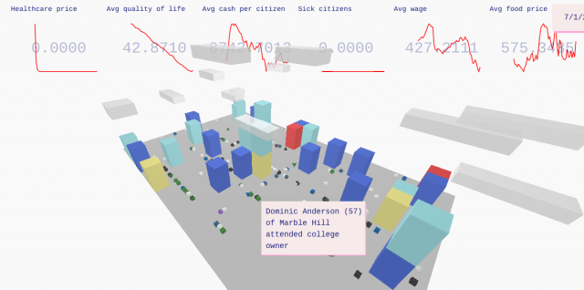
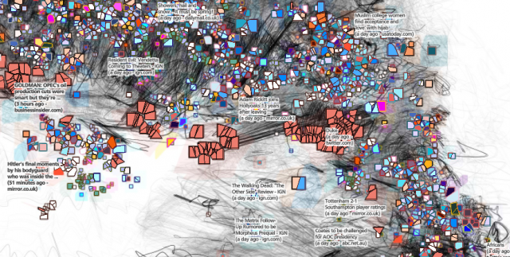

# Things I Think Are Awesome-Episode 1.

[This was originally published as my first post on my new tinyletter. I've decided to cross-post them all here since the lack of feedback...

### Things I Think Are Awesome-Episode 1.

[This was originally published as my first post on my new [tinyletter](https://tinyletter.com/arnicas). I've decided to cross-post them all here since the lack of feedback on tinyletter makes me a little sad.]

Like many of us, I've had a hard few months online. I remember when the top news stories in my Nuzzel feed weren't about politics, and how many awesome technical and creative things I was looking at or playing with.

I'm trying to get some of that spirit back. If you follow me on twitter, this won't be a list about data science and vis as much as about the lighter side, the things that make me want to make stuff and play with code or draw/write something. I like **generative text,** **fun simulations, old things, poetry, folklore, the occult, creative AI, weird datasets, funny bots, tools and toys for creativity, UFOs, offbeat research**... you get the idea. There might be a funny tweet or joke in here too, because if something made me laugh right now, it's officially **Awesome**.

So, here's a kickoff of good things I saw recently.

* **Patricio Gonzalez Vivo's GLSL shaders Tarot deck**, at [pixelspirit.](http://pixelspiritdeck.com/) Must buy! I love this. Especially The Fool. (I was thanked in the credits, but all I did was cheerlead via Twitter DM.)

* ["Dwarf Fortress creator Tarn Adams talks about simulating the most complex magic system ever."](http://www.pcgamer.com/dwarf-fortress-creator-tarn-adams-talks-about-simulating-the-most-complex-magic-system-ever/?utm_content=buffer6bca7&utm_medium=social&utm_source=twitter&utm_campaign=buffer-pcgamertw) This is a bit of a ramble — I include it because I cannot wait to explore the worlds he creates with a magic system, at least by second-hand account and bug report. In this piece I learned I am a certified category of user, the **archaeologist**, who explores the worlds generated rather than playing (I'm afraid to get into playing, I don't have that kind of time). Also, this quote, so good:

> _"first we do the framework and [then] world generation changes. It's been very odd that the last 11 years or whatever, dwarves in your fortress have been able to make 'named objects,' they'd make a named sword if you're lucky or a named floodgate or bucket if you're not, and you can install it in your fortress, do some things with it."_

* **Emergent behavior as a particle system**, based on biology principles:[Clusters, by @JJVentrella](http://www.ventrella.com/Clusters/).
* [**"What Can You Do With a Rock? Affordance Extraction Via Word Embeddings,"**](https://arxiv.org/pdf/1703.03429.pdf) by Fulda et al. at BYU. They apply Wikipedia word2vec embeddings to assist agents playing Infocom text adventure games like Zork. What a great idea. For humans, too, because figuring out what words to use is Too. Hard.
* [**"Humans of Simulated New York"**](https://arxiv.org/pdf/1703.05240.pdf), a Francis Tseng simulation paper and project. [Code here](https://github.com/frnsys/hosny),[older demo here.](http://pubsci.agency/) I tanked NY's quality of life and work available pretty fast.

* [Joseph Reisinger's weird and pretty geographic map of news — Kaleidoscope.](https://medium.com/@josephreisinger/tides-of-information-flow-visualizing-our-digitally-mediated-reality-f98a61fef701#.84jgwdvle)

* Gratuitous awesome d3 how-to:[animating thousands of points with d3 and canvas,](https://bocoup.com/blog/smoothly-animate-thousands-of-points-with-html5-canvas-and-d3) by @pbesh. Make sure to try the demo.

And that's my last week and episode one.

_Originally published at_ [_tinyletter.com_](http://tinyletter.com/arnicas/letters/things-i-think-are-awesome-hi) _. Subscribe_ [_here_](https://tinyletter.com/arnicas) _._

By [Lynn Cherny](https://medium.com/@lynn-72328) on [<time>April 30, 2017</time>](https://medium.com/p/faed01690bb7).

[Canonical link](https://medium.com/@lynn-72328/things-i-think-are-awesome-episode-1-faed01690bb7)

Exported from [Medium](https://medium.com) on February 15, 2022.
