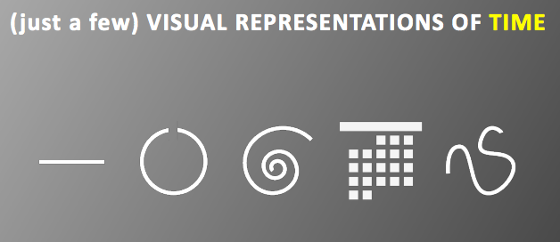
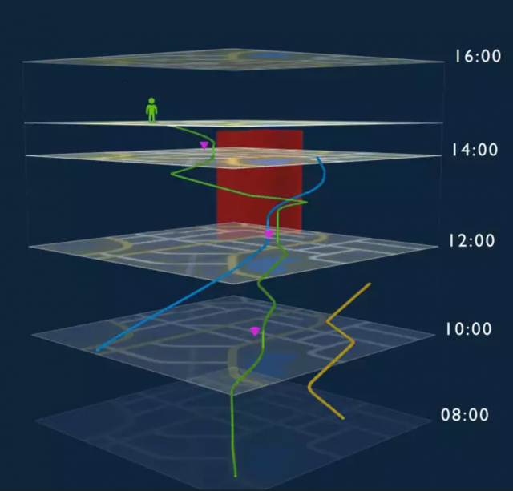
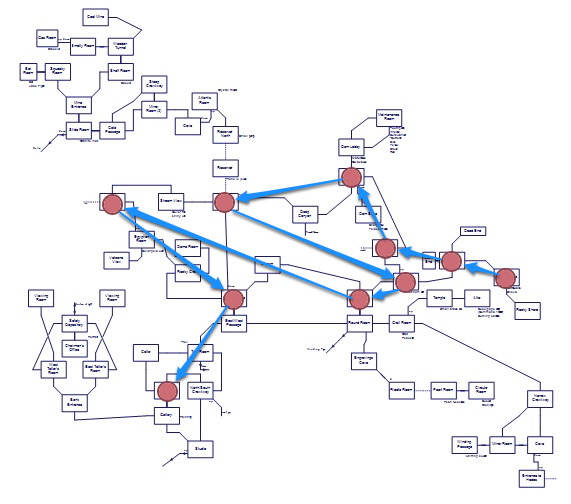
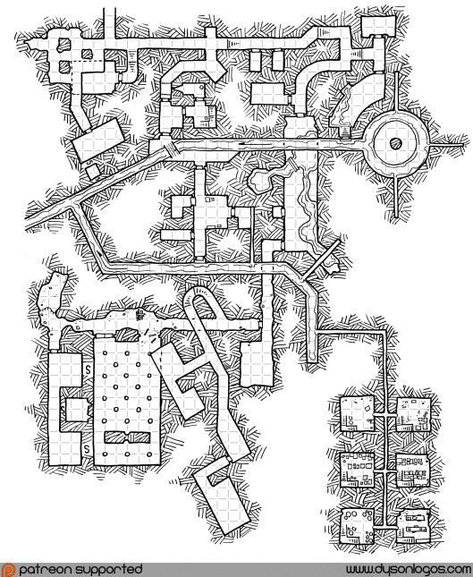
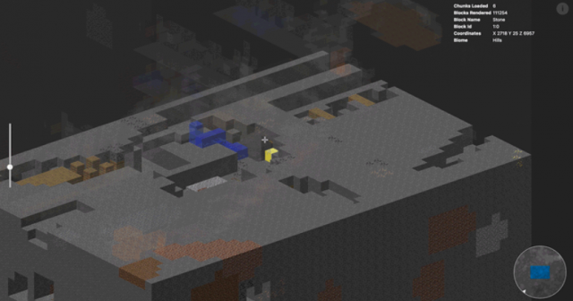
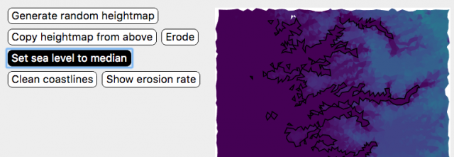
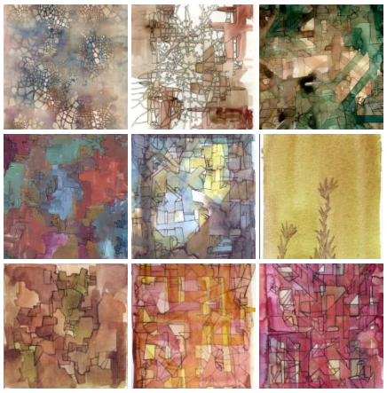
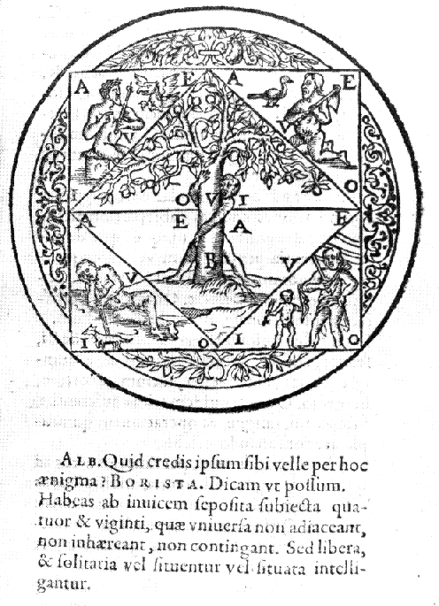
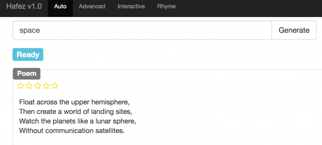

# Things I Think Are Awesome, Ep3: Time, Space, Memory

[Cross-posted from my tinyletter list here.]

### Things I Think Are Awesome, Ep3: Time, Space, Memory

[Cross-posted from my [tinyletter list here](https://tinyletter.com/arnicas).]

Hi. This episode is a lightly linked set of things that fell all over me recently. There's time/space/memory and some games and generative poetry in here.

At last week's excellent [OpenVis Conf](https://openvisconf.com/) (which I co-chair, truth in advertising), [Matt Brehmer](http://mattbrehmer.github.io/#talks) from Microsoft gave a great talk called "[What Story Does Your Timeline Tell?](http://mattbrehmer.github.io/pubs/ovc2017.pdf)" He explored different shapes for representing timelines in historical and current datavis, including spirals, circles, grids, and obviously lines.

Related, a reader of [@samim](https://twitter.com/samim?ref_src=twsrc%5Egoogle%7Ctwcamp%5Eserp%7Ctwgr%5Eauthor) on Twitter recommended [Symmetry, Causality, and Mind by Michael Leyton](https://mitpress.mit.edu/books/symmetry-causality-mind), offering the premise that perception is a spatial analysis of causality.

> _Perception is usually regarded as the recovery of the spatial layout of the environment. Leyton, however, shows that perception is fundamentally the extraction of time from shape. In doing so, he is able to reduce the several areas of computational vision purely to symmetry principles. Examining grammar in linguistics, he argues that a sentence is psychologically represented as a piece of causal history,_an archeological relic disinterred by the listener so that the sentence reveals the past.

I haven't read it, but it sounds fascinating!

Thanks to David Masad ([@badnetworker](https://twitter.com/badnetworker?lang=en)) for this link — "[Searching the Internet for Evidence of Time Travelers.](https://arxiv.org/pdf/1312.7128.pdf)" Which is an actual arXiv paper by 2 physicists (spoiler: no evidence found yet).

In yet more you-should-be-following-@samim, he posted this [amazing spacetime concept video by @bopuc and Mark Pearce](http://markpearce.ca/project/spacetime), which I think prompted the above.

> _...time is represented on the Y axis, flowing like a river from the the future down to the past. We're tracing the figures as they move through the city in (in 2d) then visualizing the resultant shape in a simplified representation of 'spacetime.'_

And in other-books-that-I-haven't-read-but-sound-terrific, Rebecca Solnit has edited some map-related essay collections about San Francisco, New Orleans, and New York. From this great review entitled [Visible Cities, by Laura Yoder](http://www.publicbooks.org/visible-cities/?utm_content=buffer07155&utm_medium=social&utm_source=twitter.com&utm_campaign=buffer):

> _The energy of this work derives from Solnit's conviction that "Every city is many places; the old woman and the young child do not live in the same city, and the rich and the poor, the pedestrian and the wheelchair-bound, black and white inhabit different but not completely separate realms."  ... Rebecca Snedeker, coeditor of_Unfathomable City _, the atlas of New Orleans, writes in its introduction, "There is a shadow atlas, or several, lurking down several forking paths we did not take..."_

A week or so ago, I saw a lovely post by game designer **Emily Short** on designing stories with and around spaces ("[Teaching Spatial Storytelling](https://emshort.blog/2017/04/21/mailbag-teaching-spatial-storytelling/)"). Her historical game design links are always fun, highly recommended. She notes that text adventure games often relied on maps to control the story progression, so the map was designed at the same time as the game's plot points.

> _How much story material belongs in each room? How much real space does a given room represent, and how does that connect with narrative presentation?_

She links to a nice post disagreeing with the amount of actual "mapping" between map and story, by Juhana Leinonen ("[Where We're Going We Don't Need Roads](http://nitku.net/blog/2015/10/we-dont-need-roads/)"). It's worth it for this diagram alone of a "linear" plot experience laid out on a Zork map (imaginary to make the point that the plot rarely does map to the space):

Emily also links to these cool dungeon designs by RPG artist [Dyson Logos](http://dysonlogos.com/), some of which are free:

Now that we're on mapping games, I was pretty tickled by this [3D Minecraft map explorer made with deck.gl](http://uber.github.io/deck.gl/blog/2017/rendering-minecraft-with-deckgl)by Xiaoji Chen (link from [@philogb](https://twitter.com/philogb), Nicolas Belmonte). It works, I tried it with a MC world :) (Drag the file onto the blank page at the demo link.)

In more map fun, the Twitter bot [Uncharted Atlas](https://twitter.com/unchartedatlas) posts generated fantasy landscapes. But the [code and interactive explanation of how it works by @mewo2](http://mewo2.com/notes/terrain/) are even more fun. The writeup on place-name generation is [here](http://mewo2.com/notes/naming-language/).

For more generative art maps, I can't recommend [Emily Garfield](https://www.emilygarfield.com/)'s procedural but still hand-drawn watercolor maps enough (she's experimenting with learning Processing now, and I'm super-curious where that will take her):

### Memory

The place-time relationships discussed above made me think of the "Memory Palace" idea in John Crowley's awesome fantasy [**Little, Big**](https://en.wikipedia.org/wiki/Little,_Big) **,**there attributed to [Giordano Bruno](https://en.wikipedia.org/wiki/Giordano_Bruno). This is the notion that you can remember anything by attaching it to a physical space in your memory. Apparently Bruno had a lot of other ideas on memory aids and some glorious hermetic diagrams. [Wikipedia](https://en.wikipedia.org/wiki/Giordano_Bruno) says this is one of his least complex diagrams, but it sure is pretty if you like mysterious woodcuts:

Wikipedia is surprisingly excellent on the broader topic of "[Art of Memory](https://en.wikipedia.org/wiki/Art_of_memory)" and cites many other useful techniques dating back to the Greeks (and Arabs) for memorization, including chunking, associations, repetition, poetic meter, and use of astrological and textual diagrams. The book [**Art of Memory,** by Francis Yates](https://www.amazon.com/Art-Memory-Frances-Yates-ebook/dp/B005TKD6UC/ref=sr_1_1?ie=UTF8&qid=1493666142&sr=8-1&keywords=art+of+memory), seems to be the reference go-to for the historical roots. I will report back on that one, because I'm totally enjoying it. It's lovely, and explores " **the old, old business of rules for places, rules for images, memory for things, memory for words.**"

Coincidentally, I also just ran into this great paper by Marjan Ghazvininejad and Kevin Knight, "[How to Memorize a Random 60-Bit String.](http://www.isi.edu/natural-language/mt/memorize-random-60.pdf)" Poetry generation seems to be the awesome answer! These are two of the same folks who wrote "[Generating Topical Poetry](http://www.isi.edu/natural-language/mt/generating-topical-poetry.pdf)," a test system of which can be found online from the link listed on [this page](https://github.com/shixing/poem/tree/master/poem_submit) (tinyletter won't let me link to a hard IP) and from the [code here](https://github.com/shixing/poem). Here is the best of my time, space, and memory poems using their tool:

Welp, that's it... hope you found these interesting and sorry it got so long!

I've decided I'm more freaked out by the silence from a tinyshout into email than I expected, so I'm duplicating my tinyletters on [Medium](https://medium.com/@lynn_72328/latest) now too. You can read there instead if you prefer! And you can always drop me a note, too.

Best, Lynn

_Originally published at_ [_tinyletter.com_](http://tinyletter.com/arnicas/letters/things-i-think-are-awesome-ep3-time-space-memory) _. Subscribe_ [_here_](https://tinyletter.com/arnicas) _._

By [Lynn Cherny](https://medium.com/@lynn-72328) on [<time>May 1, 2017</time>](https://medium.com/p/6a61a6bde2fa).

[Canonical link](https://medium.com/@lynn-72328/things-i-think-are-awesome-ep3-time-space-memory-6a61a6bde2fa)

Exported from [Medium](https://medium.com) on February 15, 2022.
