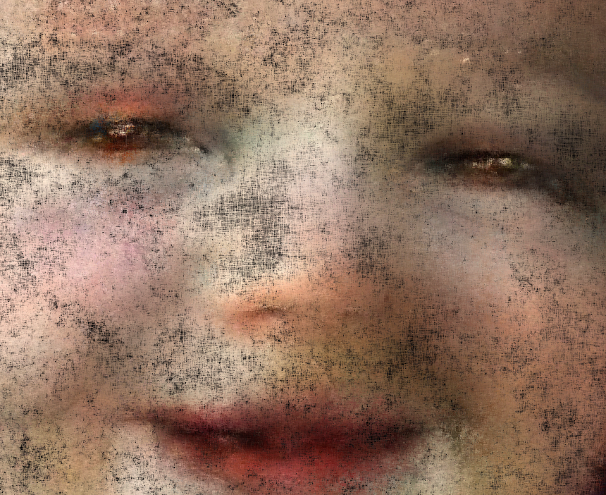
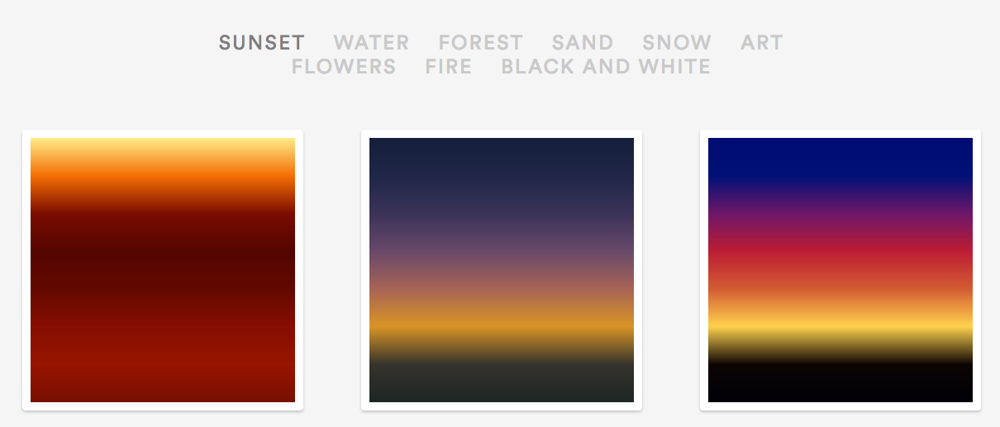
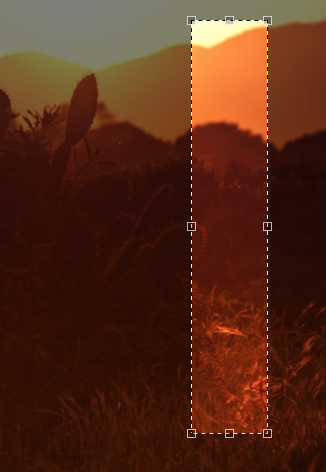
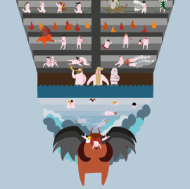
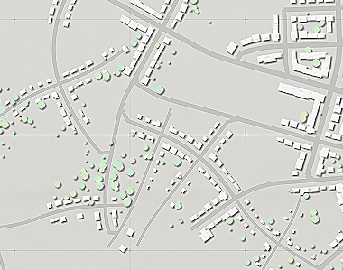
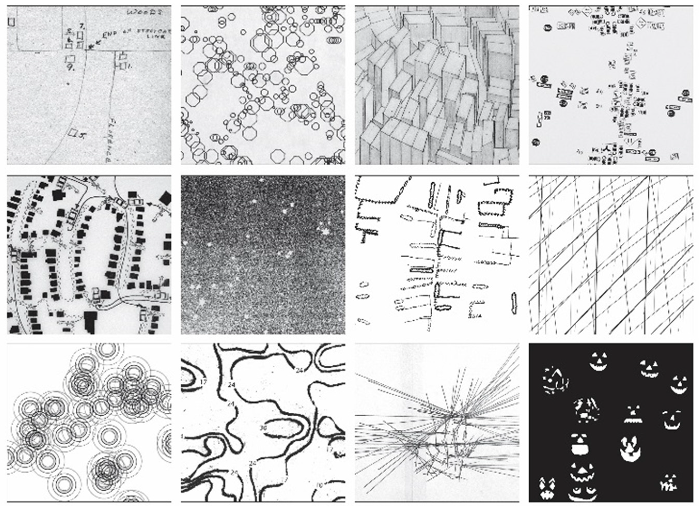
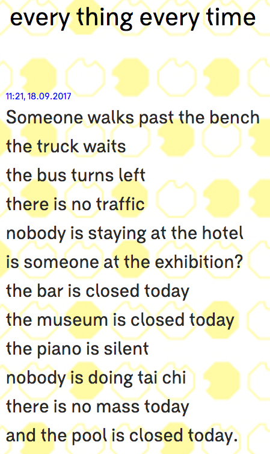
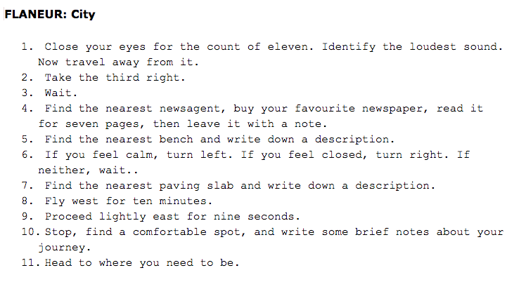
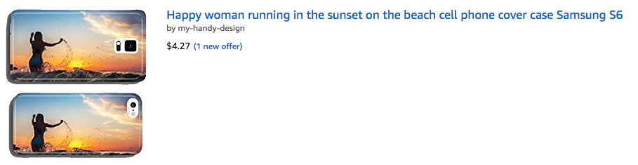

# Things I Think Are Awesome 4: Maps and Poetry and People

It's been a long time since the last newsletter/post. Sometimes it's hard to focus on the awesome, when your course is killing your...

### Things I Think Are Awesome 4: Maps and Poetry and People

It's been a long time since the last newsletter/post. Sometimes it's hard to focus on the awesome, when your course is killing your students, IT doesn't think it's their job to have VGA adapters, & you've lost your shit several times in the week; and meanwhile people are living without water and electricity and the U.S. government cares more about the NFL. Nevertheless: People and things that are beautiful, creative, and original are how I get through it. So here's a few amazing things that have piled up for me and improved my days in the past week and months. (Keywords #procgen, #maps, #design, #poetry, #ghosts, #AI.)

### Beautiful, Derived from Data

Mike Tyka's amazing [animated neural net portraits](http://www.miketyka.com/projects/dreams/). We've all seen a lot of deep learning art and generated faces, but this app is astounding — the animated style conveys old world paint texture while being future-world eerie and beautiful. A great example of true artistry being in the details, not in the algorithm alone.
 Mike's app for ever-evolving portraits

Meanwhile, in bad art, [Colin Morris posted about using a neural net to find the bad drawings of flamingoes](http://colinmorris.github.io/blog/bad_flamingos) in the [Quick Draw](https://github.com/googlecreativelab/quickdraw-dataset) dataset. It's pretty funny.

Related, the sweet and cute [@Everyonsai](https://twitter.com/everyonesai?lang=en) bot from @GalaxyKate uses sketchier sketches from Quickdraw for little introspective moments about identity. It's hard to describe.

>

[Gradient World](https://gradient.world/): A website tool for generating gradients from images of the natural world. Gorgeous. Click on one to see source image and adjust your gradient.
 [Source editing](https://gradient.world/gradient/5982a1041f89c5933a497605) at Gradient World...

### Interactive Maps of Poems

Dante's Inferno in an [adorable, zoomable illustration](http://www.alpacaprojects.com/inferno/en/). Super example of the power of the artistic details, both graphic and interactive.
 [Inferno](http://www.alpacaprojects.com/inferno/en/) screencap (the tip/bottom)

### Map Generators and Unusual Maps

[Oskar Stalberg's City Generator](http://www.oskarstalberg.com/game/CityGenerator/) is a web interactive, and you can keep clicking to drive the urbanization.
 [Oskar's City Generator](http://www.oskarstalberg.com/game/CityGenerator/)

The [Metropologeny twitter bot](https://twitter.com/metropologeny) by @[mewo2](https://twitter.com/mewo2) is doing a similar thing, posting little city maps:

>

The source code inspiration for this is the paper and code [here](http://www.sci.utah.edu/~chengu/street_sig08/street_project.htm) (thanks, Martin). @mewo2 is also well-known for his fantasy map generator bot ([@UnchartedAtlas](https://twitter.com/unchartedatlas?lang=en)), and the [NanoGenMo project that used it for a novel](https://github.com/mewo2/deserts).

In more map news, related to map stories and map poetics, run out and read now [this lovely piece on "Mapping Deeply" by Dennis Wood](http://www.mdpi.com/2076-0787/4/3/304/htm).
 Front end-paper from Everything Sings, borrowed from [Humanities article Deep Mapping](http://www.mdpi.com/2076-0787/4/3/304/htm)
> "From top left, the first is from a map made by my father's older sister the time she visited us in the mid-1980s; the next from a map of the ages of the neighborhood's trees; the next from a map of house types; the next from a map of street signs; the next from a map of the postman's 1982 route; the next of the stars that shine on the neighborhood; the next of the neighborhood's fences; the next of a selection of radio waves passing through the neighborhood; the next of wind chimes; the next of property values; the next of the distance you can see out of the neighborhood from each of its intersections; and, the last, of the pumpkins that were on the porches, Halloween, 1982."

The book he talks about is $104 on Amazon. My heart broke. But this amazing line from the introduction on Amazon made me smile: "Wood is writing a novel where we never meet the main characters, but their stuff is everywhere." (Side note: this summer I read, **_Life, a User's Manual_**, by Georges Perec, and that's a pretty good description of it.)

### Data Poetry

In generative text category of "things I love that will have a long-term impact on me," [Everything Every Time](http://everythingeverytime.net/index.html).

> "every thing every time is a piece of real-time digital writing, which is drawing from the many 'things' and 'events' and changes of 'status' that are constantly happening in Manchester," says artist Naho Matsuda. "In every thing every time I have turned these data streams into narratives formatted as poems, that are stripped from their location information and any data transmitting purpose. Smart information becomes impractical poetry."

I particularly like how "nothing" is highlighted in the poems. When nothing is happening, it might be worth mentioning. It is in poetry, anyway.

### Maps, Data, Poems

[@HarryGiles](https://twitter.com/HarryGiles), an interactive poet in Edinburgh whom I find really inspiring, is featuring a fantastic project on the BBC [Contains Strong Language](https://www.mixital.co.uk/channel/contains-strong-language) site right now. Generate your random instructions for exploring a space, and then write a poem after you do it.

### Weird But Cool Businesses

In clever business ideas, there is a [bot taking random images and selling iphone cases for them](https://www.theverge.com/tldr/2017/7/10/15946296/amazon-bot-smartphone-cases). Products page [here](https://www.amazon.com/my-handy-design/b/ref=w_bl_hsx_s_wi_web_13968870011?ie=UTF8&node=13968870011&field-lbr_brands_browse-bin=my-handy-design).

### Ghost Stories and Manuscripts

I loved this news story about the [Chicago Library seeking help to translate "rare magical manuscript."](http://www.atlasobscura.com/articles/newberry-library-transcribing-manuscripts) What could possibly etc. In related news, "[World's First Haunted Object 3D Scanning Project is Confusing Ghosts, Producing Paranormally-Active Prints.](http://weekinweird.com/2017/06/17/haunted-object-3d-scanning-project-paranormal-problems/)" Probably worth thinking about how the digital impacts the paranormal, for maybe a few seconds.

### People Who Inspire Me

A few weeks ago I considered doing an entire episode of this newsletter on people, not things. But I had a big backlog of things too, so I'll mix it up right now.

Here are a few people on twitter that are great for me right now, that make me feel better and stronger.

**Kate Compton**, [@GalaxyKate](https://twitter.com/GalaxyKate). Kate is a grad student who constantly reminds me that you can be female, learn to code later without a heroic male origin story requiring a Commodore 64, and be madly and wildly creative and influential online. She just updated her [home page of her projects and links](http://www.galaxykate.com/), which she shares online freely.

**Allison Parrish**, [@aparrish](https://twitter.com/aparrish). Allison teaches and creates generative poetry. She's funny and humble and self-effacing and grounded. While being wildly creative and influential as well. All while sharing her code and teaching materials and experiments even when they fail.

**Janelle Shane**, [@JanelleCShane](https://twitter.com/janellecshane?lang=en). Jannelle is playing with Char-RNN to generate stuff, and depending on the data set, it's amazing. I think the northern English pub names ("Darn Funk Inn", "Brrew", "Alan") and guinea pig names ("Spooty", "Hally Flope", "Flurpie") were among her best work. She's received a lot of press for it, despite having a day job as a researcher doing things with optics, not neural nets. Her experiments are mostly documented on [her site](http://lewisandquark.tumblr.com/), but keeping up with her on twitter is best. I'm going to try to replicate some of her experiments in my AI class this fall.

### Just Cute

If you need a dose of just cute, this account of animals on a sheep farm, [@1catshepherd](https://twitter.com/1CatShepherd), is beyond adorable. Especially the "puddlemaker" puppy with the long-suffering cats.

Keep being awesome, and keep us all going... Love!

(Reminder you can get this as a newsletter on [tinyletter](https://tinyletter.com/arnicas)).

By [Lynn Cherny](https://medium.com/@lynn-72328) on [<time>September 30, 2017</time>](https://medium.com/p/227668ba9ba2).

[Canonical link](https://medium.com/@lynn-72328/things-i-think-are-awesome-4-maps-and-poetry-and-people-227668ba9ba2)

Exported from [Medium](https://medium.com) on February 15, 2022.
