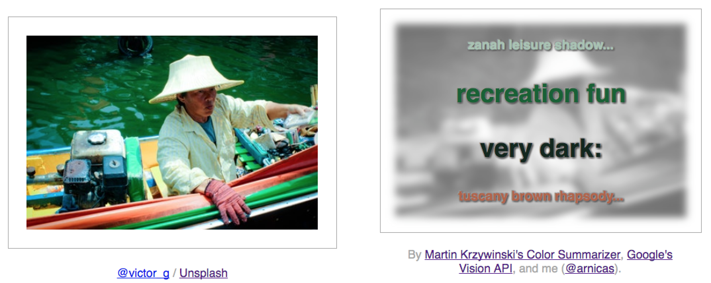
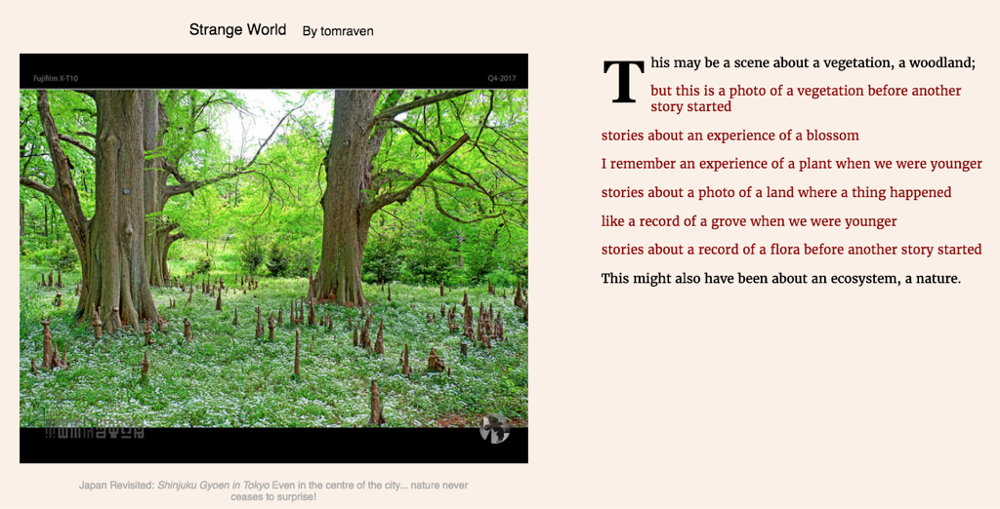
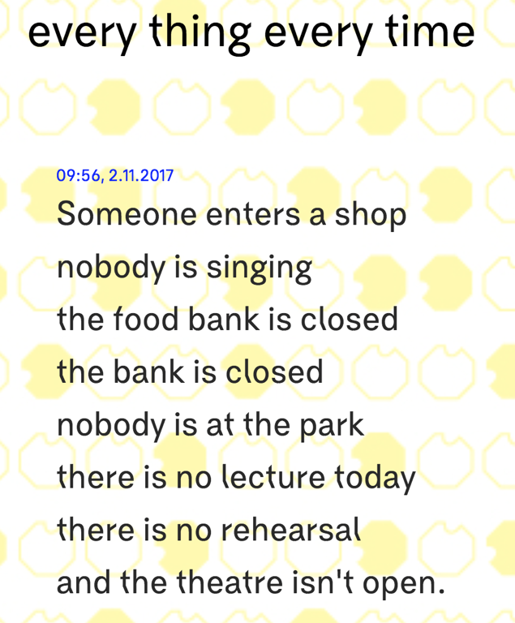
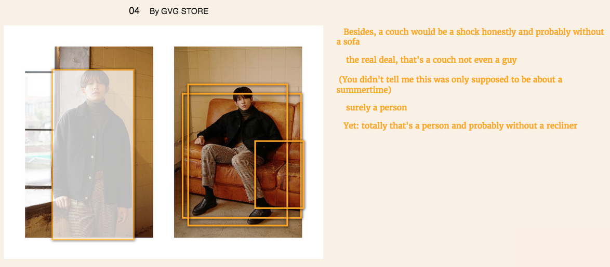

# COCO's Memory Palace: A Strange Fantasia

(This is my KIKK Festival 2017 talk written up, from the Tech Track. It was opposite @quasimondo's talk, so I think it might find a larger...

### COCO's Memory Palace: A Strange Fantasia

(This is my KIKK Festival 2017 talk written up, from the Tech Track. It was opposite @quasimondo's talk, so I think it might find a larger audience in text.)

This talk springs from my interest in transcoding text and images for artistic purposes. This talk is about photographs and generative poetry. Because I am also working with machine learning now, it's also about memory, both the human and the modeled.

### Project 1: Color Poems

The first project I'll show was inspired by a wonderful [color summarizer API by](http://mkweb.bcgsc.ca/colorsummarizer/) [Martin Krzywinski](https://twitter.com/mkrzywinski?lang=en). About 6 months ago I was impressed enough by the "image in words" section — see right side — that I asked him if I could make a bot that used the API for poetic purposes. He told me to do it and really double down on the poetry angle.
 [http://mkweb.bcgsc.ca/colorsummarizer/](http://mkweb.bcgsc.ca/colorsummarizer/)

Martin's API has [9284 words for colors](http://mkweb.bcgsc.ca/colornames/): "My list uses the following sources: bang-v2, beer SRM chart, colorhexa, crayola, n3, ntc, pantone, raveling, resene, rgb.txt (X11), steve.hollasch, wikipedia, and xkcd." This means a lot of variation, which is what you want in a generative text algorithm.

My project takes random professional photos from the [Unsplash API](https://unsplash.com/), which I pass thru a CSS filter process to convert to grayscale, blur and make transparent, and then overlay random color words from the top 4 colors returned by Martin's API. I render the colors as words, and mix in a noun or two from the [Google Cloud Vision API](https://cloud.google.com/vision/) as well.
 My Color Poems result (nouns from Vision API are probably "moisture" and "kelp"

The colors in the image are transcoded into text in a font of the same color, while the image itself becomes black and white and recedes into the background. I really like some of them, they surprise and make me laugh:

Others are just pretty and mysterious, like the images themselves.

The text is laid out with [BigText.js](https://github.com/zachleat/BigText). The hardest parts of this project for me were the CSS design and spelling Martin's name right in the credits. I have not yet made a bot or put it up on a live site; I got concerned about hitting his personal server with it. When I tried to run his code locally I was introduced to a whole world of scientific perl libraries that I didn't know existed. I never succeeded in getting it all to run on my Mac.

Most of the results are really nice. Some are funny and awkward, because Google's Vision API is weirdly objective and clinical in tone, saying things like "product" and "ecosystem" instead of "wood" and "forest."
 An early result before all the CSS fixes, dropshadows, etc. Google loves "products."

In the end I found the results a little cold: the use of the professional photos (often very washed-out colors, it seems!) and the lack of story and emotion in the poetry bothered me.

### Different Photos, Different Text

I started thinking about other images: holiday photos, selfies, and family pics, like this one of my sister and niece from years ago.
 Family photo. Rockin' that do.

How do we read this picture? Most people would see the focus as the 2 humans, one very cute, and require some prompting to look at the specifics of the cup, the door, the hairstyle, the smile...

John Berger's essay "Understanding a Photograph" is posted [here](http://www.macobo.com/essays/epdf/berger_understanding_a_photograph.pdf), in which he notes:

> A photograph is already a message about the event it records. The urgency of this message is not entirely dependent on the urgency of the event but neither can it be entirely independent from it. At its simplest the message, decoded, means: **I have decided that seeing this is worth recording**.... Photography is the process of rendering observation self‐conscious.

Taking a photograph is a moment of decision about a moment of time. **This** picture of this moment and these things is worth remembering. I don't remember the act of taking that picture of my sister and niece, but the picture is immediately a familiar moment nonetheless.

Visual ethnography is another interesting way to think about images. Using photos to elicit details and stories is a solid interview technique. But I found this photo and caption a bit strange and enlightening:
 From [Talking About Pictures: A Case for Photo Elicitation](https://www.nyu.edu/classes/bkg/methods/harper.pdf) by Ben Harper

The ethnographer Suchar has an interest in the collection. He/she sees this photo differently from his "subject" who sees it as David and Daniel and the cat. (My interest is in the cat, because I have a cat and don't know this guy's kids. I do appreciate his enormous smile though.)

I've also been reading about visual memory systems in Frances Yates' **The Art of Memory**. The "artificial memory" aide, a concept dating back to Greek rhetoricians and later medieval mystics like Giordano Bruno, are imaginary visual systems for organizing information we want to remember. Yates quotes an anonymous Classical rhetorician:

> "There are two kinds of memory... one natural, the other artificial. The natural memory is that which is engrafted in our minds, born simultaneously with thought. **The artificial memory is a memory strengthened or confirmed by training.**"

We can construct them in "memory palaces," internal architectures with places for the objects we want to recall.
 Fludd's Memory Palace for Music ([link](http://www.gutenberg-e.org/kirkbride/detail/fludd_musical_mnemonics_cca.html))
> "The artificial memory is established from places and images.... A locus is a place easily grasped by the memory, such as a house, an intercolumnar space, a corner, an arch, or the like. Images are forms, marks or simulacra.. of what we wish to remember. For instance if we wish to recall the genus of a horse, or a lion, of an eagle, we must place their images on definite loci."

Speaking of intercolumnar spaces, let's look at the artificial trained memory of another image recognition API available for use: [Amazon Rekognition](https://aws.amazon.com/rekognition/). I passed it this photo of aging whisky casks from [@TheGlenlivet](http://twitter.com/TheGlenlivet "Twitter profile for @TheGlenlivet").

I actually love the results.

I find them metaphoric, evocative, understandable: poetic. Especially when we get to 50% confidence level: temple, worship. **The Parthenon**. The odd specificity of Amazon Rekognition's memory palace! (All columnar spaces are Parthenons for Rekognition.)

Ah, I can use this for generative poetry or stories, I thought!

I did a tiny amount of previous art research in poetry first. There are not as many famous poems about photographs as there are famous poems about paintings, but they exist. I suspect there are many, just spread out, diffuse, and mostly unknown, in the way most photographs are. (Berger says they are not a fine art, because they are too ephemeral.) But h [ere is one sample collection](http://www.donttakepictures.com/dtp-blog/2016/4/13/poems-about-photography).
 from [www.donttakepictures.com/dtp-blog/2016/4/13/poems-about-photography](http://www.donttakepictures.com/dtp-blog/2016/4/13/poems-about-photography)

My poetry is nowhere near as good, because it works from an engine, and is not bespoke. I suppose this will always be the way it is.

### Project 2: Image Recognition Poems

There are 2 ways to go about image recognition by tool right now: general API labeling of the photo's broad "content" like Google Cloud Vision and Amazon Rekognition, and object identification that localizes things IN the photos (the part below on COCO). My results from the general labeling services were in the end most successful as texts, probably because they were better at zeroing in on the photos' contents.
 Using Amazon Rekognition (in red) and Google Vision API (black text) from a flickr image, with a tracery.js grammar.

There is a [Tracery.js grammar](https://github.com/galaxykate/tracery) at work, using nouns returned from the APIs; the black text is "framing" text from Google's Vision API, the red is the Amazon Rekognition API. I made Amazon's grammar more complex, its utterances more emotionally evocative, suited to its vocabulary of nouns. I also limited the results I used from Amazon to < 85% confidence, to increase the metaphoric and poetic "opportunity."
 Image local to KIKK Festival talk :)

Amazon's grammar evolved as I played, to be more about stories and memories and experiences of things. Like personal photos. A forest might also be a coral reef or an ocean we saw once; a place we strolled, where we met someone. Google's grammar voice is almost curt in comparison. It ends by correcting us all in our interpretation. Perhaps it should be removed from the poems in the next generation of this work-in-progress.

"But this is a stranger's town, with a stranger's road" : this lovely accident comes from the grammar talking about strangers, and Rekognition talking about the road and town.

There are interesting limits to the poetic opportunity when the recognition facts are just wrong: The uncanny valley of poetic mis-recognition doesn't extend to getting the flag wrong. Below is an American machine learning model #fail and not a metaphor.
 ML #fail rather than poetry.

### COCO

I originally wanted to make the poems interactive: as you click on objects in them, you get a new poetic sequence, possibly even a story.

To recognize particular images, we can use a model trained on [MS COCO](http://cocodataset.org/#home), the Microsoft "Common Objects in Context" dataset. This is a dataset of images containing localized 80 objects (in 2014) that "would be easily recognized by a 4-year old."
 from the MS COCO paper

What's a "common object" to an American 4-year old? What the model is trained on is what the model can talk to us about. I'll call the trained model I used "COCO" as shorthand from now on. So what's in COCO's memory palace?

COCO knows about 80 objects, and these are them:

**Things in a city (plus boats)**: _"person", "bicycle", "car", "motorcycle", "airplane", "bus", "train", "truck", "boat", "traffic light", "fire hydrant", "stop sign", "parking meter", "bench"_

**Animals, farm and mini-safari**: _"bird", "cat", "dog", "horse", "sheep", "cow", "elephant", "bear", "zebra", "giraffe"_

**Things people have and wear**: _"backpack", "umbrella", "handbag", "tie", "suitcase"_

**Sports paraphernalia**: _"frisbee", "skis", "snowboard", "sports ball" [seriously], "kite", "baseball bat", "baseball glove", "skateboard", "surfboard", "tennis racket"_

**Eating implements and a bad diet**: _"bottle", "wine glass", "cup", "fork", "knife", "spoon", "bowl", "banana", "apple", "orange", "broccoli", "carrot", "hot dog", "pizza", "donut", "cake", "sandwich"_

**Strange things in houses, especially computers**: _"chair", "couch", "potted plant", "bed", "dining table", "toilet", "tv", "laptop", "mouse", "remote", "keyboard", "cell phone", "microwave", "oven", "toaster", "sink", "refrigerator", "book", "clock", "vase", "scissors", "teddy bear", "hair drier", "toothbrush"_

We look at this in detail, so we can think about what's here and what's not here. COCO knows about potted plants, but not trees. She likes broccoli but not cauliflower. COCO sees clocks on the wall, but not windows. COCO knows a lot about computers, doesn't know about roads or mountains or skies.

(Tech note: I used the [tensorflow object detection model available with a Jupyter notebook demo from this folder](https://github.com/tensorflow/models/tree/master/research/object_detection). Normally tensorflow demos are automatically out of date, but this repo now seems to have been updated recently, meaning it might work with a recent version of tensorflow now. From this demo I built a flask API to run it with image urls and serve results to my browser.)

Given this picture, what will COCO see?
 sample image

If you run the Jupyter notebook demo you get these identifications:

COCO finds potted plants on the left, broccoli on the lower right, a person with a handbag who has none and a cellphone where her face is. In COCO's memory palace, women like this have bags and phones, perhaps. This person is walking on benches.

I feel the list of COCO's labels isn't super "poetic." But it occurred to me to check. I borrowed [Allison Parrish](http://www.decontextualize.com/)'s Gutenberg poetry corpus (all the Project Gutenberg texts containing "Poems" or "Poetry" in the title,[link in this project](https://github.com/aparrish/plot-to-poem/blob/master/plot-to-poem.ipynb)) and searched for hits for COCO's labels. I did it without processing for bigrams, so I had to X out the poetic hits that match a single word of COCO's pairs like "hair dryer" and "teddy bear."

The un-X-ed words show that beds are pretty poetic, as are birds and wine and horses. Then we get into the tail of the hits:

"Couch" is more poetic than "cat" but maybe because it can be a verb. "Apple" beats "orange", perhaps because it's biblical. "Toilet" occurs in the context of doing your morning toilet (hair dressing and washing, I guess), not so much the object. (I checked that one first.)

Other surprises: of the cutlery, knives are way more poetic than spoons and forks, which are equally unpoetic. "Teddy" appears in archaic "steddy" spellings. Sandwiches are some kind of code for casual meals, even if they have champagne:
 "sandwich" hits in Allison's Gutenberg poetry corpus

For the singletons, I found " _in microwave fashion_", _"even if ice-cream and pizza attach dead-pan humor"_ and _"donut-sized scales."_

For my project, I used a local API running tensorflow and the COCO-trained model (I used "ssd-inception-v2-trained-coco-11–06–2017"). The photos were flickr photos driven by a search term I input. The image is rendered with clickable boxes on it corresponding to the "recognized" or "remembered" objects, and as you click on them, the poem is built from a tracery grammar.
 COCO doesn't see the road and trees. She sees clocks in the branches.

The grammar I wrote in Tracery.js took into account the object identification uncertainty, using results shared by [Amanda Cox at OpenVis Conf last year](https://www.youtube.com/watch?v=0L1tGo-DvD0) on how people describe uncertainty in words:
 From [https://github.com/zonination/perceptions](https://github.com/zonination/perceptions)

In my grammar, the rule is constructed using phrases that capture levels of certainty, but with a spin to add a young, naive voice and some metaphoric language. For 10 to 20% confidence, for instance, COCO deems it "not a chance," "not likely," "like a dream I had once." For 60 to 80%, she deems it "some probability," "a solid belief," "probable."

In an early buggy version using literary images in Flickr's Creative Commons, where the first sentence is from Google Vision:

I got bored of her 80 word indecisiveness quicky. Poetry, like photographs, depends also on what's not there. I was inspired by the project "[every thing every time" by Naho Matsudo](http://everythingeverytime.net/about.html), one of my favorite data-to-text creative projects, in which data observed in the city of Manchester is rendered into poetry:

In those poems, the missing events become poetically interesting.

To increase COCO's vocabulary of things that she doesn't know about, I added a new local API built on an English gigaword word2vec model that had part of speech information encoded. I took word2vec related nouns from the flickr search and from her own labels and made COCO aware that she was definitely not seeing them.
 Words most similar to "castle_NOUN" in English gigaword over my local flask API

In this example, the w2v model finds sofas and recliners relevant to "couch." COCO is pretty confident in the person and the couch.
 The last line is from the click on the outline on the right of the standing boy. He doesn't have a recliner, that's for sure.

In this one, COCO is worried about people and their luggage. (She knows backpack, so the w2v model picks up rucksacks, carryalls, and suitcases to add to her doubts.)

COCO is still a strange bird, because her focus is so particular. Her memory palace has no columns, towers, and trees.

Eventually, I gave Amazon results some related nouns as well, and color coded them all together (COCO in yellow) in weird poems that might alternate between sad obsessions with knives and beautiful forest metaphors:

### Poems About Paintings

There are some very famous poems about paintings. I wondered how my toys would work on them. My favorite is "Musée de Beaux Arts" by W.H. Auden.

COCO sees the people, and not the tiny legs, of course.

Amazon Rekognition does a little better, with a forest where you might have seen something.

Another wonderful poem-painting combo is Wallace Stevens' "The Man with The Blue Guitar" for Picasso's painting:
 The Old Guitarist (Picasso) [His guitar is not blue.]
> "The man bent over his guitar,
> A shearsman of sorts. The day was green.
> They said, "You have a blue guitar,
> You do not play things as they are."
> The man replied, 'Things as they are
> Are changed upon the blue guitar.' "

The color poem for this image is not bad:

But COCO just thinks the guitar is a teddy bear.

### Keeping Things Blurry for the Poets

We are told the results of machine learning in domains like image and speech recognition are outpacing human performance.
 [https://www.eff.org/ai/metrics](https://www.eff.org/ai/metrics)

And we're told humans are fallible, maybe because they are looking at children and cats in photos, not trays on the wall:
 [Link](https://www.ncbi.nlm.nih.gov/pubmed/28889976)

Like many other artists, I'm interested in how we can use these tools in creative acts, not necessarily precise acts. With [Allison Parrish, I'd like to know what Gertrude Stein would do with COCO,](https://twitter.com/aparrish/status/860351704570658816) if she were here to try.

I'd like to see more language models that reflects human memory and desires and dreams. The vocabulary in the model impacts the poetry we can generate. Stilted scientific nouns limit us to certain use cases. The mistakes seem less important to me in composition than the world "view" of the model. As I said before, what the model is trained on is what the model can talk to us about. This matters in large and small ways.

But while playing with our modern artificial memory palaces, I find foreshadowing of their wonderful possibilities in Yates' **Art of Memory**:

> ...an artificial memory gone out of control into wild imaginative indulgence... **the dream archaeology of a humanist mingles with dream memory systems to form the strange fantasia**.

Thank you.

By [Lynn Cherny](https://medium.com/@lynn-72328) on [<time>November 5, 2017</time>](https://medium.com/p/28b48264612f).

[Canonical link](https://medium.com/@lynn-72328/cocos-memory-palace-a-strange-fantasia-28b48264612f)

Exported from [Medium](https://medium.com) on February 15, 2022.
