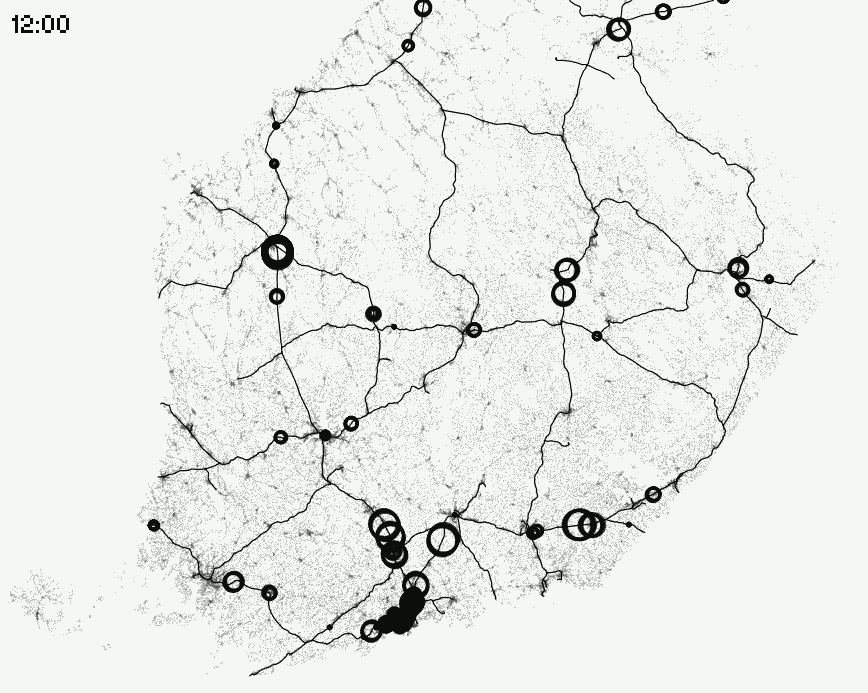

# OpenVis Conference: Data Visualization on the Open Web

"OpenVis is massively influential and packed to the gills with top talent."

### OpenVis Conference: Data Visualization on the Open Web

> "OpenVis is massively influential and packed to the gills with top talent."
> — David Mimno, Assist. Professor, Cornell Information Science

[OpenVis Conference](http://www.openvisconf.com/) is a boutique event for data visualization practice. After 5 years in Boston with [Bocoup](https://bocoup.com/), our primary sponsor in 2018 is [em **lyon business school**](http://www.em-lyon.com/en/), my employer, where I teach introductory data science and analytics courses in a new [Data R&D Institute](http://data.em-lyon.com/). We took this opportunity to move the event to Europe (Paris, May 14–16). But we felt it needed a little introduction to our new international audience!

What's in this enthusiastic, long post:

* What is OpenVis?
* What is the field of Data Visualization? (Backing up a little...)
* Getting Stats and Data Right (In Our Talks)
* Machine Learning/AI at OpenVis
* Tech Tips Talks & Map Talks
* Who Attends this Conference? Should You?
* Press Passes!
* How You Can Help the Conference!

A peak at the last point: We'd love some grass-roots help spreading the word about the conference and our workshops in Europe. We need to develop our audience reach here after our move from Boston. We also need [sponsors](http://www.openvisconf.com/#sponsorship).

### What is OpenVis Conf?

OpenVis is a top-tier conference about "open source data visualization" tools and techniques ("openvis"). "Open source" means we concentrate the talks on tools that are freely available from the open source community, rather than for-pay solutions from vendors. Our talks are educational and not sales pitches, by design. We bring together an expert speaker panel of developers, designers, data journalists and analysts, and academics focused on practice rather than solely theory or portfolio reviews. We think this makes us unique.

> "Easily the most exciting and useful practice-oriented visualization conference I've attended."
> — Professor Jeff Heer, University of Washington Data Visualization Lab and co-Founder of Trifacta

Our full [speaker program is up here](http://www.openvisconf.com/#speakers), and I'll hit the highlights with some context in this post.

### What is Data Visualization?

Data visualization is about making data visual, usually in some summary form. Business dashboards, for instance, are data visualizations. Even more basic, every bar chart is a data visualization, such as this one from **Max Roser**:
 Max Roser, [Our World in Data](https://ourworldindata.org/income-inequality)

Bar charts are typically the clearest way to express visual differences in numbers. If you don't believe me, consider this classic comparison of pie chart display (so common in business graphics!) vs. the same numbers shown in bar charts — could you tell the differences in the pie displays?
 [Wikipedia on pie charts](https://en.wikipedia.org/wiki/Pie_chart)

Our brains aren't great at processing the wedge size in pie charts, so the pie charts don't help us see the differences in the wedge size in an optimal way.

One of design goals in good data visualization is to get across the point in the most salient and obvious way possible, using visual design techniques. [Steve Franconeri](http://www.psychology.northwestern.edu/people/faculty/core/profiles/steven-franconeri.html), from Northeastern University, will talk at this year about research on the perceptual system and data visualization design. That pie chart versus bar chart example above it one of these facts about perception that can inform your design choices. Effective use of color and shape is another. Can you see the data boundaries in these two pictures? In one, you can, but the other is a much poorer design for human perception.
 (Hint: On the right side, there is a boundary where the circles and squares switch colors. (Example from a [Treisman experiment recapped by Christopher Healy here](https://www.csc2.ncsu.edu/faculty/healey/PP/).)

Although bar charts are one of the best displays for simple quantity differences, things aren't clear cut as you get more complicated. For instance, paired bars aren't always the clearest way to show differences. You might want to do some simple math and chart that instead.

[Here is an initial redesign by **Jon Schwabish**](https://policyviz.com/2015/03/30/killing-the-paired-bar-chart/) with a dot plot showing differences on his site [PolicyViz](https://policyviz.com/2015/03/30/killing-the-paired-bar-chart/). PolicyViz is a sponsor of **OpenVis Conf** and a special guest speaker the night of the 16th May in Paris, after our workshops.
 [Jon Schwabish dotplot redesign at PolicyViz](https://policyviz.com/2015/03/30/killing-the-paired-bar-chart/)

[Jon](https://policyviz.com/about/) used to work in the non-partisan Congressional Budget Office for the US government, and one of his infographics was once held up during a hearing as a decision support. That's how important data visualization is.

Our 2018 duo of dueling speakers, **Amanda Cox and Kevin Quealy** of **The New York Times**, think making too many bar charts might mean you live a "joyless existence." Amanda really likes weird charts but Kevin hates them. We're quite sure this will be a very entertaining talk from the paper that has made a real case for data visualization as a strategic journalism asset. Their cutting edge work brings them back to our speaker program over and over.

> Gregor also used to work at the NYT, but is now at [Datawrapper](https://www.datawrapper.de/) in Berlin making amazing charting tools.

Because he shares Amanda's feelings about bar charts, perhaps,[**Maarten Lambrechts**](http://www.maartenlambrechts.com/)from Belgiumwill give a talk on weird charts and how original design can help you get across your story. Here is one of [William Playfair](http://www.branchcollective.org/?ps_articles=jonathan-sachs-17861801-william-playfair-statistical-graphics-and-the-meaning-of-an-event)'s historically odd charts, which Maarten promises to justify:
 _Inquiry into the Permanent Causes of the Decline and Fall of Wealthy and Powerful Nations (Playfair, 1805,_ [_writeup link_](http://www.branchcollective.org/?ps_articles=jonathan-sachs-17861801-william-playfair-statistical-graphics-and-the-meaning-of-an-event) _)_

If I haven't convinced you yet that making good charts and visual interactives requires a combination of knowledge, design chops, and technical skill, [Miriah Meyer](https://www.cs.utah.edu/~miriah/) (University of Utah) will convince you and tell you how to bring a good process to this difficult undertaking. Miriah gives terrific talks, and is a co-author (with past OpenVis speaker [Danyel Fisher of MSR](https://www.microsoft.com/en-us/research/people/danyelf/)) on [a new O'Reilly data visualization book](http://shop.oreilly.com/product/0636920041320.do). We've been trying to get her to submit a talk for years!

On the far end of ubiquitous data visualization —computer game designers use data "vis" all the time to influence player behavior. Your stats on health are low? Eat a carrot, or catch a fish! One of our favorite and most surprising submissions this year was [**Sisi Wei** of Propublica](https://www.propublica.org/people/sisi-wei) on the topic of game design vis. She's going to talk about **League of Legends**(100 million players every month — !)and Mario Kart and how they use data design in game play.
 I think I see some bar charts here, sorry, Amanda and Kevin! (From [Your Brain on Video Games](https://tedtalkswithjae.wordpress.com/2014/12/29/6-your-brain-on-video-games/).)

Further pushing design boundaries, one of our Keynotes is from the talented founder **Caroline Goulard** and lead designer **Ludovic Riffault** for [Dataveyes](http://dataveyes.com/#!/en), a well-known French visualization design agency. I first encountered Dataveyes at a talk in NYC at [Visualized in 2014](https://vimeo.com/90340682). Dataveyes submitted so many interesting proposals and workshops this year, spanning interactive generative logos, ioT, urban visualization, and human-centered dashboard design, that we said, "Please just keynote and inspire us all!"

We are pretty sure everyone eventually visualizes transit data. Here is a sample of their Paris metro traffic visualization from [metropolitain.io](http://metropolitain.io/):
 Dataveyes: [Read about it on their site](http://dataveyes.com/#!/en/case-studies/metropolitain).

### Getting the Stats and Data Right

How important are data visualizations? [Reuters reported that President Trump likes his information supported by "visual aids like maps, charts, graphs and photos."](https://www.reuters.com/article/us-usa-trump-trip/embroiled-in-controversies-trump-seeks-boost-on-foreign-trip-idUSKCN18D0C7) We think it's pretty damned important to get them right. This is also one reason we include so much data journalism in our program. The importance of data visualization in the news is only growing. For instance, [here's a stark data visualization of what Congress has done in gun legislation since the Sandy Hook school shootings as a NYT editorial](https://www.nytimes.com/interactive/2018/02/15/opinion/congress-gun-progress.html) (spoiler: "nothing"). This is not their only visual editorial piece in in the past few months!

One of the biggest challenges in data analysis, modeling, and visualization is missing data. Missing or messy data can lead to (perhaps unintended) analysis bias and downstream policy biases for companies and governments. Sometimes missing data is intentionally missing: If it's not collected, the analysis can't be used against you. Eliminating funding for study of the impact of gun purchases on death rates or the impact of climate change on natural disasters are intentional, political data-hostile moves.

**Aaron Williams** at the [Washington Post](https://www.washingtonpost.com/) will talk about race data in the American Census and in Europe — what kinds of stories are possible when you can look at race? What if data about race isn't collected regularly (as it isn't in some European countries)? And **Nadja Popovich** of [The New York Times](https://www.nytimes.com/) will talk about visualizing climate change, an unexpectedly political topic in some countries.
 ["2017 Was One of the Hottest Years On Record"](https://www.nytimes.com/interactive/2018/01/18/climate/hottest-year-2017.html?rref=collection%2Fbyline%2Fnadja-popovich&action=click&contentCollection=undefined&region=stream&module=stream_unit&version=latest&contentPlacement=5&pgtype=collection) (Fountain, Patel, Popovich, NYT)

Even when you have the data for your visual, your analysis has to be informed by some statistical know-how. **Heather Krause** of [Datassist](https://www.linkedin.com/company/datassist/) is going to prepare us with checks against common fallacies, "to make sure the data story you're telling isn't fiction." One of them is [Simpson's Paradox](https://en.wikipedia.org/wiki/Simpson%27s_paradox), "in which a trend appears in several different groups of data but disappears or reverses when these groups are combined." (Former OpenVis speaker [**Zan Armstrong**](https://www.zanarmstrong.com/) has a paper about this in [IEEE Vis](http://ieeexplore.ieee.org/stamp/stamp.jsp?arnumber=6875927) proceedings a few years ago, co-authored with former OpenVis keynote speaker [Martin Wattenberg](http://www.bewitched.com/) of Google.)
 [Wikipedia](https://en.wikipedia.org/wiki/Simpson%27s_paradox): A positive trend appears for the two groups taken separately, but a negative trend occurs if they are combined.

You can explore Simpson's Paradox more in an [interactive visual created by Victor Powell and Lewis Lehe](http://vudlab.com/simpsons/) at UC Berkeley.

Visualizing uncertainty (estimates, model confidence...) is an on-going challenge for data visualization. Last year's [Keynote video by **Amanda Cox**](http://www.openvisconf.com/2017/#acox-video-item) is worth watching if you want to revisit some of the anxiety of depicting election uncertainty (jiggling dials, for instance). This chart from her talk about how humans relate words to probability was the most popular RT of the conference last year (thanks @rsimmon!):

>

[**Matt Kay**](https://www.si.umich.edu/people/matthew-kay) from the University of Michigan is going to speak this year about using Bayesian stats to get better interpretable estimates of uncertainty and their use in visuals like medical risk communication, hurricane paths, and transit arrival times. He'll be demonstrating with R and [tidy data](https://cran.r-project.org/web/packages/tidyr/vignettes/tidy-data.html).

### Machine Learning and AI at OpenVis

Our program evolves every year based on community input and the "zeitgeist" of what's going on out there with data, tools, and techniques. No one can deny that with big data came complex models and deep networks. Lots of us in the data visualization world are using ML techniques to mine our data, summarize it, display it better; or are being given machine learning models to visualize and clarify for end-users and decision makers.

**Ian Johnson**and **Shan Carter** are both coming from Google, one of the most active open sourcing AI companies, to talk about machine learning and data visualization. We've been trying to get submissions from [Google Brain](https://research.google.com/teams/brain/) for a few years now, and we couldn't be happier to have them here in 2018.

**Ian**, who is a prolific community builder for the popular [D3.js visualization library](https://d3js.org/) in Silicon Valley (and [d3.unconf](http://visfest.com/d3unconf-2017/) organizer), has worked on tools to analyze and visualize the famous "[Quick, Draw](https://quickdraw.withgoogle.com/)!" dataset of sketches. He posted [here](https://cloud.google.com/blog/big-data/2017/12/drawings-in-the-cloud-introducing-the-quick-draw-dataset) about the open sourcing of the data. This dataset has been a source of many interesting data visualizations and applications over the past year, including [Bad Flamingos](http://colinmorris.github.io/badflamingos/) by Colin Morris, one of my favorites! But more seriously, there is beautiful work at [Formafluens.io](http://formafluens.io/), a [report in Quartz on circle drawing by country](https://qz.com/994486/the-way-you-draw-circles-says-a-lot-about-you/), and an analysis of [dog and cat drawings](http://vallandingham.me/quickdraw/) by [**Jim Vallandingham**](http://vallandingham.me/) (on our OpenVis Program Committee).
 ["The Way You Draw Circles Says a Lot About You"](https://qz.com/994486/the-way-you-draw-circles-says-a-lot-about-you/) (Ha & Sonnad, Quartz).

**Shan Carter**, who was previously at The New York Times as a data journalist, now works in the Google Brain team on [Distill](https://distill.pub/), a visual journal aimed at making complex research ideas in machine learning, AI, and computer science more understandable to a broad audience. The journal's mission statement could be a mission statement for OpenVis talks: "devoted to clear explanations, native to the web." (Their Steering Committee has 3 former OpenVis keynote speakers on it: **Amanda Cox** of the New York Times — speaking again at OpenVis 2018, **Mike Bostock** of NYT, D3.js, and [Observable](https://beta.observablehq.com/) fame — giving a workshop at OpenVis 2018, and [**Fernanda Viegas**](https://www.bostonglobe.com/business/2017/12/08/google-she-working-invent-future/zY0LF3KhAjqrlc3TWDJLPM/story.html) in the Google "Big Picture" group.)

The background post motivating Distill ([Olah & Carter, 2017](https://distill.pub/2017/research-debt/)) describes "research debt," the lack of interpretable, accessible explanations of research for a broad audience. The aim of **Distill** is to provide a forum for interactive visualizations and explorations of technical academic work. Shan will walk us through some lessons learned from the past year of work on this publication.
 ["Feature Visualization"](https://distill.pub/2017/feature-visualization/) (interactive detail from Distill article by Olah, Mordvintsev, Schubert, Nov 2017)

Understanding how to use machine learning tools and results is becoming increasingly important for all of us. I have it on good authority (ok, email) that one of our fabulous Keynotes, [**Moritz Stefaner**](https://truth-and-beauty.net/), will be addressing how machine learning is impacting his data visualization work. Moritz is a well-known, multi-award-winning consultant who works on large, impactful projects especially in the realms of science & research, economics, social media, and [cuisine](http://data-cuisine.net/). We may be hearing a big about [his tool-design for the Deutsche Bahn](https://truth-and-beauty.net/projects/peakspotting) to track train traffic in Germany (see, transit data!).
 ["Peak Spotting"](https://truth-and-beauty.net/projects/peakspotting) by Moritz Stefaner

### Developer Tips Talks

Tools have always been an important part of the OpenVis program. Tool builders and vendors are always working on how to make visualization simpler for the non-technical, or for those suffering from "big data." This year we've moved some of the more technical how-to into our Workshop program, and tried to "up-level" the technical talks into broader design lessons.

[**Jan Willem Tulp**](http://tulpinteractive.com/), a well-known figure in the data visualization consulting world, will present a cross-tool design architecture deep dive on how to combine WebGL and D3.js for performance, referencing several projects including his 3d Star Mapper:
 [Star Mapper](http://sci.esa.int/star_mapper/) for the European Space Agency by [Jan Willem Tulp](http://tulpinteractive.com/)

In another talk on 3D design, [**Brian Jacobs**](http://briantjacobs.com/) from National Geographic will talk about making animated browser graphics about dinosaurs and space. (Dinos and space!!) His talk will include some discussion of [photogrammetry](https://en.wikipedia.org/wiki/Photogrammetry), which is a method of extracting dimensional info for 3D renderings or animations from photographs. We're always interested in new data sources! Brian works a lot with [three.js](https://threejs.org/) for the 3D side, which we've also been wanting to hear about.

If you want a taste of Brian's work, he just released [a beautiful project](https://www.nationalgeographic.com/magazine/2018/03/bird-migration-interactive-maps/) with detailed animations of bird migrations based on open data from [ebird](http://ebird.org/), a "citizen science" bird tracking site.
 ["Billions of Birds Migrate: Where Do They Go?](https://www.nationalgeographic.com/magazine/2018/03/bird-migration-interactive-maps/) " (Brian Jacobs, Nat Geo)

Our post-conference Workshop program also has a number of performance-related talks. [MapD](https://www.mapd.com/) will present their amazing multi-GPU in-memory SQL system, which supports incredibly fast queries for live data vis of big data. [Bokeh, the Python visualization library](https://bokeh.pydata.org/en/latest/), will be introduced with a focus on big streaming data by **Bryan Van de Ven** of [Anaconda](https://anaconda.org/).

Other development workshops include an introduction to [D3.js](https://d3js.org/) by [Romain Vuillemot](https://romain.vuillemot.net/), my colleague from [Ecole Centrale de Lyon](http://www.ec-lyon.fr/en), a D3.js with React workshop (pending confirmation), and a tutorial on using [Vega-Lite](https://vega.github.io/vega-lite/).

We're also extremely pleased to offer (we think) the first workshop on how to work with the new [Observable web notebooks,](https://beta.observablehq.com/) the new reactive communication tool created by two-time OpenVis Keynoter [**Mike Bostock**](https://bost.ocks.org/mike/)(dev assisted by former OpenVis speaker [**Tom McWright**](https://macwright.org/) **,** among others).

There are already lots of beautiful observable notebooks to view, including a set on [Visualization examples](https://beta.observablehq.com/collection/visualization), one on [maps](https://beta.observablehq.com/collection/maps), one on using [WebGL (and three.js](https://beta.observablehq.com/collection/webgl)) and one on [interactive explorables](https://beta.observablehq.com/collection/explorables).
 [Observable vis examples](https://beta.observablehq.com/collection/visualization)

In a perhaps related main conference talk, [**Jo Wood** from City University of London's giCentre](https://www.gicentre.net/jwo/index/) will describe what he calls "Literate Visualization," offering both a new toolkit and a theoretical position on the process of designing visualizations interactively and mixing narrative with code.

On the cutting edge, we have another position paper framework presented by [**Benjamin Bach**](http://www.aviz.fr/~bbach/homepage/index-homepage.html) (University of Edinburgh) on Augment Reality ("AR") and data visualization. AR is sprucing up journalism and games and ebooks and apps these days, and we're really excited to see what it can do with visualization. (My student's demo of putting a 3D dinosaur on a friend's arm with her Windows 10 laptop was actually a lot of fun.)
 ["Augmented Reality: How We'll Bring the News Into Your Home](https://www.nytimes.com/interactive/2018/02/01/sports/olympics/nyt-ar-augmented-reality-ul.html) " (Roberts, NYT, Feb 2018)
>

### Maps and Data Visualization

Data visualization includes infographics and interactives that tell stories too. [**Federica Fragapane**](https://www.behance.net/FedericaFragapane), another speaker this year, will talk about storytelling and empathy building in her beautiful, artistic [projects](https://www.behance.net/FedericaFragapane). One of her recent award-winning pieces is this investigation of the journeys of immigrants to Italy, [The Stories Behind a Line](http://www.storiesbehindaline.com/).
 [Stories Behind a Line](http://www.storiesbehindaline.com/), Federica Fragapane and Alex Piacentini

Maps are a key aspect in many data visualization projects of world data. Making good maps presents special challenges in the web browser, for both design and performance reasons. This year [**Erik Escoffier**](http://nerik.github.io) will be teaching people how to use [OpenStreetMap](https://www.openstreetmap.org/#map=6/46.449/2.210), one of the most amazing free data sources online, to go from city scale to planet scale and render happily in the browser (with the help of WebGL).

[Topi Tjukanov](https://tjukanov.org/), a recent talent in "geo" visualization from Finland, will talk us through how he makes his amazing animated and artistic maps with open-source QGIS and PostGIS. [His site](https://tjukanov.org/) has really beautiful work on it including this one of trains moving in Finland:
 [Bubbling Trains](https://tjukanov.org/bubbling-trains/) by Topi Tjukanov

We think map making is so important that we've also added 2 workshops on geo data to the Workshops Program. **Rob Simmon** from [Planetlabs](https://www.planet.com/) (formerly NASA) will walk people thru retrieving open source satellite image data and color correcting it, among other operations; and [**Eugene Chen** from DarkHorse Analytics](https://www.darkhorseanalytics.com) will teach us how to make detailed maps using MapboxGL.

### Okay, But Who Attends? Should You?

The conference attracts an audience that includes technical people (including data scientists and web developers), designers, analysts, managers, consultants, and journalists — anyone who needs to communicate data clearly to a lay-audience and wants to do it visually. For most of them, communicating data well is a crucial responsibility. The conference is technical, but there are a lot of design-oriented talks, and the technical talks are chosen to be educational and interesting to a more lay audience (visually, at any rate!).

> "OpenVisConf has become the ultimate meeting point for the visualization community, welcoming to newcomers as well as longtime visualization practitioners, researchers, and enthusiasts. The conference program always achieves the right balance of technical and theoretical content, delivered by an engaging and accomplished set of speakers; it also reflects the diversity of disciplines and contexts in which visualization occurs, so whether you're a journalist, a scientist, an educator, or an artist, I can't recommend OpenVisConf highly enough."
> — Matthew Brehmer, Microsoft Research

In the past, our attendee affiliation has been as stellar as our speakers' affiliations, which is the way it should be. This is a community-oriented conference where people network. A sample pulled from last year's affiliations:

_Spotify | Axis Group | Qlik | Capital One | ESRI| Netflix | Yale Digital Humanities Lab | Consumer Financial Protection Bureau | Datto, Inc | The Financial Times | Flourish | Stiftelsen | Gapminder | The Boston Globe | Velir | AirBnB | Autodesk | Bloomberg | Fjord | KGS Buildings | Mathematica | Policy Research | Microsoft | Oracle | Accenture | Bastille Networks | Quantum Black | Reuters| Stevens Institute of Technology | StitchFix | Talus Analytics | Twitter | World Bank | Yale University | Zillow | Crowdstrike | Continuum Analytics | Tableau | Facebook | Fidelity Investments | Harvard University | Intel | MongoDB | Pew Research Center | Apple_

We want this to be a useful networking conference. We're cautious about growing too big because we want to be able to talk to each other and to allow people to talk to the speakers during the breaks and lunches. We're working on some ways to improve our attendees' ability to meet people with similar interests. But we have some reports of successes already from past speakers:

> "At OpenVis, I built relationships that have resulted in real, compelling projects; I launched an interactive visualization project this year with a collaborator who I never would have met without OpenVis. I learned so much since the talks ranged from areas close to my expertise as a data scientist to areas much further away in the worlds of design and front-end data visualization technologies."
> — Julia Silge, Data Scientist at Stack Overflow

[Data Sketches](http://www.datasketch.es/) was a collaboration between [Shirley Wu](http://sxywu.com/) in San Francisco and [Nadieh Bremer](https://www.visualcinnamon.com/) in Amsterdam that started with a meeting at OpenVis and turned into a joint talk last year ([video here](http://www.openvisconf.com/2017/#wu_bremer-video-item)) and an award at an annual visualization contest:

>
>

### Press Passes!

We'd love press to attend and write about us. If you can give us some credentials that show your audience reach and previous work, as well as your topical interest in covering OpenVis, please [get in touch](mailto:%20openvisconference@gmail.com).

### How You Can Help Us

We've been successful in Boston, but this year we need to reach a European audience too. If you are a web developer, a data scientist, a business analyst with a web product, a researcher on data vis wanting to learn the cutting edge in practice — we're here for you. We can already tell from the early registrations that it will be another all-star audience, too.

But we could use your PR and marketing help. Can you help with grass-roots emails to your Meetups and colleagues, with tweets and Facebook posts? We have a new [Facebook page](https://www.facebook.com/openvisconf/) (admittedly it needs more attention), an active Twitter account that I read daily ([@OpenVisConf](https://twitter.com/openvisconf?lang=en)), and [a web site](http://www.openvisconf.com/) where you can also find a mailing list sign-up at the bottom, along with all our awesome previous conference sites and their videos.

Our [ticket purchase link is here](http://www.openvisconf.com/#register). Our workshops will be available as a separate charge from this week, which means non-attendees can register for them alone, if they want!

If you want to be up-front and center as a sponsor with this amazing audience, [our sponsor packet](http://www.openvisconf.com/openvis-conf-2018-sponsorship-prospectus.pdf) has a lot of details about the event.
 Credit: @tcash41

Most of all, please come! We'd love to meet you and extend our community of expertise into Europe and learn from you. We don't know where we'll be next year— but we'd love to see you in Paris in 2018!
 The best data vis conference ever. [Our website is here](http://www.openvisconf.com/#home).

Best wishes, Lynn / [@arnicas](https://twitter.com/arnicas) (speaking for em **lyon** and the Program Committee mostly without their review)

By [Lynn Cherny](https://medium.com/@lynn-72328) on [<time>March 5, 2018</time>](https://medium.com/p/91f46271e22e).

[Canonical link](https://medium.com/@lynn-72328/openvis-conference-data-visualization-on-the-open-web-91f46271e22e)

Exported from [Medium](https://medium.com) on February 15, 2022.
