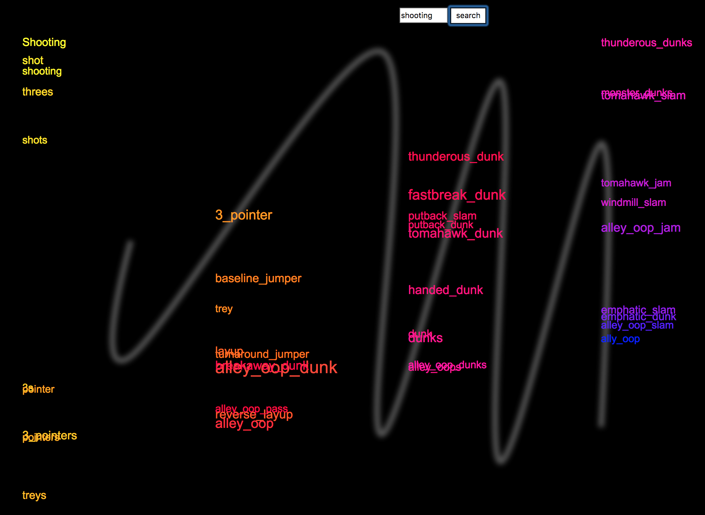

# My AI-Art Talk for Resonate

Earlier this year, I was one of the folks invited to speak at Resonate Festival who didn't end up going, after they dropped out of touch in...

### My AI-Art Talk for Resonate

Earlier this year, I was one of the folks invited to speak at Resonate Festival who didn't end up going, after they dropped out of touch in a funding & communications fiasco. (And [last year had issues too](https://medium.com/@thomasankersmit/dont-go-to-resonate-festival-in-belgrade-a-warning-to-artists-and-audiences-f77524f171bb), evidently. I wish folks had spread the word a bit more.) At the point where it was clear they weren't sending my travel info, I had already spent 5 days prepping cool new AI art toys for a new talk— so, hey, blog post!

### Toy1: Word2Vec Distances in Poetry

This project was inspired by [Mario Klingemann](https://twitter.com/Quasimondo)'s [a2b_bot](https://twitter.com/a2b_bot?lang=en), which walks through closely related words in word2vec space. Word2Vec is essentially a model of text similarity, in which words with similar contexts appear "near" each other in the model.

>

While I love it, I wanted to make a more visual treatment that captures the distances between adjacent words. I wanted to use pretty words, not so much "urinal," so I made a w2v model of [Allison Parrish](https://www.decontextualize.com/)'s Gutenberg poetry corpus ([available via this project](https://github.com/aparrish/plot-to-poem)).

I loaded that up in a Flask API, which I then repeatedly queried to create a visual poetic display (coded in d3.js). It is read in the direction of the swoopy background curve, left to right, top to bottom. The seed word here is "fire," and these are the words closest in this corpus.


Relative distance vertically suggests the distance relationship. The closest neighbor to the word "burning" in this corpus is "folded." But "folded" isn't super close, compared to, say, the distance between "shiny" and "roofed" in the second column.

The drift in apparent topics as the words chain is really interesting to me. In this set of words, we move from fire to cloth to roofs and maybe cliffs, then woods and gorges and back to woods and full circle to steaming.

Larger-sized fonts encode words that were close to many other words in the list; but I didn't allow loops to occur in the output. If a word already appeared on the list, it was not allowed to appear again, but its occurrence count was incremented. So, above, "gulfs" and "glossy" occurred quite often in this word chain of nearest relations.

Here's another word's chain — "climb." Toward the end we hit the non-English bits of the corpus, which may happen with words with too few relatives to start with.


Here's what happened when I had loops initially — too many repeats, including, as a bonus, a crazy, broken animation:


Out of curiosity, I tried another big word2vec model (the Google News model), which was much slower over the API, given its size. The results were definitely **not** poetic.


And who really knows what's up here with "shooting," except thankfully it's about basketball and not gun violence:


This visual toy is certainly a case where the design was done FOR the model and data, and a new data model would require some significant changes in the output design (spacing for overly close words, handling those compound "_" labels, for instance).

Doing this project gave me a lot more ideas about ways to display this, which is essentially the point of the fast prototype! I'll keep iterating, if I get another conference invite.

### Toy2: Telephone Translation

I've wanted to build a good telephone message game prototype for a while, and this talk gave me an excuse. I borrowed and modified this code from [Atul Pandit for ball collisions in D3](http://bl.ocks.org/atul-github/0019158da5d2f8499f7f) to make the toy.

The game is this: I have an important message — like, who killed who and where, or where to meet me— and I pass it on to someone who doesn't speak English. They pass it on to another person who doesn't speak English. Maybe they then pass it back, who knows. Essentially, every time there is a meeting between two speakers, they communicate the news, in their languages, using some translation tool to translate between them.

At the end, we see how it turned out. (I had this recently in Rome with hosts who used Google translate to communicate with me for the entire checkin and payment process.)

I'm using [Yandex's language translation API](https://translate.yandex.com/), which is easy to use and handles at LOT of languages, but because I'm limited in free calls, I'm not posting this app, I'm afraid. The UI looks like this, with ball collisions for speakers running into each other and passing on their messages (English is black):


You choose your number of speakers (balls) and they collide and pass on their messages. Even if they hit the English speaker again, they don't correct their translation, they stop listening after the first message is passed. The way humans do.

My first test was an example from undergraduate linguistics lore. [Norbert Hornstein](http://ling.umd.edu/~hornstein/) at UMD reported in class that an early translation of "the spirit is willing, but the flesh is weak" into Russian resulted in "The vodka is good, but the steak is not so great."

But actually, our ball agents do pretty well on that! Even when one is randomly assigned as Russian. I can stop the collisions and check by clicking on a ball what their current translation is (converting it to English, natch, to see where we are at). The translation state for each ball is on the right.


Other, more crucial sentences, do not go as well. For instance, if you have a mystery killer reveal that "the butler murdered him with the revolver in the salon, in cold blood," the facts get all convoluted.


You have to respect the Thai message, "is that a bar there?" in the middle of a Poirot-style detective reveal. Meanwhile, the Russian (of 61 collisions) has understood that it's a manager who was killed in a cabin. A lonely snowy cabin in the woods, I guess.

Now, suppose you have an important espionage meeting, and you pass it on to your foreign-language speaking network. "Meet me at noon under the bridge by the supermarket, come alone." They pass it on, and so on. But pretty soon there is **_"the food, the wine!"_** It is the Spanish and Italians who have gotten off topic, apparently. (The Russians are only sure the bridge is **in** the supermarket, because supermarkets are that extravagant.)


When I run that one again, the Italians continue to get derailed by the idea of a supermarket full of wonders, and have apparently infected the Danish:


What if we are doing diplomacy? Suppose there is an important meeting on the 12th in Trump Hotel, and we're paying for an outrageously expensive room. This goes badly, in fact, although the Maltese are the most fanciful with their "Crossing of the Hotels."


### Toy3: Image Reduction with Image Recognition and Poetry

This last toy is closer in spirit to what I did in my [KIKK Festival talk](https://medium.com/@lynn_72328/cocos-memory-palace-a-strange-fantasia-28b48264612f), a talk I actually gave (and wrote up [here](https://medium.com/@lynn_72328/cocos-memory-palace-a-strange-fantasia-28b48264612f)). In that series of toys, I reduced images to black and white and colorful text; and I used object recognition APIs and models (like COCO) on photographs to construct poems. In this toy, I combine the two operations into a simpler model.

I use images from social media (or anywhere), run Amazon's [Rekognition API](https://aws.amazon.com/rekognition/) on them to identify key objects in the picture, choose an object or two to look up matching lines of poetry in a sqlite database of Allison Parrish's Gutenberg poetry corpus; then turn the image into black and white via a threshold operation, composite that image with text from the poem and RGB object labels from the API. Tada! Well, it's a lot of simple steps, and some surprisingly interesting results. The text is placed randomly; the poetry is underneath the image, and the object labels are on top. Sometimes great poetry is covered up almost entirely, but that's "art."

Here's the main code loop (sorry, not sure how to format it right here):

> def make_combo_from_poem(file, poemlist):<br>
from collections import deque<br>
<br>
fg = binary_pic(file)<br>
foreground, size = load_transparent(fg) # returns size too of the image file<br>
queue = deque(poemlist)<br>
background = make_text(queue.popleft(), size[0], size[1]) # main poem<br>
background.save("output/text/" + os.path.basename(file) + ".png") # saves the text bg file<br>
back = combine(background, foreground)<br>
for word in queue:<br>
newback = put_text_on_top(back, word) # keyword<br>
newback.save("output/poemimgs/" + os.path.basename(file) + ".png")

Here's some of the text output from one image — the recognition results and the lines of poetry I'll work with:

```
{'Name': 'Castle', 'Confidence': 99.12834167480469}{'Name': 'Housing', 'Confidence': 93.01422882080078}{'Name': 'Monastery', 'Confidence': 93.01422882080078}[(1151, 'castles shall be subject to my hand."', 254), (1151, 'known to you whose are these castles and this lordly land?"', 404), (38468, "Caparison'd all richly with silken housings rare", 1988), (30659, 'To where the monastery stood.', 1916), (31314, 'Stands his little monastery,', 6758)]
```

For example, here is the source image:


And here is one output after processing it (the results can vary due to randomness in placement and poem line choice):


Cool, huh?

Another pair:


More result images:


Well, we can't always be poetic. But when we're not, hopefully we're funny.

### In Conclusion

I don't really regret working on these — I had a bad 6 months of stress and this was actually a nice break, even if I didn't feel I could afford the time. When you make toys that you find it fun to play with, you're doing good things for yourself. (Suggested follow-up reading: [Brendan Dawes, The Point of Making Pointless Things](http://brendandawes.com/blog/makingstupidstuff), although I'm concerned about our collective constant focus on doing fun things because they might pay off in work later. Also, [my essay from my KIKK talk](https://medium.com/@lynn_72328/cocos-memory-palace-a-strange-fantasia-28b48264612f) is much better written and more thoughtful.)

So, anyone want me to give a talk? I'm available now that classes are over. I'm currently based in France.

#### More where this came from

This story is published in [Noteworthy](http://blog.usejournal.com), where thousands come every day to learn about the people & ideas shaping the products we love.

Follow our publication to see more product & design stories featured by the [Journal](https://usejournal.com/?utm_source=usejournal.com&utm_medium=blog&utm_campaign=guest_post) team.

By [Lynn Cherny](https://medium.com/@lynn-72328) on [<time>June 3, 2018</time>](https://medium.com/p/229a778d5484).

[Canonical link](https://medium.com/@lynn-72328/my-ai-art-talk-for-resonate-229a778d5484)

Exported from [Medium](https://medium.com) on February 15, 2022.
