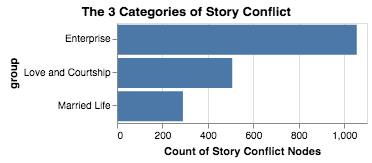
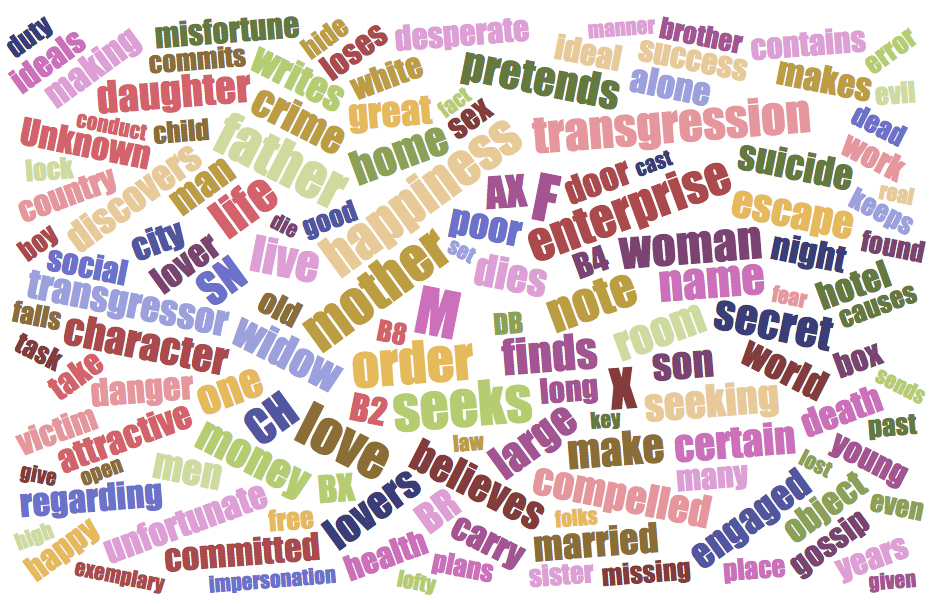
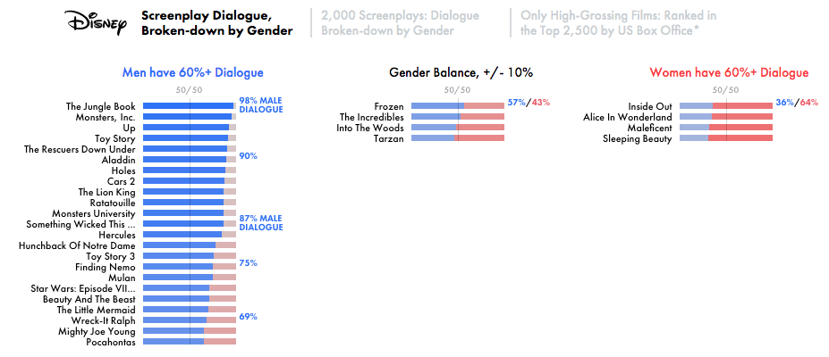

# "Plotto": Generating Truly Offensive Stories Since 1928.


Tl;dr: I wrote a lot of code to generate stories from the 1928 writer's manual " **Plotto**," and then I looked at the data and decided that just because I could, it wasn't a good idea. I'm not releasing that dataset and code.

There are 2 primary parts to this: The data analysis, and the reflection on what that data means against other related cultural data explorations and current events. This #longread may be of interest to folks who are into procedural content generation, digital humanities, AI art, and data visualization/analysis. (My original talk slides, given as an invited talk during Nantes' Digital Week at [l'Ecole de Design](https://en.lecolededesign.com/news/datarama-interview-lynn-cherny-3059), differ slightly and are [here](https://ghostweather.slides.com/lynncherny/deck-15), while the talk video is [here](https://vimeo.com/294572664).)

### Tools For StoryTellers

Mostly as a background hobby, I'm interested in tools that help creatives create. I've worked on complex, expensive software for creatives before (e.g., at Adobe, Autodesk, and SolidWorks), but these days I'm personally focused more on story & poetry creation through either procedural generation ("procgen") or AI-assisted means. (You can find some talks I've given about this in my other [Medium articles](https://medium.com/@lynn_72328) and in a video at [Eyeo Festival 2016](https://vimeo.com/178239200).)

I'm gonna bypass the literature references for "story" (I'm not an academic anymore, w00t!) but give you my very simple working definition:

> "Story: A sequence of events that someone reports."

So, in a story, events happened, and they could be fictional or not, of course. Someone thought these specific events were important, and told some audience about them. A possibility of cause-and-effect is suggested in the telling of multiple events in some kind of relationship to each other (the "sequence" part). But the reporting may be done in an artistic, non-linear, or otherwise "interesting" way. (There are dissertations suggested by all of these assumptions, sure!)

[Pixar's famous story creation rules](http://www.pixartouchbook.com/blog/2011/5/15/pixar-story-rules-one-version.html) suggest one template that supports my definition, although it's more operational with all the connectives:

````
_Once upon a time, there was _____. Every day, _____. One day, _____. 
Because of that, _____. Because of that, _____. Until finally_____._
````

Here we have a setting of norms established. Then something unusual happens, the initiating incident that makes a story unfold. There follows the crucial sequence of events. And then it "ends" (at some point that the storyteller thinks is the end).

When we talk about tools to support creating stories, we have a huge inventory of tool-types to work through. I'll arbitrarily split them into 2 types:

* Tools that support the creation of the form: Including stuff like screenplay formatters, Word and other word processors, Adobe tools, even Powerpoint and Keynote, game engines like Unity, etc.
* Tools that support the content creation itself: Clip art libraries, thesauri, and what I'll call inventory systems, which might be combined in various creativity-prompting games or activities.

Certainly there is sometimes overlap in the two, which is an interesting area to live for a software provider.

### Inventory Systems

An example of a simple creativity prompt tool using an inventory system is Rory's [Story Cubes](https://www.storycubes.com/) dice. This is analogue, highly successful, and a great basic example.

<p align="center"></p>
<p align="center"><i><a href='https://www.amazon.com/Gamewright-318-Rorys-Story-Cubes/dp/B003EIK136/ref=sr_1_1_sspa?s=toys-and-games&ie=UTF8&qid=1538905290&sr=1-1-spons&keywords=story+cubes&psc=1'>Amazon Link</a></i></p>

Given a fixed set of images on the die, the "player" rolls them and then uses the images as inspiration to create a story linking them (order, cause-and-effect...). Although marketed mainly as a kids' toy (like many creativity tools, smh), their corporate blog features examples of them used in various adult creativity acts, from [character background creation in games](https://www.youtube.com/watch?v=3Mvv5N16OsU) to [comics](https://www.storycubes.com/gallery/ross-bamfylde).

So what goes into an inventory system? Apparently with the right simple design, you can start really small and get paid to grow. Rory's Cubes expanded the system based on enormous sales success, and now you can buy imagery inspired by different existing media "[StoryWorlds](https://www.storycubes.com/shop/#storyworlds)", like **Scooby Doo** and **Dr. Who**, and my favorite, the [**Moomins**](https://www.moomin.com/en/). I guess this is the fan-fiction version of the die?

Examples of more scholarly, rigorous inventory systems come from folklorists and anthropologists like Victor Propp and Stith Thompson, originally in book form. Propp's [Morphology of the Folktale](https://monoskop.org/images/f/f3/Propp_Vladimir_Morphology_of_the_Folktale_2nd_ed.pdf) is well-known among narrative studies researchers and games scholars. Examples of his derivative motifs, which seem incredibly general:

> VIIIa. ONE MEMBER OF A FAMILY EITHER LACKS SOMETHING OR DESIRES TO HAVE SOMETHING. (Definition: lack. Designation: a.)
> IX. MISFORTUNE OR LACK IS MADE KNOWN; THE HERO IS APPROACHED WITH A REQUEST OR COMMAND; HE IS ALLOWED TO GO OR HE IS DISPATCHED. (Definition: mediation, the connective incident. Designation: B.)

Recent computational narrative work has been re-inspired by his system, such as W. Victor H. Yarlott and Mark Finlayson's 2016 "[Learning a Better Motif Index: Toward Automated Motif Extraction](http://drops.dagstuhl.de/opus/frontdoor.php?source_opus=6708)," and [Gervás 2013 in "Propp's Morphology as a Grammar for Generation"](http://drops.dagstuhl.de/opus/volltexte/2013/4156/pdf/p106-gervas.pdf). (As a non-trivial aside, some excellent coverage of early computational creativity systems, including those two, can be found in [James Ryan](https://www.jamesryan.world/publications/)'s paper on [Grimes's 1960's story generation system](https://www.researchgate.net/publication/319301897_Grimes%27_Fairy_Tales_A_1960s_Story_Generator).)

The Stith Thompson Motif Index, published as several volumes in the 1950ies was entitled " **Motif-index of Folk-Literature : A Classification of Narrative Elements in Folktales, Ballads, Myths, Fables, Mediaeval Romances, Exempla, Fabliaux, Jest-books, and Local Legends."**It ismuch larger and more detailed than Propp's work. For years I waited for it to show up in a searchable online database. Thanks to grant support, it does exist in a [simple hyptertext form at U of Alberta](https://sites.ualberta.ca/~urban/Projects/English/Motif_Index.htm). Here's a sample page:

<p align="center"></p>
<p align="center"><i> <a href='https://sites.ualberta.ca/~urban/Projects/English/Motif_Index.htm'>S. Thompson Motif Index at U of Alberta</a><p align="center"><i></i></p></i></p>

On the very much less academic front, and geared towards authorship, we have the inventory system in the book "[Plotto](https://www.amazon.com/Plotto-Master-Book-All-Plots/dp/1941040551/ref=sr_1_1?ie=UTF8&qid=1538907060&sr=8-1&keywords=plotto)," created entirely by William Cook.

### What's Plotto?

"[**Plotto: The Master Book of All Plots**](https://www.amazon.com/Plotto-Master-Book-All-Plots/dp/1941040551/ref=sr_1_1?ie=UTF8&qid=1539711738&sr=8-1&keywords=plotto)" (Amazon title!) was written by William Cook in 1928. I have had the physical book for years, which is a gorgeous object, but I have always wanted a digital database of the contents.

<p align="center"></p>

Cook is pretty proud of his creation and has this exalted dedication to the glory of Creativity and Creators everywhere:

> "The Soul, with its human faculties which put it in immediate touch with the Universe, is a Divine Instrument, an Aeolian Harp which is not played upon by the Winds of Chance but by all the Winds of Destiny that blow from the four quarters of Human Nature; and this Music of the Soul is a Divine Harmony which the Creative Imagination, alone of the human faculties, interprets in Creative Art. To this high interpretation, through fictional narrative,
> Plotto is dedicated."

It's probably worth remembering this insanely over-the-top dedication when we get into the plots it contains. Plotto's plot inventory system looks like this:

<p align="center"></p> 
<p align="center"><i><a href='https://garykac.github.io/plotto/plotto-mf.html'>Screencap</a></i></p>

Cook's system is broken at the top level into major plot types, and here we see the "Love and Courtship" and "Love's Beginning" Type and Subtype. Then we are looking at plot conflict entries labeled 1 a through c. Each of them represents a conflict, such as "A, poor, is in love with wealthy and aristocratic B." Some conflicts have more than 1 clause, according to the expansions after the asterisks. Each conflict has conflicts that might precede it, indicated above (e.g., 112 before 1a), and conflicts that might follow it, indicated below (e.g., 187).

Cook uses a system of character codes of binary and explicit gender, which are these — I think you can also see how character is simplified and codified, given the very specific, limited roles (cop, boss, "inferior"...).

<p align="center"></p>

Also, there are various annotation notes that require manipulations of the stories as you move between them, such as transposing characters or changing characters.

<p align="center"></p>

This " **Plotto"** book clocks in at 480 pages printed. There are 1852 conflicts in it. I never read it cover to cover, I just flipped around in it and giggled at it. I'm boggled at the work that went into creating it, and imagine mansions with walls covered in 1920's notecards and string. The biography of him on Amazon explains a little bit about what his source of inspiration was:

> William Wallace Cook was born in Marshall, Michigan, in 1867. He was the author of a memoir, The Fiction Factory, as well as dozens of Westerns and science-fiction novels, many of which were adapted into films. He was nicknamed "the man who deforested Canada" for the volume of stories he fed into the pulp-magazine mill. He spent five years composing Plotto before finally publishing it in 1928. Cook died in his hometown of Marshall in 1933.

And I kind of think this reviewer is right —

<p align="center"></p> 
<p align="center"><i><a href='https://www.amazon.com/Plotto-Master-Book-All-Plots/dp/1941040551?keywords=plotto&qid=1537014013&sr=8-1&ref=sr_1_1'>link</a></i></p>

Obviously anyone interested in narrative generation would want to turn this sucker into a generative system. I know at least two others who've noodled around with it too (including [Mark Riedl](https://www.cc.gatech.edu/people/mark-riedl) at Georgia Tech, who probably encountered the same things I'll be describing here).

Well, saving me a lot of trouble, one [Gary Kacmarcik](https://garykac.github.io/plotto/plotto-mf.html) on Github got a digital (maybe OCR?) version of " **Plotto**" cleaned up somehow and built out the [hypertext version](https://garykac.github.io/plotto/plotto-mf.html) of " **Plotto**." His faithful digital representation of the book allowed me to move on to the more interesting problem of using it as a tool for story generation.

But now I'll just quickly summarize: There were months of occasional Python hobby work that was tedious and uncovered lots of errors in the system (numbers that went nowhere, typos and inconsistencies in the labels and character codes, bad punctuation that broke code, yadda yadda); but in short I parsed the HTML from Gary, wrote up regex rules and generative code for the transformation and transposition character rules, iteratively cleaned the conflicts as errors were found, built a chaining system to randomly produce plot steps, converted it into "readable" text with text substitution functions. Hackery fun!

### Generating Stories from Plotto

So, a simple story generation from " **Plotto**" might involve these steps:

```
Random starting conflict: 932Possible successor conflicts: ['598', '835', '1460']
```

Then, we expand the text of the start conflict and a random successor:

```
number 932A-0 is a writer who plans to work up a pet idea into a story * A-0, a writer, before he begins work on a story, wishes to make sure that the tale he has in mind will be interesting to the general public. He plans to settle the question by secret enterprise **number 598A-0, an author, impersonates the crook hero of a story he is writing for the purpose of obtaining situations and "local color" * A-0, a novelist, impersonates the hero of a story he is writing and becomes involved in an unpleasant complication **
```

To make it more readable, we follow the character replace/swap instructions and replace strings with their full text:

```
Male protagonist is a writer who plans to work up a pet idea into a story. Male protagonist, an author, impersonates the crook hero of a story he is writing for the purpose of obtaining situations and "local color".
```

As you can see, no care has been taken to handle pronouns or names elegantly, I just performaed simple string replacements in the fields denoted by "A-0" and other codes.

Other examples of simple 2-part chains include:

```
Female protagonist goes innocently with male rival or enemy of male protagonist, a friend, to pass a few days at a summer resort. Female protagonist has committed a secret transgression in order to help her husband, male protagonist.
```

For more complex versions involving multiple conflicts, some examples are here (sure, I should have used names to make it more readable):

```
Male protagonist, on his sacred honor, has promised his friend, male friend of male protagonist, that he will do whatever male friend of male protagonist shall require of him. Female protagonist's father, father of female protagonist, fails in his attempt to subdue and control father of female protagonist, a "wild" and unmanageable youth left in his charge. Male protagonist is a woman-hater, but he is rendered a service by female protagonist which causes him to revise his opinions of the opposite sex.
```

```
Male protagonist is an aristocrat; and female protagonist, the woman he loves, is a "daughter of the people" and hates the aristocracy. Female protagonist receives a letter from an unknown source. Male protagonist, harassed by gossip that reflects on his integrity, seeks deliverance from false suspicion.
```

You can probably guess from "woman-hater" and some other clues that I found the plots and characters a bit — well, _antiquated,_ in terms of gender roles. Indeed, even Gary, who implemented the hypertext version, must have been annoyed, because he added a "gender swap" toggle at the top of the page, which just changes all the A's to B's and vice versa. That was definitely not in Cook's original plan for The Music of The Soul That is " **Plotto**."

<p align="center"></p>
<p align="center"><i><a href='https://garykac.github.io/plotto/plotto-mf.html'>Site link</a></i></p>

But then I got this, which introduces to the sexism a very explicit racism:

<p align="center"></p>

"Female protagonist, of an inferior race, rescues male protagonist, of a superior race." I was immediately uninterested in launching a project allowing people to build stories with " **Plotto**," despite having invested a fair amount of time already.

And my next major regret: I'm a data analyst and visualization person, why didn't I look at the data first before writing the code to generate stories from it?

### "Plotto": The Data Analysis

What really IS in this giant book? He has 3 top level groupings for plot conflicts, and some subgroups. If we count by super-group level, we see his narrative priorities: "Enterprise" wins over romance and "Married Life" takes a solid last place.

<p align="center"></p>

This gets even more evident when we check the subgroups for each — there are subgroup plot conflicts, but none for the Married folks:

<p align="center"></p>

A simpler relative of " **Plotto**" is clearly the "[Choose Your Own Adventure](https://en.wikipedia.org/wiki/Choose_Your_Own_Adventure)" story, a branching narrative, more fleshed out, but left under reader control. These can be analyzed and represented visually as networks (and notice it may be more complex than a simple tree):

<p align="center"></p>
<p align="center"><i> <a href='https://www.atlasobscura.com/articles/cyoa-choose-your-own-adventure-maps'>Atlas Obscura</a></i></p>

I loaded " **Plotto**" into a graph representation and analyzed all the conflicts as nodes and the relationships as edges, where an edge might have instruction attributes like "change a character to another one."

<p align="center"></p>
<p align="center"><i>Ugly basic slide explanation of the representation as a graph.</i></p>

This is one layout of the hairball graph we get using [Gephi](https://gephi.org/) and coloring by the top-group node relationships:

<p align="center"></p><p align="center"><i>Network of "Plotto" connections colored by grouping, screenshot from my slides</i></p>

Of slight surprise to me was the "Enterprise" nodes mingling with other groups more than the others do; on the other hand, it's his most sizable and productive category.

Another interesting result followed an investigation of nodes by highest degree — in other words, with the most "in" and "out" connections to other nodes. Here I colored them by top level category again.

<p align="center"></p>

I admit I did not expect to see "Married Life" (red) nodes in the highest degree set! And the top node for degree/connections is a "Love and Courtship" node! Here:

```
B-0, rescued from an accident by A-0, whom she does net [sic] know, falls in love with him.
```

Ah yes, the gratitude romance trope — you can find it on TV Tropes as "[Rescue Romance](https://tvtropes.org/pmwiki/pmwiki.php/Main/RescueRomance)." Some of the other high degree nodes include:

```
Node 898 of degree: 36	A-0 is a selfish person, constantly looking out for "Number One" * A-0, selfish and miserly, finds that his methods are mistaken and that he is making no progress towards happiness **Node 918b of degree: 36        A-0 undergoes a tragic experience which results in a beneficial character changeNode 606 of degree: 35        A-0 has invested all his money in a certain enterprise * A-0, investing all his money in a certain enterprise, sees the enterprise fail and himself plunged heavily into debt **Node 403 of degree: 34	B-0's husband, A-0, is brutal and tyrannical * Goaded beyond her powers of endurance, B-0 puts poison in a glass and gives it to A-0 ** B-0, giving her husband, A-0, poison, flees before the poison has time to take effect ***Node 623 of degree: 34	A-0, innocent, is supposed to be a transgressor * A-0 is supposed to be a transgressor because he is found with contraband goods in his possession **Node 601 of degree: 34	A-0, seeking to help his friend, A-2, lends him all his money * A-0's friend, A-2, fails to repay money borrowed from A-0 and A-0 is left penniless **Node 1061 of degree: 32	A-0 is told by a clairvoyant that he has inherited the trait of cowardice * A-0's belief in the statement that he has inherited the trait of cowardice, makes a coward of him **
```

### Gender in "Plotto"

The plot conflicts proposed are strongly biased towards male gendered characters, and not solely the main protagonist's role but also the supporting characters:

<p align="center"></p>

It looks pretty likely that most of " **Plotto**" output would fail the [Bechdel Test](https://en.wikipedia.org/wiki/Bechdel_test), a measure of gender representation which requires that a fiction work has at least 2 women in it, who talk to each other about something other than a man. Well, let's see.

I counted the number of male characters together in a single plot conflict vs. the number of female characters sharing a plot. There are 1170 plots with a single male mention, and 963 with a single female mention. But there are 485 plots with 2 male characters and only 78 with 2 female characters.

<p align="center"></p>

There is one plot with 4 male characters, which is offensive, because apparently to Cook "whiteness" really matters when you're all on an island:

```
A-0 is a United States consul * A-0 lives on an island, and on the same island are two other white men, A-2 and A-5, both friends of A-0's * A-6, an officer of the law, calls on A-0 to help him arrest A-5 **
```

The stories with only women in them are amazingly depressing — there's a lot of pretending to be a boy, wanting love, handbags and shopping, and suicidal thoughts. I'd feel suicidal stuck in this guy's fictional universes, too, to be honest!

<p align="center"></p> <p align="center"><i>Python output of women's stories in Plotto, too depressing to reproduce in formatted text.</i></p>

Stories with multiple women are obviously failing the Bechdel Test, in that they largely revolve around designing women on the hunt for a man:

```
B-0's friend, B-2, an attractive married woman, seeks to save A-0, B-0's fiance, from the wiles of a designing woman, B-3, and restore him to B-0. B-2 does this by winning A-0 away from B-3
```

```
A-0 is engaged to marry B-0. B-3, a designing woman, seeks to compromise A-0 (218a, b) so B-0 will give him up. B-2 is a generous woman who seeks by secret enterprise (844b) to rescue A-0 from the wiles of B-3 and restore him to B-0.
```

Finally, here's a word cloud of the words in stories with multiple women:

<p align="center"></p> <p align="center"><i>Words for Plotto plots with multiple women characters</i></p>

Meanwhile the gangs of men are involved in more action-and-enterprise related plots:

<p align="center"></p> <p align="center"><i>Words for Plotto plots with multiple male characters</i></p>

### Race in "Plotto"

I didn't do a thorough analysis of race appearances apart from some keyword searches. The race-specific plots I did find number about 30 and are, obviously, quite offensive:

```
B-0, of an inferior race, falls in love with A-0, of a superior raceA-0, of an inferior race, falls in love with B-0, of a superior raceB-0, of an inferior race, in seeking to win the love of A-0, of a superior lace [sic], learns how hopeless is the task of challenging racial conventionsA-0, in love with B-0, of an inferior race, seeks to abandon B-0 secretly in order to uphold a lofty conception of dutyA-0, with a taint of negro blood in his veins—known only to himself—loves and is beloved by B-0, a white girl
```

" **Plotto**" contains many specific call-outs to "whiteness" as important, noble, and heroic, while the "savages" are primitive and diseased, even without specific skin-color mentioned. The "other" is non-white, that's all, and therefore a conflict element for the white man. This, for me, is one of the most damning aspects of " **Plotto**" stories; and yet uncannily politically relevant given the discourse in America right now.

```
A-0, a white man cast away among bloodthirsty savages, has his life spared because he is a ventriloquist and supposed to be a god
```

```
A-0 finds himself the only white man in a tribe of half-savage natives * A-0, finding himself the only white man in a tribe of half-savage natives, is compelled to struggle against their primitive superstitions **
```

```
A-0, a white man battling against the superstitious frenzy of a half-savage tribe stricken with the plague, upholds the highest ideals of the white man's civilization
```

```
A-0, a white man of brilliant intellectual attainments, battles for existence in an isolated, primitive, savage wilderness
```
<p align="center"></p> <p align="center"><i>A "Plotto" plot, with cuddly "savages" being duped by a gold AI</i></p>

Geez, I have had enough of " **Plotto**!"

Before moving on to discussion, the tools I used for analysis include: Python & Jupyter Notebooks, Altair (charts — my first attempt!), NetworkX, Pandas, BeautifulSoup for the HTML parsing, Gephi for the network hairball, Neo4j (not shown here), Sublime Text to edit node/edge lists to fix data, and [Jason Davies' Word Cloud Generator](https://www.jasondavies.com/wordcloud/).

### What Stories Are We Telling Today?

Surely things are a lot better now than they were in 1928. Right?

Well, how would we know? Cook worked on " **Plotto**" from the end of the 1880ies to early 1920ies. We might eagerly and intuitively dismiss him as a dinosaur of his time, but that would be naive for data literate people who've been paying any attention to the news in the past year.

From a truly "big picture" perspective, we might look at digital humanities data analysis of large text collections like the [Hathi Trust](https://www.hathitrust.org/). This year [Ted Underwood, David Bamman and Sabrina Lee published their analysis of gender across centuries of fiction](http://culturalanalytics.org/2018/02/the-transformation-of-gender-in-english-language-fiction/), and the news was actually not good. Things have gotten worse, not better:

> In fact, there is an eye-opening, under-discussed decline in the proportion of fiction actually written by women, which drops by half (from roughly 50% of titles to roughly 25%) as we move from 1850 to 1950. The number of characters who are women or girls also drops.

So, more books are written by men, and the representation of female characters in male-authored books is far lower than in books written by women. " **Plotto**" author Cook was a man writing pulp fiction in the early 20th century, and he obviously had little time for women characters, consistent with this view... but note that the problem persists 100 years, it doesn't really get a lot better:

<p align="center"></p> <p align="center"><i>Underwood et al. chart</i></p>

Underwood et al. also look also at a proxy for "cultural impact" in the percent of bestsellers by women, more recently, and find well less than 50% and an enormous drop in the middle of the last century (well after Cook's " **Plotto**"):

<p align="center"></p> 
<p align="center"><i><a href='http://culturalanalytics.org/2018/02/the-transformation-of-gender-in-english-language-fiction/'>The authors of yearly bestsellers from Publishers Weekly in Underwood et al (2018)</a></i></p>

Underwood and colleagues offer one possible analysis: as literature became higher status, more men took it up and presumably pushed out the women. Or perhaps women found other venues for intellectual activity. They suggest more work is needed: "For instance, how much of this change was due to shifting literary ideals (the masculinity of high modernism), and how much to the displacement of domestic fiction by adventure, detective, or Western genres?" Cook and " **Plotto**" are direct descendants of the pulp fiction referred to here.

Reflecting on the masculine ideals of critics today, [Andrew Piper and Richard Jean So in the New Republic report on a study of gendered book reviews](https://newrepublic.com/article/132531/women-write-family-men-write-war); women writers were reviewed less often in prestigious forums like **Times Literary Supplement** or the **New York Times**, and reviews of their work focused on the female authors in their roles in relation to men and family rather than their relation to ideas.

> Book reviewers are three or four times more likely to use words like "husband," "marriage," and "mother" to describe books written by women between 2000 and 2009, and nearly twice as likely to use words like "love," "beauty," and "sex." Conversely, reviewers are twice as likely to use words like "president" and "leader," as well as "argument" and "theory," to describe books written by men.

Underwood and friends also found evidence of "gendered" descriptions and verbs in fiction itself over the past couple centuries. Women "feel" and men "get" things. "Women smile and laugh, but mid-century men, apparently, can only grin and chuckle."

In related smaller scale work, [David Robinson](http://twitter.com/drob) looked at the verbs used in Wikipedia plot descriptions of 112,000 stories, books, films, games (collected by [Mark Riedl](https://github.com/markriedl/WikiPlots)) with this argument:

> Since the dataset contains plot descriptions rather than primary sources, it's also more about what **happens**than how an author describes the work: we're less likely to see "thinks" or "says", but more likely to see "shoots" or "escapes".

He finds that these plots portray women as reactive and in pain or under duress, with men as active doers, hurters, and savers — again consistent with the general ethos of " **Plotto**" stories:

<p align="center"></p>
<p align="center"><i><a href='http://varianceexplained.org/r/tidytext-gender-plots/'>David Robinson's analysis of Wikipedia Plot Descriptions</a></i></p>

At this point, however, it's important to mention that Wikipedia English plot descriptions are a product of the male gaze: It's a known fact that Wikipedia itself has less than 20% female editors, an issue of concern even to the Wikimedia Foundation. [Quote here from Wikipedia page on Wikipedia gender bias](https://en.wikipedia.org/wiki/Gender_bias_on_Wikipedia):

> Another critique of Wikipedia's approach, from a 2014 [Guardian](https://www.theguardian.com/commentisfree/2014/aug/07/guardian-view-wikipedia-evolving-truth)editorial, is that it [sic] has difficulty making judgments about "what matters". To illustrate this point they noted that [the page listing pornographic actresses](https://en.wikipedia.org/wiki/List_of_pornographic_actresses_by_decade)was better organized than [the page listing women writers](https://en.wikipedia.org/wiki/List_of_women_writers).

Who is writing our digital history, who is describing the stories we've told as a (English-speaking) culture? Well, it's men, and probably men with a lot of leisure time and significant technical skills. Which may be shorthand for "white men."

### Gender in Films, TV, Games

Film, TV, and game analysis has given us a similar, perhaps even more detailed, picture of gender bias in the last few years. Some standout visual data essays include 2 pieces from [The Pudding](https://pudding.cool/) on [films that fail the Bechdel Test](https://pudding.cool/2017/03/bechdel/) (quote below, article 2017) and their follow-up on [dialogue on-screen by gender and age in films](https://pudding.cool/2017/03/film-dialogue/).

> When writing teams are entirely male, about 50% of films fail the Bechdel test. Add a woman to the mix and only a third of films fail. The seven films written entirely by women all **pass**the Bechdel test.

As The Pudding [notes](https://pudding.cool/2017/03/bechdel/), things haven't gotten better in terms of diversity in Hollywood: "Films made in 1995, on average, failed the Bechdel Test 37% of the time. Today? 38%. Films made in 1995 had about 18% women in director, producer, and writing roles. Today? 17%."

In their 2017 dialogue study, [The Pudding](https://pudding.cool/2017/03/film-dialogue/) reports that the Disney and Pixar films which our next generation are consuming still show an extreme bias towards male character on-screen dialogue over female character dialogue.

<p align="center"></p>

In 2000 screenplays from all sources, the divide by gender dialogue shows an extreme bias towards male characters talking on screen (even in "romantic comedies," where there are more supporting male characters than female):

<p align="center"></p>
<p align="center"><i><a href='https://pudding.cool/2017/03/film-dialogue/'>The Pudding's analysis of gender and dialogue in films</a></i></p>

For related work, I recommend [Nesta's visual report on gender in UK films](https://www.nesta.org.uk/blog/women-in-film-what-does-the-data-say/) (similar findings), and [Google's report on female onscreen time](https://www.google.com/about/main/gender-equality-films/), which found that women occupy the screen more than men only in Horror movies (where they are assaulted, scream, and are finally killed).

I mentioned the TV trope that showed up in " **Plotto**" as the highest degree node — for a detailed gender analysis of TV tropes, I highly recommend the project [Stereotropes](http://stereotropes.bocoup.com/?_ga=2.50257061.2036979136.1539534084-400869051.1539534084) by friends at Bocoup. TV tropes that are always female include "[damsel in distress](http://stereotropes.bocoup.com/tropes/DamselInDistress)" and "[the Hooker with a Heart of Gold](http://stereotropes.bocoup.com/tropes/HookerWithAHeartOfGold)." And of course there's the close relative and inspiration for a lot of accessible feminist media work, the videos on [tropes in games by Anita Sarkeesian and Feminist Frequency](https://feministfrequency.com/series/tropes-vs-women-in-video-games/). "Trope" collections are essentially inventory systems, like Propp's, Thompson's, or even " **Plotto**."

Race and ethnicity on-screen fare no better than gender representation. A USC Annenberg study 2 years ago ([Smith et al.](https://annenberg.usc.edu/sites/default/files/MDSCI_Inequality_in-700_Popular.pdf)) studied gender, race, and sexuality in the top 100 Hollywood grossing films and found that race on-screen in no way reflects the racial mix of the US audience — worse, it hasn't improved in 7 years.

<p align="center"></p>
<p align="center"><i><a href='https://www.thoughtco.com/diversity-in-hollywood-3026690'>Does Hollywood Have A Diversity Problem?</a> (Yes.)</i></p>

Women writers/directors and black writers/directors improve these representational issues, as many media analysts have noted.

### Who Gets to Tell Their Stories? It's Not Just About Fiction.

We do not have sufficiently diverse storytellers, critics, directors, media executives, tool-makers and game designers. It's not really a surprise that Hollywood and the publishing industry are male-dominated, reviews are male-dominated (e.g., see [538 on TV show reviews](https://fivethirtyeight.com/features/men-are-sabotaging-the-online-reviews-of-tv-shows-aimed-at-women/?ex_cid=story-twitter)), and critique of women's work is written mostly by men. This latter despite the truism that more women buy and read books; [Ian McEwan said 10 years ago](https://www.theguardian.com/books/2005/sep/20/fiction.features11), "When women stop reading, the novel will be dead."

For more thoughts on the "male gaze" and male-dominated bias in media production and reviewing, I recommend Lili Loofbourow's article "[The Male Glance](https://www.vqronline.org/essays-articles/2018/03/male-glance)" (VQR 2018):

> To be clear, the show about boys got way too much credit, and the show about girls got way too little. This is how we approach male vs. female work. Let's call it the "male glance," the narrative corollary to the male gaze. We all have it, and it's ruining our ability to see good art. The effects are poisonous and cumulative, and have resulted in an absolutely massive talent drain. We've been hemorrhaging great work for decades, partly because we were so bad at seeing it.

Stories of harassment in media in the past year haven't been "just" about sexual harassment, but also about artistic suppression, as this [Hollywood Reporter](https://www.hollywoodreporter.com/news/designing-women-creator-les-moonves-not-all-harassment-is-sexual-1142448) article recounts about the **Designing Women** creator: "Linda Bloodworth Thomason, one of CBS' biggest hitmakers, reveals the disgraced mogul kept her shows off the air for seven years: 'People asked me for years, "What happened to you?" Les Moonves happened to me.'" I'll avoid looking up and citing the huge literature on Harvey Weinstein's impact on female writers, directors, and actresses, because


<p align="center"></p>


Rebecca Solnit's essay "[Whose Story (and Country) Is This?](https://lithub.com/rebecca-solnit-the-myth-of-real-america-just-wont-go-away/)" offers a laser sharp eye to the media and political stories that are off-target for so many of us. She opens it with her female gaze on a film:

> "Watching the film _Phantom Thread_, I kept wondering why I was supposed to be interested in a control freak who is consistently unpleasant to all the people around him. I kept looking at the other characters — his sister who manages his couture business, his seamstresses, eventually the furniture (as a child, I read a very nice story about the romance between two chairs) — wondering why we couldn't have a story about one of them instead. Who gets to be the subject of the story is an immensely political question..."

Stories are about real lives too, as Solnit fumes onwards (and as I do now). Remember my definition: _A sequence of events that someone reports._ Implicit in this is the importance of the events to the teller, the importance of the telling to an audience. There are significant real life consequences to whose stories are invited, heard, and taken seriously.

When black folks in the United States report a murder, and feel like they have to have "witnesses to the witnesses" to get any action, that's a fact about real life stories ([Washington Post, Unequal Justice](https://www.washingtonpost.com/graphics/2018/investigations/black-homicides-arrests/?utm_term=.334e12f78db3)) and the audiences that appear to dismiss them. When Anita Hill reports harassment and her testimony is not considered important enough to block a Supreme Court nominee, that's about real life stories dismissed by a panel of all-male listeners with enormous power. That story is considered not believable, or worse, **_not important_**. When the same thing happens 27 years later and involves a story of assault, that's **still** about events that **still** aren't considered important enough to sway decision-makers in front of a job candidate. (See twitter rage aneurysm quote above.)

We've got lots of evidence that stories of sexual assault aren't taken seriously by audiences (while being heinous to the storyteller), but the most damning evidence in the U.S. is the backlog of untested rape kits sitting on the shelf at labs and police stations. Nothing says " **we don't care**" quite like making someone go through a second physical invasion in the hospital to collect evidence and then **_doing_** **_nothing with it._**

<p align="center"></p>
<p align="center"><i><a href='https://www.newsweek.com/rape-kit-untested-sexual-assault-serial-rapist-detroit-prosecutor-nation-752440'>Newsweek</a>, 
<a href='https://www.sfchronicle.com/news/article/Efforts-to-clear-California-s-rape-kit-testing-12760627.php'>SF Chronicle</a>,
<a href='https://www.theguardian.com/film/2018/apr/13/i-am-evidence-the-shocking-film-on-the-truth-about-untested-kits'>Guardian</a></i></p>

The HBO documentary film " **I Am Evidence**" was co-produced with Mariska Hargitay, who played Olivia Benson on **Law & Order: Special Victims Unit.**She playeda character who advocated for sexual assault survivors after she had herself been assaulted. The importance of her character's story to the audience became clear when people wrote to her after seeing the show. "At first it was a few, then it was more, then it was hundreds, then it was thousands," she says in the documentary. Her fictional story spoke truth to her audience.

I don't think we can understate the importance of fictional representations that speak to real lives and real stories. Our cultural fictions and our cultural realities are mirrors of one another, even when they're funhouse mirrors.

### Back to Tech and Tool-Building...

I'm not alone in wanting to build cool things, particularly text generators, with AI today. I started on the " **Plotto**" project because of this. Hey, free data set! (Except, free as in "puppy." And then free as in "beer" hangover.)

Luckily, with " **Plotto**," I was able to quantify some of the issues inherent in the data set — sadly, _after_ I had already done a ton of work to automate story generation. Luckily I have a certain set of data analysis skills and a certain point of view to focus my questions about that data.

We need diverse researchers to confront data sets like this, even old data sets, and ask new questions. I'm increasingly heartened by the women working in data visualization today, making data visualizations about things of interest to women: This list of top 25 data visualization projects by [Orana Velarde at Visme](http://blog.visme.co/best-data-visualizations/) contained a great number of projects by women, for instance! And [The Pudding](https://pudding.cool/) is continuing to kill it on women's data vis topics. (See [Jan Diehm's and Amber Thomas's piece on women's inferior pockets](https://pudding.cool/2018/08/pockets/); Underwood et al. found that pockets are gendered in fiction: "One of the main things men do have is a pocket; in the twentieth century they are constantly putting things in it." WOMEN WOULD LIKE TO DO THIS TOO. THIS IS STILL A PROBLEM.)

Despite the strong showing of women in data visualization and data science, this chart continues to depress me:

<p align="center"></p>
<p align="center"><i><a href='https://www.npr.org/sections/money/2014/10/21/357629765/when-women-stopped-coding'>NPR</a></i></p>

As we do more with AI tools, that drop in that line will become more and more important unless we remedy it somehow.

Apart from the training needed to work with AI tools today — and our pressing need to have diverse people and skillsets among AI researchers — I'm also concerned by the difficulty of inspecting and profiling the vast data sets used in AI applications now. AI application power comes thanks to enormous data sets (never mind the TPUs). But the size of these datasets makes it much harder to inspect them for bias and error. Often, like me with " **Plotto**," it's only when we get the questionable output that we ask question about the training data. For instance, [Zhao et al](http://markyatskar.com//publications/bias.pdf). found that after training a model for image object recognition, a bias towards recognizing women as cooks was amplified due to bias in the data set's training images, which featured 66% female cooks:

<p align="center"></p>
<p align="center"><i>"<a href='http://markyatskar.com//publications/bias.pdf'>Men Also Like Shopping</a> "-Zhao et al.</i></p>

Nevertheless, artists and social scientists are grappling with these issues and their impact regularly now. See, for instance, the excellent spoken poem on black women mis-recognized as male by computer vision in "[Aint I A Woman](https://www.youtube.com/watch?v=QxuyfWoVV98)" by Joy Buolamwini.

Text datasets that are enormously popular for AI creative activities include Wikipedia and word2vec models based on Google News. I already mentioned the known bias in Wikipedia's recorded version of history and culture (predominantly male). Folks who use [DBPedia](https://wiki.dbpedia.org/about) as a knowledge base, built from Wikipedia, are using a highly biased data set with a particularly opinionated view of the porn actresses of the the world.

The most popular word2vec models, which automagically shows you the context of words, stems, relationships, etc — is built off the last century of news articles. Researchers Bulakbasi et al. [made news](https://www.technologyreview.com/s/602025/how-vector-space-mathematics-reveals-the-hidden-sexism-in-language/) when they showed the bias in the analogies it produces: "Ask the database "father : doctor :: mother : x" and it will say x = nurse. And the query "man : computer programmer :: woman : x" gives x = homemaker." And, yeah, sure:

> "One might have hoped that the Google News embedding would exhibit little gender bias because many of its authors are professional journalists."

In good news, it's possible to de-bias some of these models, once you know about the bias (e.g., Bulakbasi paper [link](https://arxiv.org/abs/1607.06520), [Rob Speer at Luminoso](https://luminoso.com/resources/debiasing-ai-systems)). Of course, whether tool-builders and artists know about these adjusted models is another question.

In game design, there's a steady current thread of work on using existing games to train new games; see for instance the survey "[Procedural Content Generation Via Machine Learning](https://arxiv.org/pdf/1702.00539.pdf)" by Summerville et al. 2018, and recent work by [Guzdial and Riedl](https://arxiv.org/abs/1809.02232). One of the goals of this work is to reduce production and authorship effort. I'm personally quite interested in these approaches, but am concerned about using databases of our cultural artifacts without significant questioning of their encoded biases. We need a diverse set of tool-builders to ask different questions and design tools to build truly different fictional worlds.

I'm reassured by the presence of female game designers and young developers like UCSC student [Kate Compton](http://www.galaxykate.com/), who has written about the politics of designing tools to build "[Little Procedural People](https://dl.acm.org/citation.cfm?id=3110573&dl=ACM&coll=DL)" and "casual" creative tools; and [Emily Short](https://emshort.blog/), who works on game engines at SpiritAI and maintains an active presence in the interactive fiction community; and the work and voices of people like [Rebecca Fiebrink](https://www.doc.gold.ac.uk/~mas01rf/homepage/) and [Phoenix Parry](https://www.gold.ac.uk/computing/people/perry-phoenix/) at Goldsmiths.

In the AI art world, I'm also inspired by the care and attention [Anna Ridler](http://annaridler.com/) takes with creating custom datasets for her visual generation (tulips!), [Hannah Davis](https://tisch.nyu.edu/itp/itp-people/faculty/somethings-in-residence-sirs/hannah-davis)'s focus on emotional and subjective datasets in her work, [Helena Sarin](https://thegradient.pub/playing-a-game-of-ganstruction/)'s use of her own art and photos to train her GANs and [her generous documentation of her work process](https://thegradient.pub/playing-a-game-of-ganstruction/).

<p align="center"></p>
<p align="center"><i><a href='http://annaridler.com/myriad-tulips/'>Tulip picture training data by Anna Ridler</a></i></p>

" **Plotto**" is one guy's inventory system and text instructions for a procedural generation system. It's an oddity in its size and complexity, but in the end, I think it is not interesting. The biases found in " **Plotto**" — limited gender roles, offensive racial attitudes, plot stereotypes — are still around in media today, suggesting maybe his particular authorial viewpoint wasn't all that unique or challenging. It's so similar to today's media stories that it barely feels cute and retro (ok, except maybe the train holdups). We have more than enough battles to fight against the attitudes in media today. As a technologist, I'm choosing not to amplify Cook's old-fashioned voice and viewpoint by not publishing the derived dataset or the code I created to tell his stories.

This whole long post was my story about why, and now this is the end. Thanks for reading.

By [Lynn Cherny](https://medium.com/@lynn-72328) on [<time>October 16, 2018</time>](https://medium.com/p/26b587f83c07). (Converted to md on github on Feb 21, 2022.)

[Original post link](https://medium.com/@lynn-72328/plotto-generating-truly-offensive-stories-since-1928-26b587f83c07) Exported from [Medium](https://medium.com) on February 15, 2022.
