# Dwarf2Text: A Mediocre Data-to-Text Generation Project Leads to Learning Stuff (Part 1)

In this article, I will introduce text generation from data tables, using a project I did with game data as a base from which to explore...

### Dwarf2Text: A Mediocre Data-to-Text Generation Project Leads to Learning Stuff (Part 1)

In this article, I will introduce text generation from data tables, using a project I did with game data as a base from which to explore the problem domain, industry, and tools. It'll take 2 parts — in part 1, I'll introduce my project with its many flaws, then introduce the field of text generation, the subtopic of generation from tabular data, technical approaches (briefly), and companies in the space. In the next part, I'll go deeper on tools and then summarize and explore the idea of narrative generation from data in more detail.

### "Dwarf2Text" for NaNoGenMo, the Inciting Project

I made the deadline for the 2020 National Novel Generation Month (aka [NaNoGenMo](https://nanogenmo.github.io/)) with a somewhat mediocre "data2text" story generation project. "Data2Text" (or "table2text") refers to using tabular data as the basis of text generation. For instance, a row in [this table of the highest mountains in Europe](https://en.wikipedia.org/wiki/List_of_highest_points_of_European_countries), if sorted by height, might be the input source for a generated sentence like "The highest mountain in Europe is Mount Elbrus, in Russia, at 5642 meters." A variant might be: "Russia's Mount Elbrus, at 5642 meters, is the tallest mountain in Europe." And with even more derived data work (querying 2 rows, doing some math), one might also generate: "Mount Elbrus, in Russia, is the highest mountain in Europe; at 5642 meters, it is 441 meters higher than the second highest in Europe, Shkhara in Georgia."

I have been noodling on and off with the [legends XML files](https://dwarffortresswiki.org/index.php/DF2014:Legends) generated by the game [Dwarf Fortress](http://www.bay12games.com/dwarves/features.html) (see an [old slide deck of mine here](https://www.slideshare.net/arnicas/mining-someone-elses-magic-world-dwarf-fortress-story-generation)). Dwarf Fortress, if you aren't familiar with it, is a game set in a complicated, procedurally generated world. One can generate infinite numbers of virtual histories by just asking for a new world — the XML data you export each time will be different.
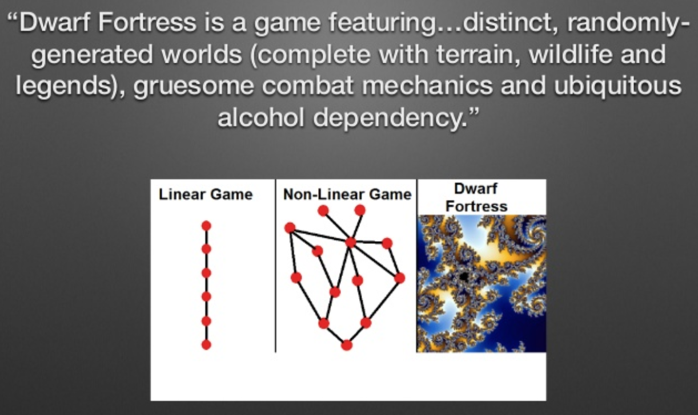 I think this was the description on their website but I can't find it now. Slide from my old [talk deck](https://www.slideshare.net/arnicas/mining-someone-elses-magic-world-dwarf-fortress-story-generation).

I thought I'd turn the dry XML stats of the world inhabitants — their skills, their relationships, their life events, and the game sites— into my 50K words.

So, I did that. But it's boring. It's as boring as trying to dig a mine with a toothpick for 30 days, which is incidentally what it felt like writing the code to generate my 50K words. When the rock dust had settled, I decided to refactor it, but then the refactoring went just as badly! I concluded I was probably using the wrong tools, the wrong levels of abstraction, the wrong approach entirely.

The Big Picture "story" plan I executed — hastily conceived to make the deadline — was to crawl relationships between characters in the sqlite database I had created and generate a little bio of each character, with a few selected "interesting" life events, if there were any. During prototype generation, I realized the output was awful, so I threw in some some random adjectives from a corpus of adjectives and varied the ordering of the descriptive elements; but the final product still feels repetitive and dry.

Here's a sample:

> **Thruni Glazedspooned was child to Domi Chastebuds.**
> Thruni Glazedspooned was a human. Thruni Glazedspooned was killed by Nocpur Haleflew The Snarling Simplicity (a killer of unknown race) in the uncapped Lancedsneaks (cruelly struck down) in year 111. He was no good at anything useful. He was a member in the The Confederations Of Duty, an organization of humans. He was related to 3 others. He lived for 6 years.
> **Stral Lullhood was mother to Thruni Glazedspooned.**
> Stral Lullhood was a human. In year 101, Stral Lullhood wandered . In year 101, Stral Lullhood changed jobs . In year 103, a relationship began between Domi Chastebuds and retiring Stral Lullhood. Stral Lullhood settled in the human Lancedsneaks in year 103. Stral Lullhood was killed by Nocpur Haleflew The Snarling Simplicity (a hydra) in the clapping Lancedsneaks (struck by a blade) in year 111. She was ok at negotiation. She was a member of 3 organizations. She had 3 children. She lived for 31 years.
> **Rimtil Pantsear was child to Stral Lullhood.**
> Rimtil Pantsear was a male human. He lived for 94 years. He was largely unmotivated. He was ok at using armor properly, pretty good at using an axe, rather crap at climbing, rather crap at cooking, ok at discipline, ok at dodging, rather crap at gelding things, ok at using a shield, ok at noticing what's going on, rather crap at tanning hides. He was related to 2 others. He was a former member in the The Group Of Axes, an organization of humans. Atu Marshvile abducted Rimtil Pantsear in the tyrannical Lancedsneaks in year 109. In year 109, Rimtil Pantsear settled in the employed Fellfondle . In year 119, Rimtil Pantsear changed jobs in the swooning Fellfondle. In year 201, Rimtil Pantsear died peacefully of old age .

You can see errors in spacing and punctuation, repetitive descriptions, some dysfluency — and elsewhere there are cases where I failed to provide rules for English surface forms and showed "raw" tabular data elements, like: "ok at military_tactics, outstanding at soap_making." The fact that the first character, Thruni, was killed at 6 years old, is not commented on in any meaningful way. A human narrator probably would have milked this for some pathos at least. Or at least paused meaningfully before moving on to the next character.

As a brief tech summary: I used the [Python port](https://github.com/aparrish/pytracery) of [Tracery](https://tracery.io/), a simple content-free grammar generation tool created by [Kate Compton](http://www.galaxykate.com/). I had used it along with a text generation GPT-2 model the previous year for [a much more successful Nanogenmo project](https://github.com/arnicas/venice_directions_nanogenmo), so it was familiar. I made a template-based grammar for sentence production, paired with db queries and string replacements to turn the tabular data into (nearly) natural language. But there were definitely levels of representation missing in my approach, not to mention modularization in the code.

When a friend asked me to give a talk recently, I chose this project to motivate a dive into the problem space and tools out there. This article (and forthcoming Part 2) recap what I learned about data2text approaches and the current state of the art.

Here is the plan for these articles:

* Text Generation in a Nutshell, and Data2Text
* Levels of Representation in Data2Text Text Gen
* Technical Approaches: AI, Statistical, Templates
* Companies Doing Data2Text
* Part2: Tools (a Focus on Open-Source)
* Part 2: A Tiny, Inadequate Discussion of Narrative Generation from Data

### What is Text Generation?

Some applications of text generation include:

* Sequence to sequence problems: E.g., translation from one language to another, from human text to SQL queries, and the like.
* Multimodal: Describe image (or video) contents in text, such as captioning images.
* Summarization: Turn big text → smaller text without losing the gist.
* Question / answer generation: Help systems, chatbots, educational tools
* Dialogue / responses: Chatbots, help agents, game NPC interactions
* Narrative: Story generation, long form discourse like news articles reports or stories, and (interactive) game content
* "Data2text": Turning data points (or queries on tables) into natural language.

Text generation from tabular data, or data2text, may be used for things like automated news reporting (e.g., readable reports of sports scores, weather forecasts, earthquakes), accessibility (e.g., describe a chart's or table's contents in text for screen readers), product web page generation or population from dbs of product features, general report generation (big enterprise areas here are medical and financial reports). There is also a new niche of text generation for dashboard data in BI Tools (more later on this).

In data visualization and product marketing, text generation based on data can be used for personalization. For instance, the **New York Times** uses personalized data reports during user exploration of data in data journalism pieces, such as in this report on voting "[bubbles](https://www.nytimes.com/interactive/2021/04/30/opinion/politics/bubble-politics.html)." When you get to the point where you can select your own location, the story continues, with a graphic and customized text based on the data.
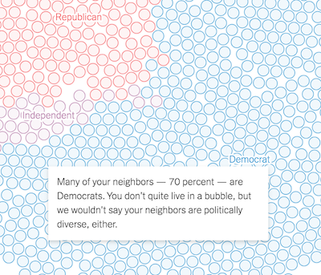 [NYT Voting Bubbles](https://www.nytimes.com/interactive/2021/04/30/opinion/politics/bubble-politics.html), tailored for my search

From a marketing perspective, one might want to customize a message in a report sent to a customer based on their behavior (and their profile "type"), such as the energy saving climate-conscious customer, or the climate-disinterested person (as in [Conde-Clemente](https://digibuo.uniovi.es/dspace/bitstream/handle/10651/41000/Toward.pdf;jsessionid=0E3CFC6124C465A0D4D4AB5996CFBD24?sequence=1) et al).

Finally, one might want to generate charts along with supporting descriptive text entirely driven by data — a much harder problem to do well, in that it requires identifying the "interesting" aspect of a visual data set, without a human author. See, for instance, [Tang et al.'s 2017 "Top K Insights"](https://www.microsoft.com/en-us/research/uploads/prod/2017/02/Insights_SIGMOD17.pdf) attempt, which identifies outlier points and trends. Or the interesting data exploration descriptions in the [Voder](https://arjun010.github.io/static/papers/voder-infovis18.pdf) system or Google Sheets' Data Explorer, where text accompanies exploratory graphics. Here are some histograms produced by Data Explorer while examining a dwarf skills table, with very different text descriptions of their shapes:
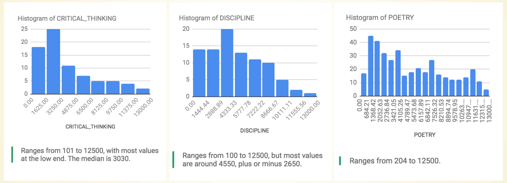 Google Sheets' Explore panel text and histograms

As an aside, I recommend the long, detailed system design paper on how to generate bar chart descriptions that is [Demir et al. 2012](https://direct.mit.edu/coli/article/38/3/527/2163/Summarizing-Information-Graphics-Textually). It's a wakeup call on the inherent difficulties and the many levels of representation needed in your non-mediocre implementation.

### Levels of Representation

Speaking of levels, the standard view on text generation stages is a 3-level view from [Reiter and Dale 2000](https://www.amazon.com/Building-Generation-Studies-Language-Processing/dp/052102451X/ref=sr_1_1?dchild=1&keywords=reiter+and+dale&qid=1623331863&sr=8-1):
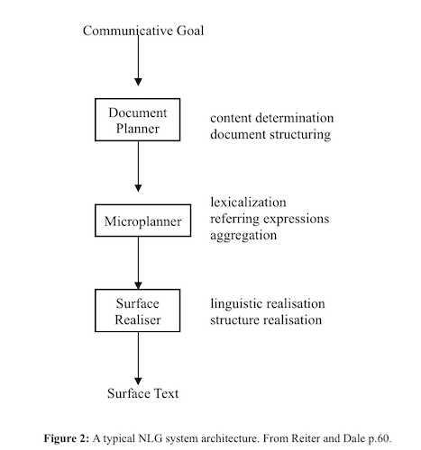

These levels of design specify what to say, how to say it, and how to say it "correctly." My project was weak at all three levels in various ways. Let's explore how!

#### Document Planning: Structuring

This is a tough one for long-form generation. I don't think many NaNoGenMo pieces attempt much "big picture structure," although Greg Kennedy's reviews of [2020](https://greg-kennedy.medium.com/attack-of-the-robot-authors-7fb51d4efff6) and [2019](https://greg-kennedy.medium.com/computers-writing-books-54628883d2b8) entries hint at a few. In 2019, with my (better) [Directions in Venice](https://github.com/NaNoGenMo/2019/issues/137) entry, I tried to generate darker, stormier descriptions of Venice as time went on, using a simple % counter. (Due to various technical deadline issues, it was only worked so-so in practice.) In Part 2, I'll discuss this problem and projects that tackle it more successfully, like Aaron A. Reed's novel [Subcutanean](https://aaronareed.net/subcutanean-book/) and various game strategies.

The generation of my piece as a whole involved traveling social network relationships among the characters mentioned, and splitting it up with randomly inserted (ironic) inspirational quotes, like "Peace begins just where ambition ends." There wasn't any overall change in tone or structure over time.

Each character's skills were summarized in a couple of possible ways, but I think doing outlier tests on skills across the whole population might have turned up more interesting characters with good skill stories. For instance, when digging recently, I discovered that one dwarf, Goden Mantheater, can play 4 types of instruments which no one else can play. She is automatically interesting! Weird skills, unusual races, deities with strange interests, authors of historical documents, these are all story-worthy! Yet note how hard it is to encode this observation in a programmatic rule.

> Stongun Bluntfocused constructed the artifact "The Forest Retreat In Practice" at Frostyprairie, a Forest Retreat, in the year 55.

While I did look for slightly more interesting events in a character's history, I failed to do anything useful with patterns such as this one, where a spy has the tables turned on him (in bold):

> In year 172, Zotho Tattoospear became a buddy of Atu Malicepassionate to learn information. Zotho Tattoospear became a buddy of Omon Tightnesspleat to learn information in year 179. **In year 186, Stasost Paintterror became a buddy of Zotho Tattoospear to learn information.**Zotho Tattoospear became a buddy of Meng Cruxrelic to learn information in year 191. Zotho Tattoospear became a buddy of Osmah Exitsneaked to learn information in year 192.

Finally, when I recently looked up which sites were most mentioned in historical events, I discovered Abbeyenjoy was a rich place. Even more interesting were the event types that occurred there — it's a very literary place! Excellent site for a generated novel! If only I had done this examination earlier.
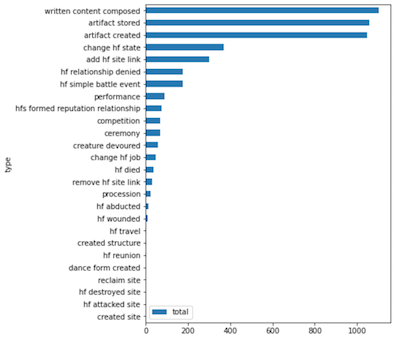 The most common events were related to written content or artifacts. ("HF"="historical figure")

Finally, at the character level, some more data mining might have been done to find interesting groups. An exploratory [UMAP](https://umap-learn.readthedocs.io/en/latest/) layout of characters by race, age, gender, and other attributes shows some clustering. Some of the straight lines on top appear to be male childless dwarves who died young.
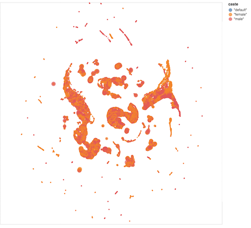 UMAP layout of characters, using attributes to try to cluster them.

The problem of finding good stories in data is a bigger one than just a data2text generation problem. Do as I say, not as I did: Explore your data thoroughly in advance,even if it's for a personal project where 50K repeats of the word "meow" would have been fine.

#### Micro-Planner: More Detail

The micro-planning level is where we decide on referring expressions, aggregations of interest (combining facts in the same sentence, or making lists), and generally determine the data-to-surface-form relationship.

Consider the problem of numeric data for skills: My dwarves have a skill rating number for each of their skills, like a 600 for "make_music." Rather than just list numbers, I tried to give them a text description ("ok at" making soap, "crap at" fishing etc.); but as we know, the relationship between words and numbers is not straightforward. One person's "never" is another person's "sometimes."
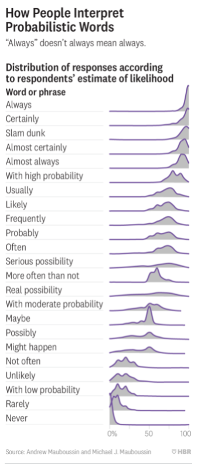 [HBR article 2018](https://hbr.org/2018/07/if-you-say-something-is-likely-how-likely-do-people-think-it-is)

(See summary in [HBR](https://hbr.org/2018/07/if-you-say-something-is-likely-how-likely-do-people-think-it-is), and [this Dutch study](https://arxiv.org/abs/1901.09686) which found similar issues. Also, see this very interesting [2018 paper on the creation of a probabilistic model to pick what verb to use to describe a stock's rise or fall](https://www.aclweb.org/anthology/Q18-1038.pdf). Did a price change in the upward direction merit a "soar"? A "climb?" Or just "it rose?")

In narrating the generated dwarves, this squishiness of meaning is probably fine, but in some cases, it may not be.

The micro-planning stage is also where you decide how you want to refer to entities, and when you can do which surface form. If a dwarf character is labeled as male, one can use the pronouns "he" and "him" (lacking any other insight into their preferences; there is also a non-binary gender flag in the data). One might refer to Tise Mortalblossomed, a female elf, as "the elf", "Tise" or "Mortalblossomed," in a context where her full name has been used already. Or as "Ameli Stirredstones's daughter" or "Salore Oakenskirt's sister."

There is also some important mapping at this level, which lies between the data and the final template. This is where we set up a relationship between fields in the data table and human-readable strings or string sets. In a skill table, the character skills are shorthanded in non-English codes like "grasp_strike" and "axe." These should map to more English phrasing like "grasping and striking" and "using an axe." Historical event templates are even more complex: there are different "actor" or argument slots for different event types, such as "created site" (a creator character, a site, and a year) and "hf changed state" (character changed from which state to which state, and when). Ideally these argument relation templates also surface in multiple syntactic forms, for variety. (Mine did not.) Developing sufficient good, natural variants is one of the design challenges of such systems.

Perhaps at this layer there should also be some logic to check for story hooks, like how old the character was when they died. There could be an infinite number of these special case checks.

This is also the level at which missing data, or zero values, need to be planned for. I ended up repeatedly writing special rules for all missing/null/zero values in my data queries which was a pain in the ass. Some tools are better at supporting this, as you'll see in Part 2.

The lack of a clear code and design separation between the micro-planner and the surface realiser that follows was one of the more severe problems in my system. This is partly related to tool use, and partly to lack of planning and structuring in advance. My code, like my network of character relations, essentially turned into a hairball.

#### Surface Realiser: Linguistic Morphology and Punctuation

Not to be taken lightly, this is the level at which most tools operate, as you'll see in the coming post. We need to handle:

* Subject-verb number agreement for language(s) of choice: _He runs, They run._
* Correct plural forms: _child_→ _children, fish_→ _fish, woman_→ _women_, etc.
* Correct articles: _an owl, a bat_.
* Punctuation and Orthography: Capitalize the first letter of a sentence, proper nouns, end sentences with correct punctuation with correct spacing (as I did not, despite Tracery having some functions for this).
* List handling: Separate multiple items by "," and before the last, use "and" or "or."
* HTML Markup, if you want to produce it.

There are libraries for handling some of this yourself, if you insist: [Compromise](https://github.com/spencermountain/compromise) and maybe [RiTa.js](https://github.com/dhowe/ritajs) for JS, and for Python, libraries like [Inflect](https://pypi.org/project/inflect/), [LemmaInflect](https://github.com/bjascob/LemmInflect), [Inflecteur](https://github.com/Achuttarsing/inflecteur) for French, and so on. You will need to hook up the functions to the text strings yourself.

### Technical Approaches to Text Gen

There are essentially a continuum of approaches, from the purely "smart template" driven approaches to the neural "deep learning" approaches. I'm going to discuss the neural net approaches first, which are still largely at the research stage, at least for data2text.

#### Neural "Data2Text"

There are both encoder-decoder methods, as well as decoder only (GPT-2 onwards). They all suffer from various issues, and are very much still at the research rather than useful stage. One big problem is the need for a training set; my zero-shot prompt engineering experiment with [GPT-neo](https://github.com/EleutherAI/gpt-neo) was a garbage-producing bust, even with several lines of data2text equivalence examples. As for training — If you generate a training data set using template/rewrite rules, why not just use your template/rewrite rules for your application? It will run faster, won't need a GPU to run, and will be easier to modify and maintain.

Other equally serious issues include the usual text generation failure modes: hallucination of incorrect data, not including enough of the source data in the output, and general weird garbage. Here's a research example from [Obeid & Hoque 2020](https://arxiv.org/abs/2010.09142), where the red text is the "hallucinated" facts:
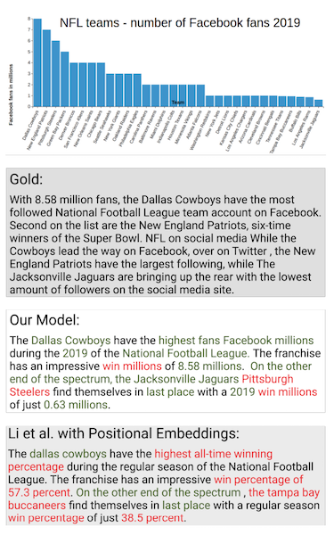 [Obeid & Hoque 2020](https://arxiv.org/abs/2010.09142)

I tried using the Few Shot NLG method in [Chen et al 2020](https://arxiv.org/abs/1904.09521) with a subset of the dwarf statistics, pairs formatted thus:

```
name:NAME_8025 age_1:12 caste_1:female race_1:goblin birth_year_1:178 death_year_1:190
```

with output goal of

```
NAME_8025 was a female goblin who was born in year 178 and lived until year 190 .
```

There were more complex examples, with other clauses. It's certain I didn't train long enough. However, the errors were classic NLG errors, like repetitiveness — the model reaalllly thinks she wants to rule the world:

```
NAME_5389 was a female goblin who was born in year 156 and is still alive.  her goal is to rule the world  . her goal is to rule the world  . her goal is to rule the world  . her goal isto rule the world  .
```

Also endearing but incorrect word salad:

```
NAME__unknown_of_unknown_cats was a nonbinary forgotten beast who was born 254 years before history began and is still alive. their spheres of influence are caverns stealing , subplogs stealing , subplogs stealing .
```

As well as just getting the data fields wrong, like NAME_12 for NAME_1280.

Another problem with neural data2text models is that, in general, there are no levels of planning or representation. It's just dumping tables in and getting text slabs back. Of course this is a topic of research, as are all the current error modes. Mitigations for neural data2text issues include using copy mechanisms to ensure data accuracy, use of knowledge graphs and databases to ensure accuracy and "bigger picture" planning, and multi-stage models to capture the planning stages (e.g.,[Data-to-Text Generation with Content Selection and Planning](https://arxiv.org/abs/1809.00582), Puduppully et al. 2019, [Laha et al 2019](https://arxiv.org/abs/1810.02889), [Moryossef et al 2019](https://arxiv.org/pdf/1904.03396.pdf)). I read a lot about this before deciding it wasn't ready for end use yet.

But there are also neural methods that might contribute usefully to template-based or statistical approaches, such as "Learning Neural Templates for Text Generation" ([Wiseman et al. 2019](https://arxiv.org/pdf/1808.10122.pdf)), in which they learn inspectable latent templates while learning to generate:
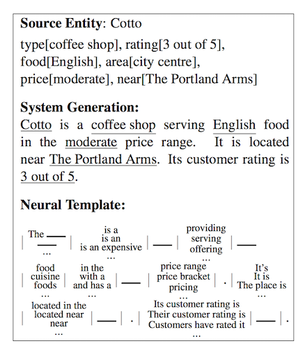 Latent neural template plus generation from [Wiseman et al 2019](https://arxiv.org/pdf/1808.10122.pdf)

Advances like AllenNLP's neural search tool "Spike" that uses pattern matching to retrieve structural content matches could also be a big help in populating templates and providing variants to authors. For instance, using the [Spike demo](https://spike.apps.allenai.org/datasets), I can do a pattern search against Wikipedia text for things haunted by other things and see what the pairs are. Or, I can look for what castles are haunted by, specifically. Not useful for dwarves, but generally interesting!
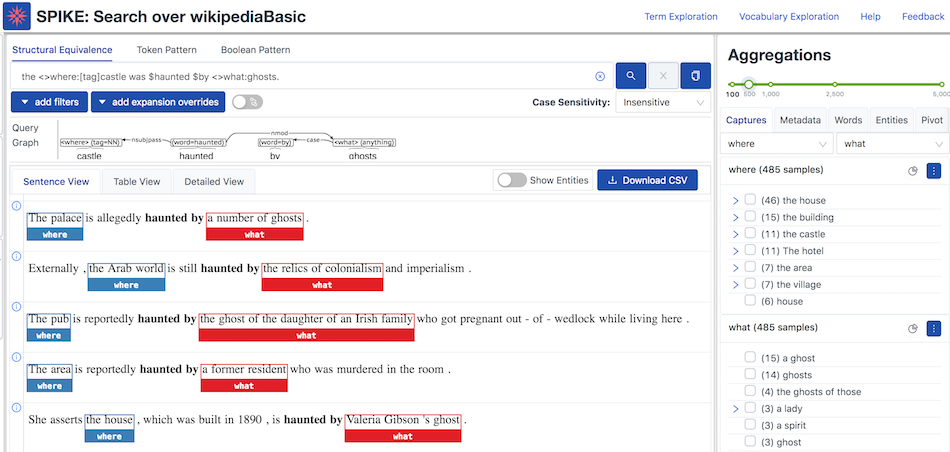 [Spike Search](https://spike.neural-sim.apps.allenai.org/datasets/wikipediaBasic/search#welcome) from AllenAI

#### Probabilistic and Statistical Approaches

I will give short shrift to these systems, as the lines blur a bit here with some current AI work and it's hard to find old code (although see this [ACL page](https://aclweb.org/aclwiki/Downloadable_NLG_systems)). Good reviews exist in [Gatt and Krahmer 2018](https://www.aclweb.org/anthology/Q18-1038.pdf) and in the ACL 2019 tutorial slides on [Storytelling from Structured Data and Knowledge Graphs](https://docs.google.com/presentation/d/1HaGCNc6n_sjyGLdaGzAVPvAeT0ZhhL3Q/edit#slide=id.p1). The stock market verb prediction paper ([Zhang et al. 2018](https://www.aclweb.org/anthology/Q18-1038.pdf)) could be considered one of these. In general, there are probabilistic context-free grammar models, HMMs of various types, text classification approaches, stochastic planners, n-gram models, weighted decision-trees, etc. I wish code before Github was easier to find.

#### "Smart" Template Approaches

These approaches dominate actual industrial applications. I'll go over the available tools, focusing on open source, in some detail in Part 2 of this article. Before doing so, I'll give a brief introduction to the industry players themselves.

### Industry Today (or Last Year)

The early, big companies in this space are [Ax Semantics](https://en.ax-semantics.com/), [Automated Insights](https://automatedinsights.com/), [Yseop](https://www.yseop.com/), [Narrative Science](https://narrativescience.com/), and [Arria NLG](https://www.arria.com), according to [Robert Dale's 2020](https://www.cambridge.org/core/services/aop-cambridge-core/content/view/BA2417D73AF29F8073FF5B611CDEB97F/S135132492000025Xa.pdf/natural_language_generation_the_commercial_state_of_the_art_in_2020.pdf) industry report. These companies generally have a "BI Integration" tool for adding text to your charts and graphs on your reporting dashboard:
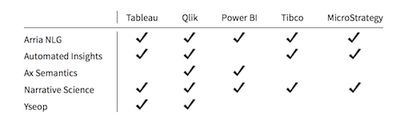 BI integration from Dale (2020)

More recent companies include (per Dale):

> Infosentience ([https://infosentience.com](https://infosentience.com)), founded 2011 and based in Indiana: appears to be focused on sports reporting, but their website does suggest some other use cases have been addressed.
> Linguastat ([http://www.linguastat.com](http://www.linguastat.com)), founded 2005 and based in San Francisco; focuses on product descriptions.
> Narrativa ([https://www.narrativa.com](https://www.narrativa.com)), founded 2015 and based in Madrid, with offices in the United Arab Emirates [and US]; sees its target market as consisting of the usual suspects: financial services, e-commerce, healthcare and telecoms.
> Phrasetech ([https://www.phrasetech.com](https://www.phrasetech.com)), founded in 2013 and based in Tel Aviv.
> Retresco ([www.retresco.de](http://www.retresco.de)), founded in 2008 and based in Berlin: the case studies on their website describe applications in product description, real estate, sports reporting, traffic news, and stock market reporting.
> Textual Relations ([https://textual.ai](https://textual.ai)), founded in 2014 and based in Sweden: focusses on product descriptions, producing output in 16 languages. [They have super smart job ads up.]
> VPhrase ([https://www.vphrase.com](https://www.vphrase.com)), founded in 2015 and based in India: their website describes a large set of case studies across a range of industries and claims multilingual capabilities.
> 2txt ([https://2txt.de](https://2txt.de)), founded in 2013 and based in Berlin: primary focus is product descriptions.

Finally, some newer players using AI (apparently) include [Quillbot](https://quillbot.com/), [Grammarly](https://www.grammarly.com/), and [LightKey](https://www.lightkey.io/), and [ShortlyAI](https://shortlyai.com/). These companies seem to be more aimed at document editing (spelling, grammar, tone) and sometimes creativity help. The creativity tools usually require a premium service account.

One could also argue that [AI Dungeon](https://play.aidungeon.io/main/landing) is a text generation company, in a quite different target space, although definitely creativity-related.

Dale concludes that the major vendors (at least for data2text) aren't doing much that's theoretical or complex, particularly due to the difficulties of communicating such functionality to users (bold is mine):

> As far as I can tell, linguistic knowledge, and other refined ingredients of the NLG systems built in research laboratories, is sparse and generally limited to morphology for number agreement (one stock dropped in value vs. three stocks dropped in value). I say all this not to dismiss the technical achievements of NLG vendors, but simply to make the point that these more sophisticated notions are unnecessary for many, if not most, current applications of the technology. In fact, not only are concepts like aggregation and referring expression generation of limited value for the typical data-to-text use case: **in a tool built for self-service, they are arguably unhelpful, since making use of them requires a level of theoretical understanding that is just not part of the end user's day job**. Much more important in terms of the success of the tool is the quality and ease of use of its user interface.

### Concluding, for Now

In part 2 of this article, I'll go deep on the template approaches and associated tools, and revisit the "story from data" problem that my dwarves had.

### Some Overview References

* Tutorial at ACL 2019, Storytelling from Structured Data and Knowledge Graphs ([slides](https://docs.google.com/presentation/d/1HaGCNc6n_sjyGLdaGzAVPvAeT0ZhhL3Q/edit#slide=id.p1)) ([site](https://sites.google.com/view/acl-19-nlg/content?authuser=0))
* [Awesome Natural Language Generation](https://project-awesome.org/tokenmill/awesome-nlg) curated list (mostly neural)
* [Downloadable NLG systems from ACL](https://aclweb.org/aclwiki/Downloadable_NLG_systems)
* [Survey of State of the Art in NLG](https://arxiv.org/pdf/1703.09902.pdf) (Ghatt & Krahmer 2018)
* [Dale's 2020 Industry Report](https://www.cambridge.org/core/services/aop-cambridge-core/content/view/BA2417D73AF29F8073FF5B611CDEB97F/S135132492000025Xa.pdf/natural_language_generation_the_commercial_state_of_the_art_in_2020.pdf)
* LiLiang's [repo](https://github.com/liang8qi/Data-to-Text-Generation) of some papers about data2text
* [Automating the News](https://www.amazon.com/Automating-News-Algorithms-Rewriting-Media/dp/0674976983), Nicholas Diakopoulos
* [Pretrained Language Models for Text Generation: A Survey](https://arxiv.org/abs/2105.10311)
* My [table2text links from arXiv](https://arnicas.github.io/text-gen-arxiv-papers/categories/table2text/table2text.html) (updated regularly)
* [Procedural Storytelling in Game Design](https://www.amazon.com/Procedural-Storytelling-Design-Tanya-Short/dp/1138595306/ref=sr_1_1?dchild=1&keywords=procedural+story+generation&qid=1622449219&sr=8-1) (more on this in Part 2)

### About Me

I'm a freelance data scientist currently in Europe. I'm always interested in NLP and generation problems. Say hi to me [@arnicas](https://twitter.com/arnicas) on Twitter if you want!

By [Lynn Cherny](https://medium.com/@lynn-72328) on [<time>June 26, 2021</time>](https://medium.com/p/497639d14ebc).

[Canonical link](https://medium.com/@lynn-72328/dwarf2text-a-mediocre-data-to-text-generation-project-leads-to-learning-stuff-part-1-497639d14ebc)

Exported from [Medium](https://medium.com) on February 15, 2022.
