# AI Art Illustrations

## Init Image with Gen2's 18 Seconds

Extending an image with 4 secs at a time... honestly I adore the weirdness. Who is this? What is going on? There are portals in the pictures.  I love it.

Starting again from the Franz Sedlacek bat picture. I edited lightly to speed up the central weird office bit and the ending and reduce file size.

(The [MP4](./gifs/bat-office-sequences-gen2-smaller.mp4))

## Init Image Tests with Gen2 and Pika Labs Beta (Updated 31 July 2023)

Init Image from Midjourney:

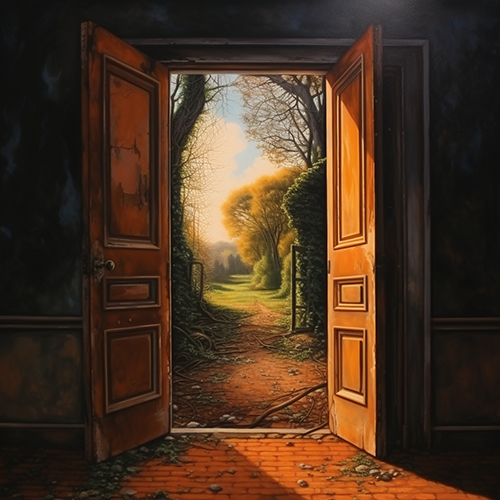

### Runway Gen2 with no prompt

This has nice motion, but at the end the composition is actually slightly different (more visible in higher res). A prompt will otherwise wipe out the init image with their current settings.

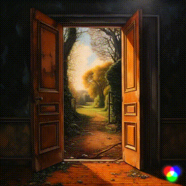

### Pika Labs AI, prompt with variants of "birds flying" as the concept

Getting progressively better with prompt and guidance scale settings. But LOL the duck.

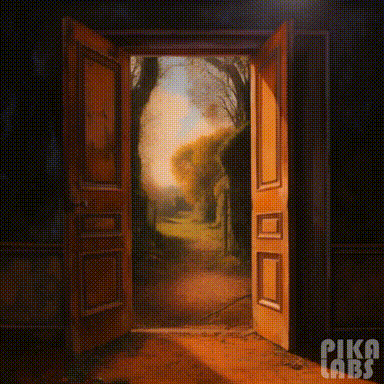

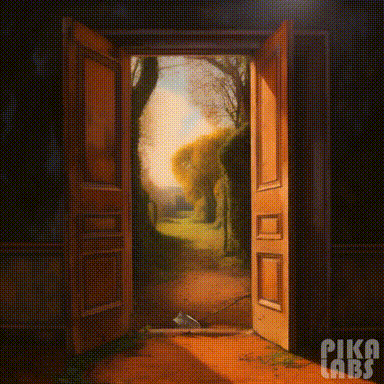

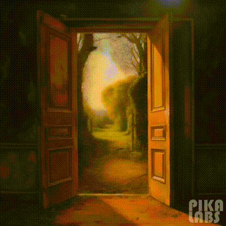

## Init Images from Creepy Fine Art:

[Franz Sedlacek](https://www.dailyartmagazine.com/franz-sedlacek/), a creepy source image:

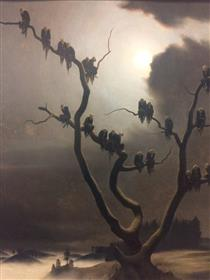

### RunwayML Gen2

Entire composition changes in the end, abruptly.

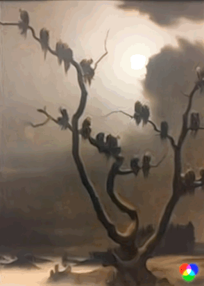

### Pika Labs

With some fiddling with prompt and guidance, I can get this:

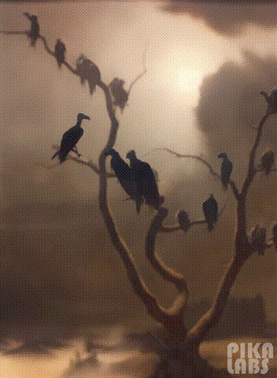

## A Less Realist Image

Another source image by Franz Sedlacek:

### RunwayML Gen2 

Again changes the whole composition at the end, no prompt:

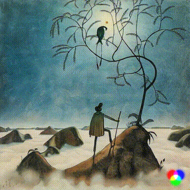

### Pika Labs

Both pleasing! I asked for an ocean of mist.

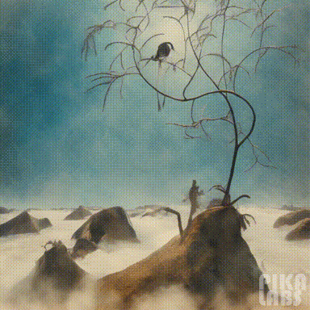

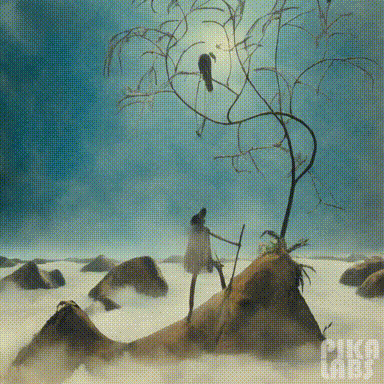

## Another Franz Sedlacek, Just Pika

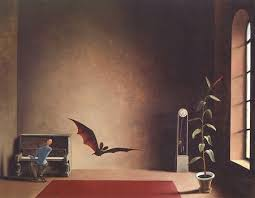

### Using Pika Labs To Get the Bat to Flap :)

Not perfectly successful... a few attempts -- we would want the guy playing the piano but also the bat:

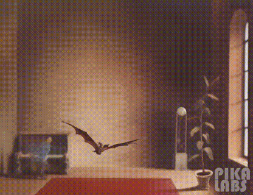

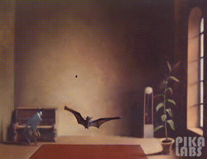

# Animate Diff - mid July 2023

[AnimateDiff](https://github.com/guoyww/AnimateDiff) example for my newsletter [here](https://arnicas.substack.com/p/titaa-445-myhouse-is-a-very-weird).

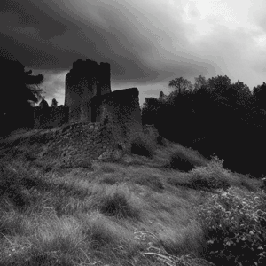

