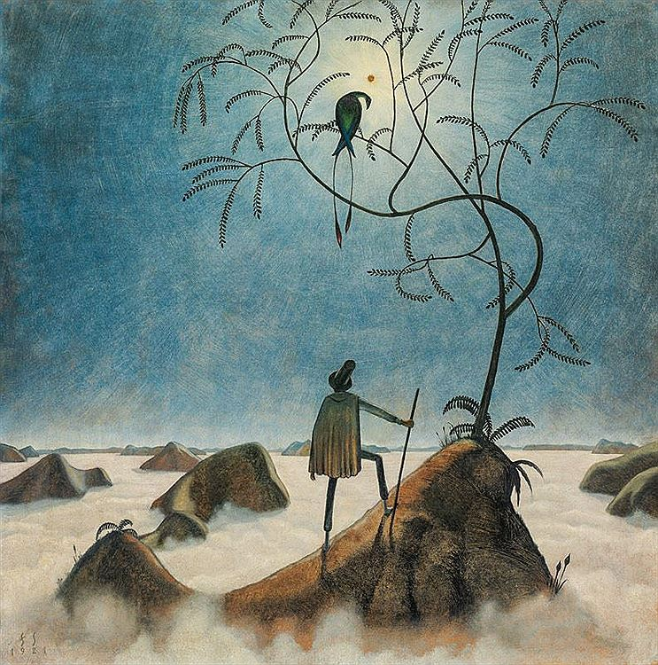

# AI Art Illustrations

## Init Image Tests with Gen2 and Pika Labs Beta (Updated 31 July 2023)

Init Image from Midjourney:

### Runway Gen2 with no prompt

Prompt will otherwise wipe out the init:

### Pika Labs AI, prompt "birds flying" as the idea outside the door:

Getting progressively better with prompt and guidance scale settings:

## Init Images from Creepy Fine Art:

[Franz Sedlacek](https://www.dailyartmagazine.com/franz-sedlacek/), a creepy source image:

### RunwayML Gen2

Entire composition changes in the end, abruptly.

### Pika Labs

With some fiddling with prompt and guidance, I can get this:

## A Less Realist Image

Another source image by Franz Sedlacek:

### RunwayML Gen2 

Again changes the whole composition at the end, no prompt:

### Pika Labs

Both pleasing! I asked for an ocean of mist.

# Animate Diff - mid July 2023

[AnimateDiff](https://github.com/guoyww/AnimateDiff) example for my newsletter [here](https://arnicas.substack.com/p/titaa-445-myhouse-is-a-very-weird).

