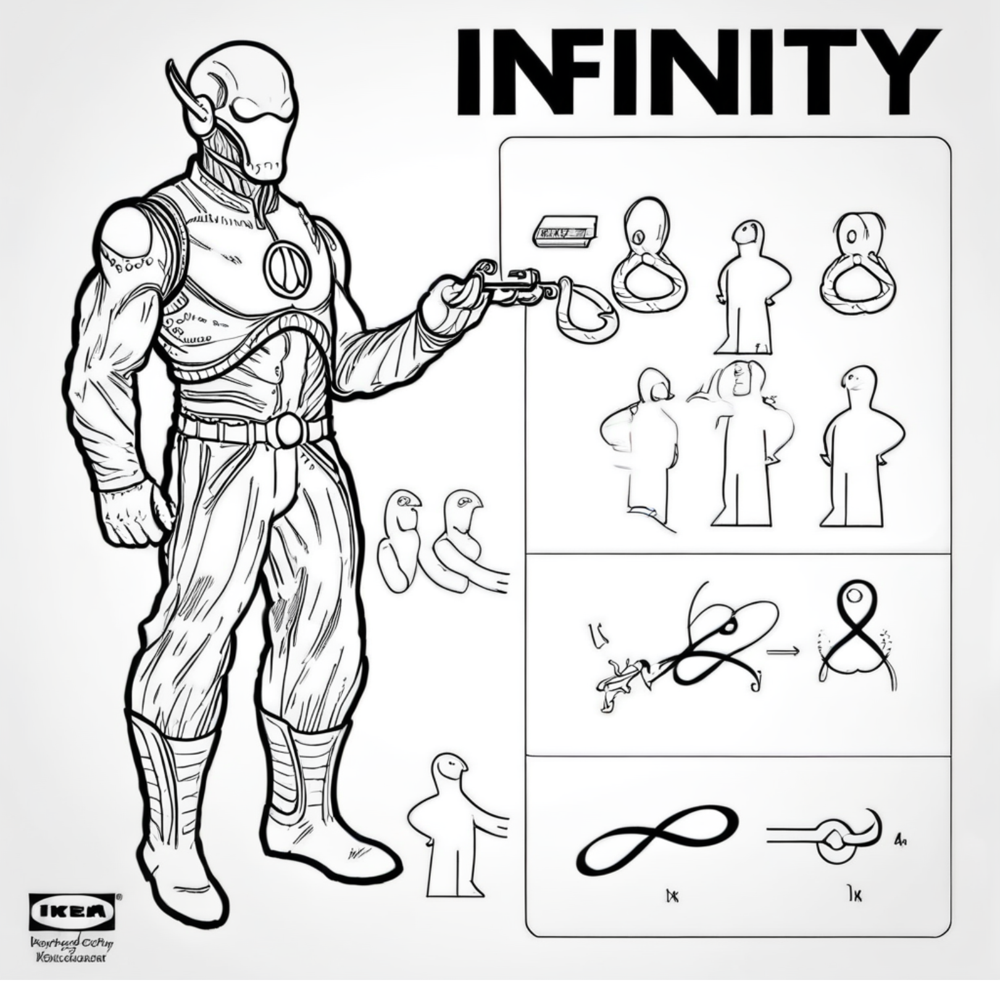

# Using a LoRa SDXL Fine-Tuned on IKEA Diagrams

HuggingFace demo at [LoraTheExplorer](https://huggingface.co/spaces/multimodalart/LoraTheExplorer), if you sort by likes it should show up and you can try it on the right.  Or use it in your favorite SDXL interface like Automatic1111's webui. Otherwise, the code/link is [ostris's here](https://huggingface.co/ostris/ikea-instructions-lora-sdxl). Written about in my mid-October newsletter at [arnicas.stubstack.com](https://arnicas.substack.com).

Robot:

Angel:

Archangel:

Ghost 1:

Ghost 2:

Time travel:

Golem:

A UFO:

Astral projection:

A broomstick:

Jack-o-lantern:

Zombie:

Demon:

Stargazing:

Dreaming:

Imagination:

Stonehenge:

Petroglyphs:

Travel:

Happiness:

Write poetry:

Write a novel:

An open door:

Infinity:

