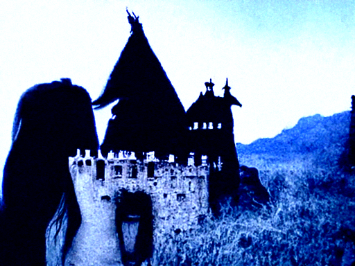
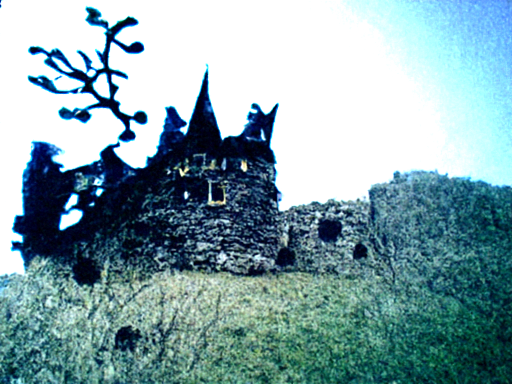
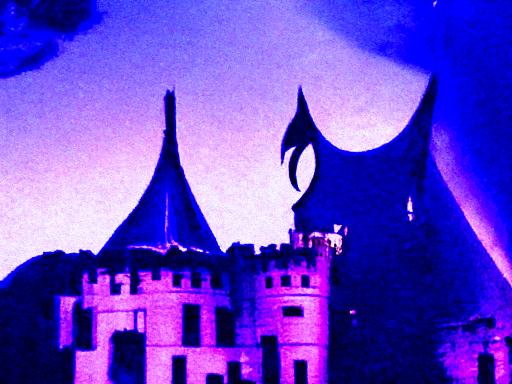

A Caption-Image Story Game
==========================
*Output is generated by using Jina-AI's discoart 'one-liner' to produce the images (200 its) using Disco Diffusion code and Antarctic Captions by dzryk.*

Prompt input: The woman was a witch, and the castle was her home.

Other top captions:

- A very old gothic image of a old castle on a large block of gray
- a house standing on top of a hill in a very gothic style landscape
- A black and white photo showing a castle with red background.
- A castle is a man surrounded by woods and rain.
- An old fashioned gothic castle is rising in the distance.

    

  
Top caption used: The castle was the home of a very old witch.

Other top captions:

- A castle in the woods, with wood structures and a structure on the top of a
- a castle like building sits on top of a hillside next to a field of wood
- A castle sitting on top of an old hillside with trees in a yard.
- A wooden castle in front of a tree house near houses.
- A gothic style castle sitting in a field next to a field.

    

  
Top caption used: The castle was the home of an evil queen. A princess was waiting for us.

Other top captions:

- A purple and white picture of a colorful castle holding a banner on top of it.
- A scene with a purple castle, a castle sign, a man with a hat and
- A tall blue castle with a white banner on it with a witch's hat.
- A large purple flag is seen above a castle.
- A picture of a castle waving toward a woman with a blue hat on.

    

  
