A Caption-Image Story Game
==========================
*Output is generated by using Jina-AI's discoart 'one-liner' to produce the images (200 its) using Disco Diffusion code and Antarctic Captions by dzryk.*

Prompt input: The woman was a witch, and the castle was her home.

Other top captions:

- A beautiful dark castle with a white dress and ivy and the word "RULE
- A small gothic castle on a hill next to grass with trees and trees and
- A large castle covered in green grasses, with a large moon above it.
- a very old and beautiful gothic castle in the dark sky is very dark
- A dark house is surrounded by trees and tall trees.

    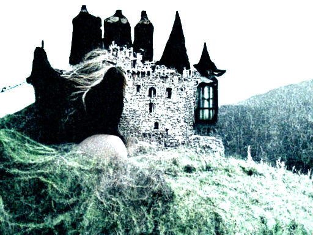

  
Top caption used: The beautiful dark castle was owned by an evil queen who ruled the kingdom with an iron fist.

Other top captions:

- A castle standing tall with blue stave topped turrets and a white gate in front of
- A black and white painting of a large castle with a red shield.
- A tall castle with towers on the cliff side rising up to a blue sky.
- A close up of a tall and rectangular castle with tall turrets.
- A castle is standing atop of a hill in the sky.

    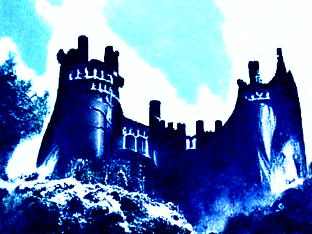

  
Top caption used: The castle was the home of a wicked queen who used magic to keep it in place.

Other top captions:

- A picture of a castle is seen in the sky next to some woods.
- A castle is seen rising above a land of trees.
- A black castle is visible from above that is high in the sky.
- A castle stands on top of the hill and is well lit.
- A picture of a castle in a lush blue setting next to trees.

    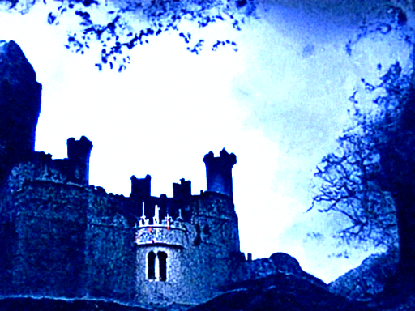

  
Top caption used: The castle was the home of a beautiful princess. A dragon guarded the entrance.

Other top captions:

- A painted dragon standing in front of a castle in front a door.
- A dragon is displayed on a door inside of a castle.
- A dragon perched on the roof of a castle and looking into a window.
- A dragon head standing on a door with a castle on a wall
- A dragon standing in front of the front door of a castle.

    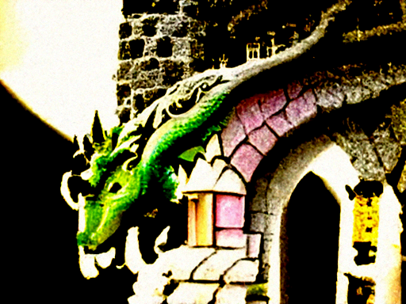

  
Top caption used: The dragon was a petrified prince. The windows were stained glass depicting his story.

Other top captions:

- A dragon flying through a window above a wooden pole with a banner.
- An old dragon flying a kite in a glass window.
- A dragon kite flies through a stained glass window on a day.
- a red dragon flying past a stained glass window with a dragon on top of it
- A small piece of wood stained glass behind a large dragon flying on top of a stone

    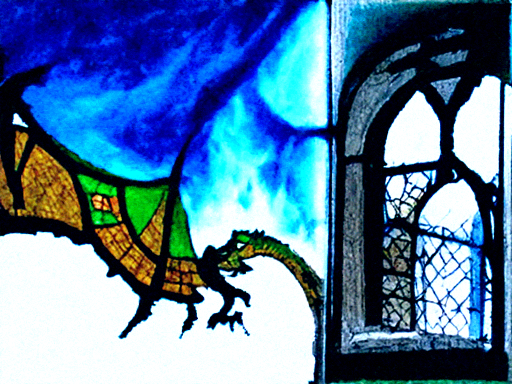

  
Top caption used: The dragon was flying through the stained glass window because it was holding a kite on the side of the window.

Other top captions:

- A kite flying over a glass kite window with a dragon head on it.
- A kite fly and a kite float behind a window with a dragon on a
- A kite with a dragon sitting on top of a building by a window.
- A dragon kite is flying on the ground next to a glass door.
- A dragon kite is sitting inside of a small window.

    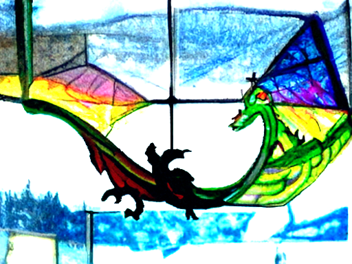

  
Top caption used: The dragon was flying a kite in front of a stained glass window. A bird was flying next to it.

Other top captions:

- An image of a dragon kite on a piece of stained glass on a sky.
- A kite flying through a piece of stained glass with a dragon on it.
- An image of a dragon kite that is flying on top of a window ledge.
- A green dragon kite hanging from a glass window that has one white cross on it
- A white glass window window shows a kite of a dragon flying and a dragon in

    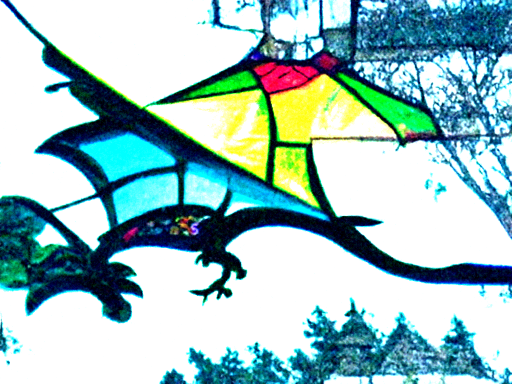

  
Top caption used: The dragon kite was a magical creature that could fly and breathe fire.

Other top captions:

- A kite flying above a large field holding a dragon kite.
- A dragon kite and a green lizard kite flying in a green airfield.
- A kite with dragons on it on an artificial field with a man wearing glasses.
- A kite floating next to a large green dragon kite on the side of a
- A man sitting under a bright kite with a large dragon.

    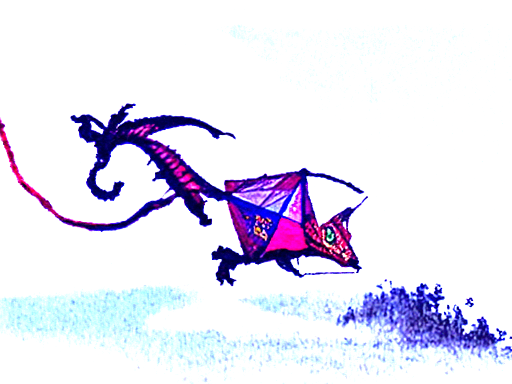

  
Top caption used: The dragon was the king of the kites. He was looking for a princess to marry.

Other top captions:

- A woman is flying a dragon flying a green and white kite.
- A colorful dragon kite flying in a green field with trees behind it.
- A person in a green hat is flying a dragon kite on a field.
- A man holding a green dragon kite in the sky next to a beach.
- A person sitting on top of a kite with a dragon circling above it.

    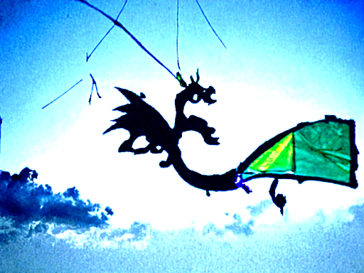

  
Top caption used: The dragon was flying the kite because it wanted to catch the wind.

Other top captions:

- A man flying a kite in the sky with a dragon kite as a backdrop
- Person flying a kite next to a dragon and lion kite on red field.
- A person flying a kite against a blue sky on the ground with a red dragon
- a man flying a kite over town while holding an inflatable dragon kite on
- A woman flying a dragon kite in the sky.

    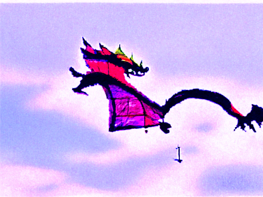

  
Top caption used: The dragon was a magical creature that could grant wishes. It flew around the world, looking for people to help.

Other top captions:

- A young child can be seen flying a kite of a dragon in the sky.
- A child flying a kite with a black dragon in it behind some trees.
- A woman walking past a dragon sitting on top of a lawn waving a kite at
- A woman is flying a kite with a dragon on the wings.
- A man flying a kite with a large flying dragon beside him.

    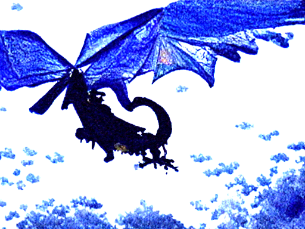

  
Top caption used: The dragon was flying high in the sky, carrying a kite with flapping wings.

Other top captions:

- A person flying a kite, with an octopus and a dragon flying past.
- A person flying a dragon kite on a grassy field and a tree.
- A colorful kite with a dragon, bird and dog caught in the air.
- a man flying a kite in the grass flying a dragon kite
- A person flying a kite in the sky holding a picture of a dragon kite

    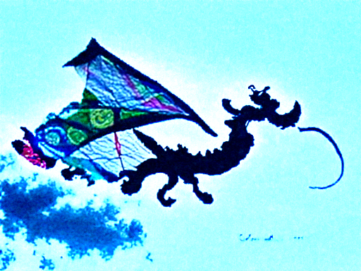

  
Top caption used: The two people were actually fairies, and the black dragon kite was their pet.

Other top captions:

- A small man flying a dragon kite with a blue ribbon flying next to it
- A group of people flying a kite in the air and a dragon.
- A small boy is flying a dragon kite along on the grass.
- A man is flying a kite with a blue dragon kite in the air.
- A group flying dragon kites outdoors at a kite festival.

    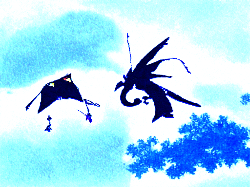

  
Top caption used: The kite was actually a dragon, and the man was a wizard.

Other top captions:

- an adult kite in the sky next to a dragon kite, in a yard
- A pair of children flying a kite and a red kite with a dragon in
- A person flying a kite with a green dragon on it to a mountain.
- A person flies a kite with a dragon kite in the sky.
- A woman flying a dragon kite and a little boy flying a kite.

    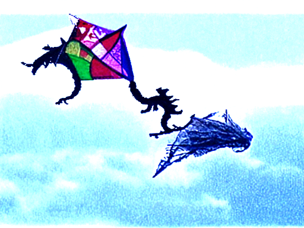

  
Top caption used: The person was using magic to fly the kites.

Other top captions:

- Two guys flying colorful and colorful kites in a grassy field.
- A man flying some colorful kites next to one another and a man on a white
- A man is holding an illuminated kite that he flies into the air.
- Two men flying colorful kites on the field.
- Two people are flying various colorful kites in the sky.

    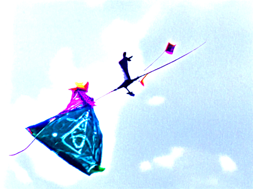

  
