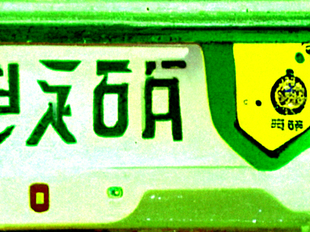
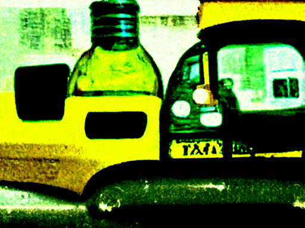

A Caption-Image Story Game
==========================
*Output is generated by using Jina-AI's discoart 'one-liner' to produce the images (200 its) using Disco Diffusion code and Antarctic Captions by dzryk.*

Prompt input: A painting of a lonely traveler walking beside a lake

Other top captions:

- a painting in a park with a man standing next to a lake looking out a window
- a picture of a man in a lake and a woman in a garden on two mountains
- A couple of paintings of a lake surrounded by a field of trees and a man walking
- A painting that takes place in a small park with a man fishing.
- A painting of a man holding a fish in front of a pond.

    

  
Top caption used: a painting in a park with a man standing next to a lake looking out a window

Other top captions:

- A painting with a man sitting on a bench and a garden behind him.
- A man looking at a painting on a wall in a park that has a garden next
- a painting depicting a painting of a landscape next to a park with trees and trees
- an advertisement painted on a wooden wall to a gated park in a green park
- A mural painting of a park in front of a building, green trees and several sun

    

  
Top caption used: A painting of a mural on a wall looking at a green park through the distance.

Other top captions:

- A mural with a green and white landscape, trees and lots of buildings nearby.
- Several tall, green trees are growing in a painting of a green garden.
- A mural of a garden setting with trees and trees looking at the wall beside it.
- an image of a large green garden in the background of a painting.
- A painting of a green landscape hanging on wall of a window.

    

  
Top caption used: A wall painting depicting gardens in a green field and trees.

Other top captions:

- A wooden wall that shows a garden scene behind and in front of a green plant.
- A painted wood wall with a painting of a garden and trees.
- A wooden mural of a Chinese garden scene painted on a brick wall next to a truck
- A green and white mural on top of a wall with a garden in each background.
- A wall display on a wall with paintings of a Chinese person and trees in front of

    

  
Top caption used: The wall painting on a wall is a Chinese green decoration with trees, flowers, flowers

Other top captions:

- A white painting on a wall of chinese characters next to two trees.
- A painting of a Chinese character sitting on a mural inside of a wall on a green
- A wall painted with Chinese writing that is in a green background.
- A wall painted with Chinese characters on a building with trees and plants.
- A mural with chinese letters written on a wall with different colors of flowers and flowers

    

  
Top caption used: A painting of chinese letters on a wall that is painted with red curtains and green

Other top captions:

- A neon sign on a wall with graffiti written in Chinese with some wood and fire burns
- a store sign painted in Chinese with some red and white letters
- A large red sign in the shape of a Chinese character on a piece of wall.
- A neon sign with Chinese print and graffiti painted on a building.
- A red Chinese lettering posted on a neon sign in front of an empty shop storefront

    

  
Top caption used: A graffiti painted white neon sign written in Chinese on top of a wall with a green

Other top captions:

- A photo of a graffiti written on a wall decorated in Chinese font.
- A black and white picture of graffiti written in Chinese.
- An open area of graffiti is covered in Chinese words.
- Some graffiti written in Chinese on brick walls with some green.
- A mirror image of a wall marked with graffiti writing in Chinese.

    

  
Top caption used: Written in Chinese graffiti on a building wall is painted green and yellow.

Other top captions:

- A number of Chinese characters written in a yellow graffiti on a green wall.
- A yellow tag written in Chinese ink by a graffiti artboard covered in graffiti and symbols
- A graffiti tag written in Chinese that is covered in yellow and white.
- A yellow tag with Chinese characters written with a black arrow in the middle of a graffiti
- a yellow tag with Chinese language writing on a wall

    

  
Top caption used: A graffiti written in green Chinese words with a yellow button on it.

Other top captions:

- A yellow tag writing in Chinese and green writing in the street corner of a building.
- A piece of graffiti written in Chinese lettering and black spray painted in green neon letters
- a white tag with a word in Chinese and yellow on a wall with a large circle
- A piece of chinese graffiti written in graffiti next to a yellow tag and a black
- a yellow tag on a wall written in Chinese with yellow paint near a wall

    

  
Top caption used: A yellow tag written in Chinese and green and painted with pink lines and white and blue

Other top captions:

- A yellow and green license plate printed in Chinese with two different directions on it.
- A yellow tag on a car plate with Chinese characters written in it.
- yellow tag with Chinese characters on street corner on a white table top.
- A yellow tag sitting outside of a road sign printed with Chinese characters on it.
- yellow tag with Chinese characters sitting next to the bottom of a car window.

    

  
Top caption used: A large yellow car plate with green and black words written and written in Chinese on it

Other top captions:

- A white license plate displayed in both Chinese and English with a yellow back plate.
- A yellow plate with two names and the names of some vehicles written in Chinese.
- a yellow license plate containing a red tag to reflect Chinese characters
- A yellow and white car door, a plate holding Chinese words.
- A yellow license plate with the words and a lettering written in Chinese on the bottom

    

  
Top caption used: A yellow and green licence plate with the word of China written on it.

Other top captions:

- A green license plate with an engraved in Chinese language next to the words "Yellow"
- A yellow license plate with Chinese writing printed on it and a yellow tag holder
- A license plate of yellow writing on a plate of metal with Chinese characters.
- A yellow license plate printed with a yellow background and chinese letters.
- A yellow license plate with a black and white picture of Chinese writing.

    

  
Top caption used: A yellow license plate of the Chinese language sitting on the dashboard of a car.

Other top captions:

- A yellow plastic tax plate with four white blocks written in Chinese.
- A yellow and black license plate written in Chinese with a sticker in yellow.
- a yellow driver's license plate with an engraved Chinese word and a yellow tag
- A yellow license tag showing the Chinese characters, including some buildings and people.
- A Chinese license plate with a yellow color lettering and two white characters

    

  
Top caption used: A yellow plate with Chinese characters at the end of a vehicle door.

Other top captions:

- an xiaoan yellow taxi sign that has the same words written in Chinese on it
- The yellow taxi logo is painted with an image of a building with Chinese symbols.
- Tinted glasses and chinese symbols on the back of a yellow cab.
- Yellow Taxi sign, with Chinese characters, and some black and yellow buses and a red
- A yellow parking meter with Chinese characters painted on it.

    

  
Top caption used: A yellow taxi with a white tag attached to it with several Chinese characters.

Other top captions:

- A taxi sits on a street with graffiti painted on a side of it.
- A yellow two person taxi driving on a road with a yellow person in the front
- A yellow and white taxi on the street with a driver and the passengers inside
- A yellow taxi riding on the side of a street with the driver of the cab.
- A yellow and white taxi on the street with two men.

    

  
Top caption used: A yellow taxi and cab and a yellow passenger holding a bottle beside the driver.

Other top captions:

- A traffic light and parked yellow taxi with a yellow and white striped cab
- A yellow taxi on a road with a parked car with the driver sitting in front.
- A yellow taxi carrying yellow items that have a green and black background and some trees.
- A couple driving a yellow and white taxi in the street
- A yellow taxi travelling down a road with a person sitting in the front seat leaning out

    

  
Top caption used: an image of a yellow taxi with a car in the rear

Other top captions:

- A yellow taxi with yellow wheels next to a car with trees under the cab window.
- A large yellow taxi standing next to a small yellow dog while parked on the street.
- A yellow taxi with two stop sign and people sitting in front of it.
- A blue taxicab and a yellow taxi stand at a stop sign in a parking
- An upturned yellow taxi parked in the street next to some parked cars.

    

  
Top caption used: Monochrome background of a yellow yellow taxi on the street next to a large white

Other top captions:

- a yellow taxi parked at a bus stop next to a white bus
- A yellow taxi and yellow and white Trolley stop at a street corner
- A yellow bus with a taxi parked next to some white fences.
- A yellow taxi sitting on a street next to a yellow bus standing along a corner.
- a yellow bus parked next to a white cab on a road

    

  
Top caption used: Two yellow and white taxis sitting on top of a bus stop.

Other top captions:

- A yellow bus driving through the snow near a building full of cab licenses.
- Two yellow buses drive down the road in a snow covered city.
- Cabs and yellow and green buses in downtown London are parked at bus stops.
- A yellow bus parked in a parking garage with cars and a black cab
- Two yellow buses parked on snowy streets in a park with red and yellow buses.

    

  
Top caption used: Many yellow buses on a snowy road with some buildings parked behind them.

Other top captions:

- A row of yellow and white school buses parked on a snowy street.
- There are many yellow school buses parked on the side of the road in a snowy parking
- Several yellow school buses in the parking lot on a snowy street next to the building.
- A number of school buses parked in front of a school building in the snow.
- A line of school buses parked on the side of a street in the snow.

    

  
