A Caption-Image Story Game
==========================
*Output is generated by using Jina-AI's discoart 'one-liner' to produce the images (200 its) using Disco Diffusion code and Antarctic Captions by dzryk.*

Prompt input: A woman looks out the window of a fairy-tale castle.

Other top captions:

- A beautiful picture of a castle view out of a window overlooking a wooded area.
- A fairy tale castle with a man looking out of a window.
- A green window overlooking a castle with a fairy tale in the distance.
- The view from a large window overlooks a castle next to a forest
- A window with a fairy tale setting next to a very large castle.

    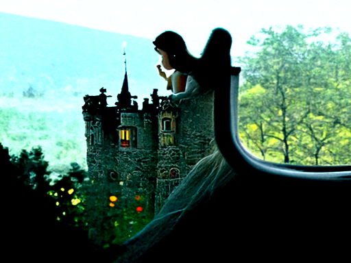

  
Top caption used: A beautiful picture of a castle view out of a window overlooking a wooded area.

Other top captions:

- A window overlooking a castle surrounded by trees.
- A glass window looking out over a castle with lots of trees on the side.
- A window with a panoramic view of a castle.
- A view looking out of a large window of a castle on a hill side.
- A window overlooking a castle looking out on a valley with trees.

    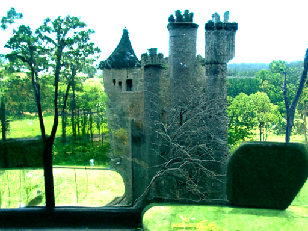

  
Top caption used: The view of a castle through a windowspanning of a window.

Other top captions:

- A picture of a castle looking out through a window of a large window.
- The view of an outdoor window through a large window view of a castle.
- A large window with the reflection of a castle in a green sky.
- A glass window showing a picture of a wall of a castle with a tall window.
- View through a window of a castle with a huge stone tower on the side.

    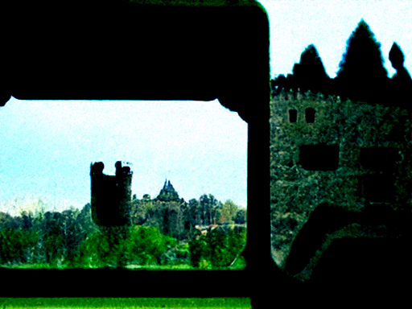

  
Top caption used: A view through a window of a wall with the castle in the background.

Other top captions:

- A close up view of a glass wall frame in the foreground of a big castle.
- A sunny view of a castle through a large window in the middle of the background.
- A view of a castle through a window as a blue sky appears through a large glass
- A view through a window of the front door of a huge walled castle made of
- A view through a window and a wooden door with a castle.

    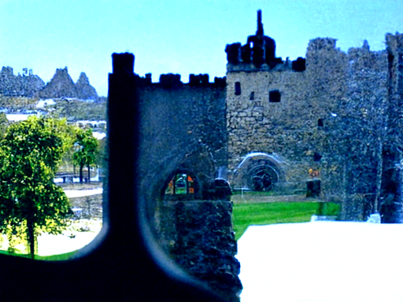

  
Top caption used: A view of the castle through a window inside a glass door.

Other top captions:

- A glass pane at top of the window to a castle.
- A glass window with a small castle in the background as view on a sunny day.
- A view through a picture window of a castle.
- Close up of a window with a reflection of a view of the castle on a field
- a view of a castle through a small window on a window to sky

    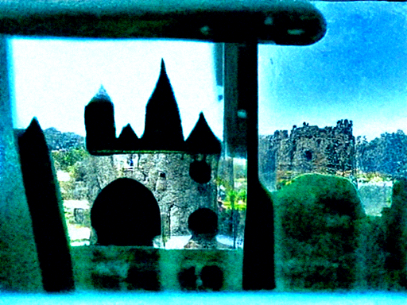

  
Top caption used: A view through a green window of a tall castle.

Other top captions:

- a view through green shutters of a large window in a castle
- The view in front of a large window with a green castle with a tree sitting behind
- View through a window of a tall, green castle house.
- A very green and green colored window looks out through the window of a castle.
- A view of a window through a castle window overlooking a green wall.

    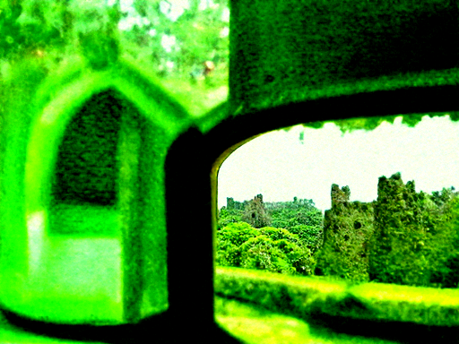

  
Top caption used: A view through a large window that has a view of a large green castle.

Other top captions:

- A green castle is seen through a window in the back of a building.
- a blue and green castle with a green wall view through a looking glass wall
- a window panning out over a green castle with trees in the background
- An open window with a green background behind a tall and green walled castle.
- The beautiful green castle that is looking through a window.

    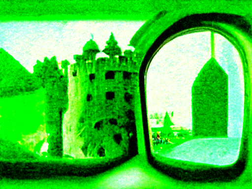

  
Top caption used: A green light colored window on top of an image of a castle.

Other top captions:

- a castle has a green light emitting a ring around it
- A castle with green colors that some of the top glass has on it.
- a castle on top of a green hill with a blue light to the center of it
- A green castle building with blue walled structures with light at night.
- A red castle building on a hill top with green light in the background.

    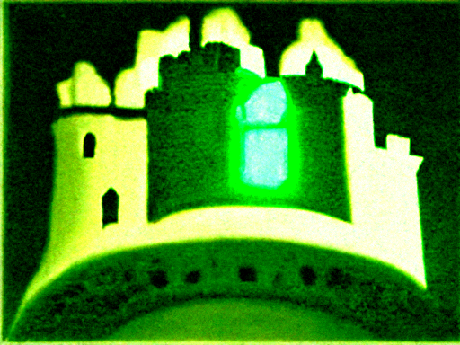

  
Top caption used: The lights in a castle building are illuminated by a green color.

Other top captions:

- a green castle with a lighted gate and a green building
- The castle has a green light shining from above a tower with a green dome.
- A castle with a green door and a green square with a light on it.
- A green castle gate and tower lit up at night.
- a light green building with a castle at night with a green door

    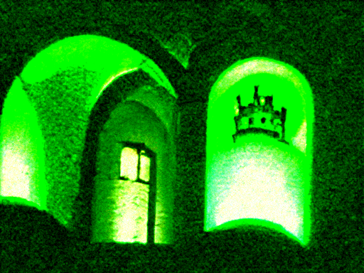

  
Top caption used: A dark green castle wall has light from a fire light on it.

Other top captions:

- A large green castle looking at the light shining by a building.
- A view of the castle is dark by an open window against a green background.
- A white walled castle is visible close by as it is being lit up.
- A castle is lit up through a window with a light glowing at it.
- A castle tower in a green brick structure is glowing in the distance.

    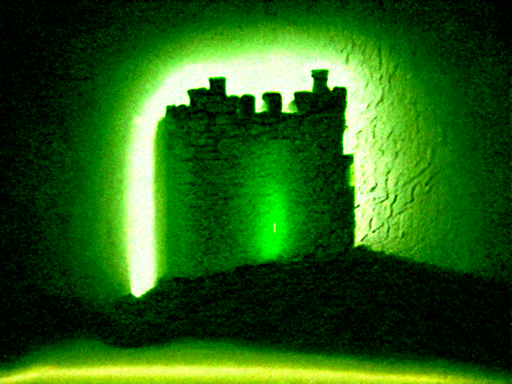

  
Top caption used: A green and black castle wall of light on top of a building in the distance.

Other top captions:

- The tower of a castle is lit up in a green light behind a building.
- a tower with a fire lit at night in another castle with a green wall
- A small dark green tower with lights of some small buildings and a white wall with green
- a green castle with a castle in the distance is lit up
- A green castle with white walls, green trees, and a tall tower of light.

    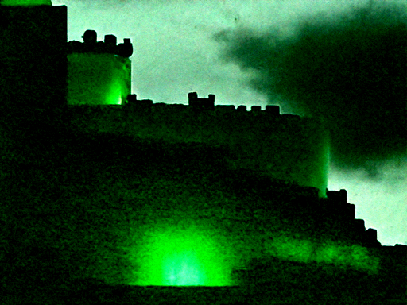

  
Top caption used: A large green castle is seen with lights on as the skyline dims.

Other top captions:

- a view of a castle in the sky with lights off and buildings standing there lit up
- a picture of a tall green white castle with tall turrets
- A castle sitting on a hill above a forest near a town with lights in it.
- A castle is illuminated by several lights and a few small buildings.
- A tall white castle standing under lit city sky with trees in background.

    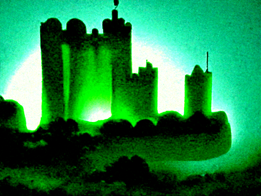

  
Top caption used: A lit up castle of large blue and green buildings standing in the night sky.

Other top captions:

- A silhouette of a castle at night above a river with lights on.
- A white wooden castle and a green building illuminated in the night.
- Lights on top of the top of a man made castle with buildings illuminated by moon
- A castle with huge green castle with fire glowing from a large tower atop the side of
- A top of a castle with a castle building illuminated and building in the distance.

    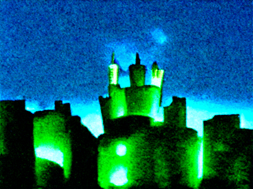

  
Top caption used: a castle standing in the sky with light showing from a city street

Other top captions:

- a castle shining out of the sun with a cloud of air and clouds around it on
- A castle is on a blue cloud that is seen in the night sky.
- an image of a blue cloud above a castle.
- A picture of a blue castle in the sky with a green cloud.
- a castle rising from above top of a cloud that has lights.

    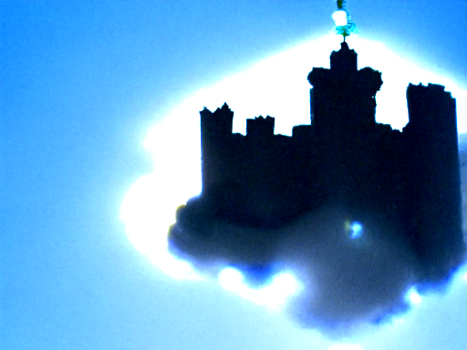

  
Top caption used: A castle is seen in the sky illuminated by a blue cloud while looking up.

Other top captions:

- A castle that is looking over a cloudy sky with a blue light surrounded by it.
- The view of a castle is blue that is illuminated by a cloud.
- A bright blue castle with blue tower and clouds standing on a cloud
- A bright blue cloud over a tower of a castle.
- A castle sits in the air above a blue cloud.

    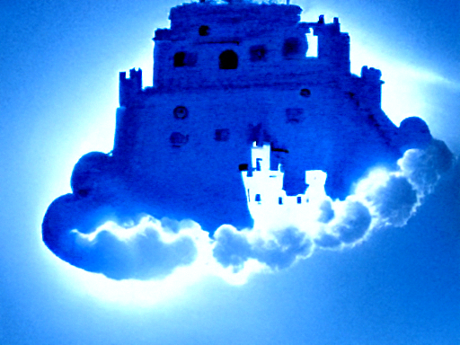

  
Top caption used: An image of a castle in full sunlight is seen on a cloud.

Other top captions:

- A blue castle is seen on top of a cloud with a building in the air.
- A person in a white castle looking at a cloud sitting by a castle.
- A cloud standing next to a large blue castle in the sky.
- A large sky has a blue cloud forming behind a castle on it.
- A castle under a large blue cloud sitting on a blue background.

    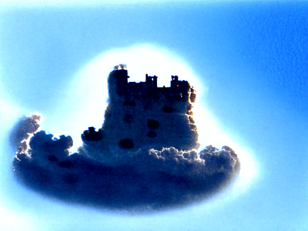

  
Top caption used: A cloud hanging over an image of a large blue castle.

Other top captions:

- A blue cloud floating next to a large castle on top of a hill.
- An image of a blue cloud above that has a castle in the background.
- A large blue shape of a very blue castle with a smoke cloud forming as it goes
- A large blue castle with a castle outside under a cloud covered window.
- A large blue cloud rising over a castle on a bright blue water.

    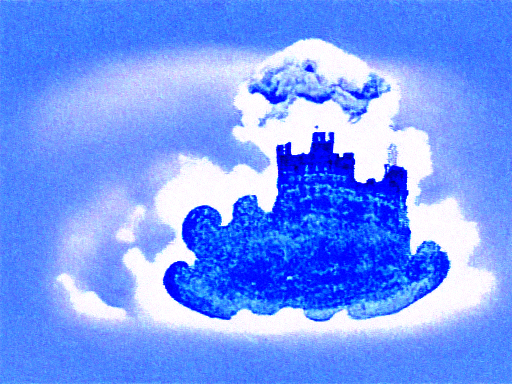

  
Top caption used: A blue cloud forming outside of a big castle with smoke emitting from different shapes.

Other top captions:

- A castle is lit up by a blue, colored smoke from a smoke ball.
- A castle with a blue cloud standing in form of smoke over it.
- Smoke is rising over a castle with a blue cloud blowing in the background.
- A dark castle covered in smoke emitting a blue cloud.
- A picture of a castle with a blue smoke cloud above it.

    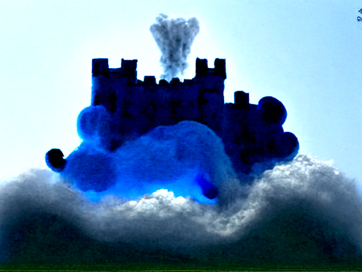

  
Top caption used: A castle next to water with smoke pouring out of a tank and blue colored clouds above

Other top captions:

- A steam cloud rising above a blue water fountain in front of a castle.
- A blue lake with steam hanging above a royal blue water castle.
- a blue cloud hanging in the sky with water flowing past a castle wall
- A blue cloud is floating over water with a castle tower and a water fountain behind it
- A blue castle is spouting water from a river by a waterfall.

    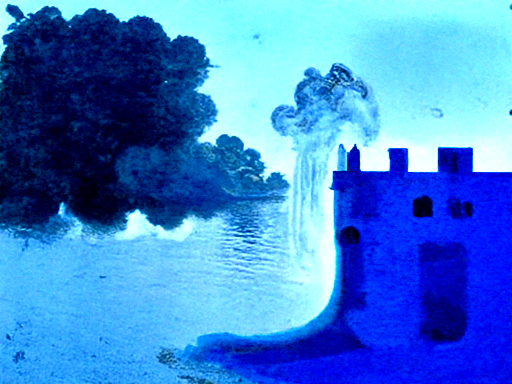

  
Top caption used: White steam rising up from a castle with a blue castle looking in a blue light.

Other top captions:

- A castle with a blue tower that is lit by light and fog at night.
- A castle is lit up almost completely in the air with white smoke.
- A castle is lit up in the sun with blue flames in the background.
- a large castle building lit up at night sky with steam coming out of it up
- a blue and white castle and another building are lit up with an old castle

    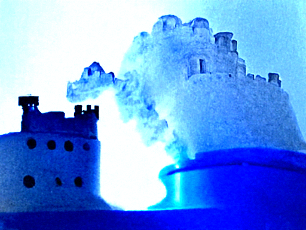

  
